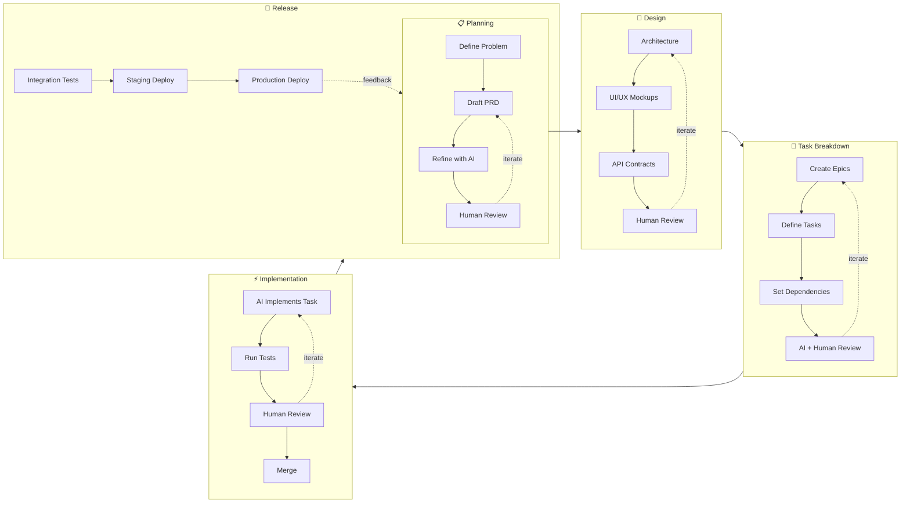

# SpecFlux

> From vibe coding to vibe engineering — ship structured software with AI agents

[](LICENSE)

<!-- Hero GIF placeholder - will be replaced with actual demo -->
<!--  -->

## The Problem

The industry promotes "vibe coding" as one-shot prompts that produce pretty but barely functional software. **This is far from real software engineering.**

Real software is carefully designed, planned, and iterated. AI is making this process faster than ever — but only if you have the right structure in place.

**What's missing is a repeatable process** — one that lets AI iterate fast while maintaining production quality:
- Specs that persist across sessions and guide every change
- Acceptance criteria that define "done" before code is written
- Tasks that build incrementally on a solid foundation
- Human review gates that catch issues before they ship

## The Solution

SpecFlux transforms vibe coding into **vibe engineering** — keeping the speed and creativity of AI-assisted development while adding the structure that produces maintainable software.

## Development Philosophy

Software development is a cycle, and each phase is itself a cycle of refinement. SpecFlux puts AI at every stage — not to replace engineering discipline, but to accelerate it.



**How AI fits in:**

| Phase | AI Role | Human Role |
|-------|---------|------------|
| **Planning** | Interview to extract requirements, draft PRD | Approve scope and priorities |
| **Design** | Suggest patterns, generate schemas | Make architectural decisions |
| **Breakdown** | Create epics/tasks from PRD, identify dependencies | Validate estimates and order |
| **Implementation** | Write code with full context, run tests | Review PRs, approve merges |
| **Release** | Automate deployments, monitor errors | Final go/no-go decision |

Each cycle produces artifacts that feed the next. AI accelerates every loop while humans hold the quality gates.

## Features

- **Structured Specs** — PRDs, epics, and tasks with acceptance criteria. AI agents always know the full context.

- **Visual Kanban Board** — Track AI-driven work across statuses. Drag-and-drop workflow with real-time updates.

- **Dependency Management** — Define task dependencies with visual graphs. AI agents understand what's built and what's blocked.

- **Context-Aware Agents** — Launch Claude Code with automatic context injection. Agents receive PRD, epic, task, and acceptance criteria.

- **Multi-Repo Orchestration** — Manage backend, frontend, and infrastructure repos in one project. Cross-repo task coordination.

- **Human-in-the-Loop** — Approve changes before they land. Review checkpoints keep you in control.

## Quick Start

### Download

Pre-built binaries available on [GitHub Releases](https://github.com/specflux/specflux/releases):

| Platform | Download |
|----------|----------|
| macOS (Apple Silicon) | `specflux-x.x.x-macos-arm64.dmg` |
| macOS (Intel) | `specflux-x.x.x-macos-x64.dmg` |
| Windows | `specflux-x.x.x-windows-x64.msi` |
| Linux | `specflux-x.x.x-linux-x64.AppImage` |

> **Note:** Apps are currently unsigned. See [Installation](#installation) for bypass instructions.

### Installation

**macOS:**
1. Download the `.dmg` file for your architecture
2. Open the DMG and drag SpecFlux to Applications
3. First launch: Right-click → Open → "Open Anyway"

**Windows:**
1. Download the `.msi` installer
2. Run the installer
3. If SmartScreen appears: "More info" → "Run anyway"

**Linux:**
1. Download the `.AppImage` file
2. Make executable: `chmod +x specflux-*.AppImage`
3. Run: `./specflux-*.AppImage`

### First Project

1. **Sign Up** — Create account with email or GitHub
2. **Create Project** — Name it and link your GitHub repository
3. **Run `/prd`** — Start the interactive PRD interview
4. **Run `/epic`** — Break down your PRD into epics and tasks
5. **Run `/implement`** — Let AI agents build your feature

<!-- Screenshot placeholders


-->

## Development Setup

Want to contribute or run from source?

### Prerequisites

- Node.js 20+
- Rust (for Tauri)
- pnpm or npm

### Clone and Run

```bash
# Clone the repository
git clone https://github.com/specflux/specflux.git
cd specflux

# Install dependencies
npm install

# Run in development mode (browser only)
npm run dev

# Run full desktop app
npm run tauri:dev
```

### Build from Source

```bash
# Production build
npm run tauri:build
```

### Running Tests

```bash
# Run tests
npm test

# Run with coverage
npm run test:coverage

# Lint and typecheck
npm run lint
npm run typecheck
```

## Tech Stack

- **Desktop:** Tauri 2.x (Rust)
- **Frontend:** React 18+, TypeScript (strict), TailwindCSS
- **Terminal:** xterm.js with WebSocket
- **Testing:** Vitest + React Testing Library

## Documentation

- [CONTRIBUTING.md](CONTRIBUTING.md) — How to contribute
- [CODE_OF_CONDUCT.md](CODE_OF_CONDUCT.md) — Community guidelines
- [SECURITY.md](SECURITY.md) — Report vulnerabilities

## Support SpecFlux

SpecFlux is source-available under the [Elastic License 2.0](LICENSE). Personal use is free forever.

If SpecFlux helps your workflow, consider supporting development:

- [GitHub Sponsors](https://github.com/sponsors/specflux)
- [Buy Me a Coffee](https://buymeacoffee.com/specflux)

## License

[Elastic License 2.0](LICENSE) — Free for personal use. Commercial use restricted.

---

Built with care for developers who want AI-assisted development without chaos.
