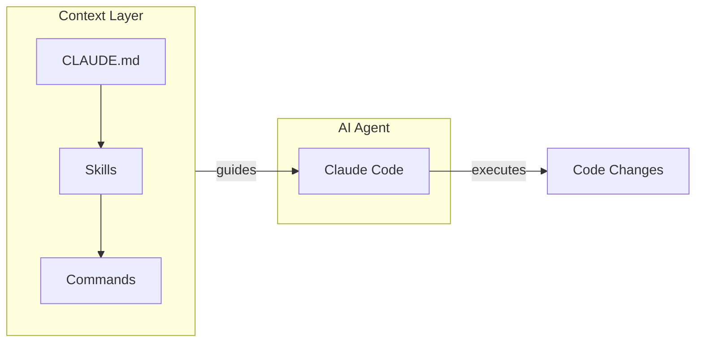
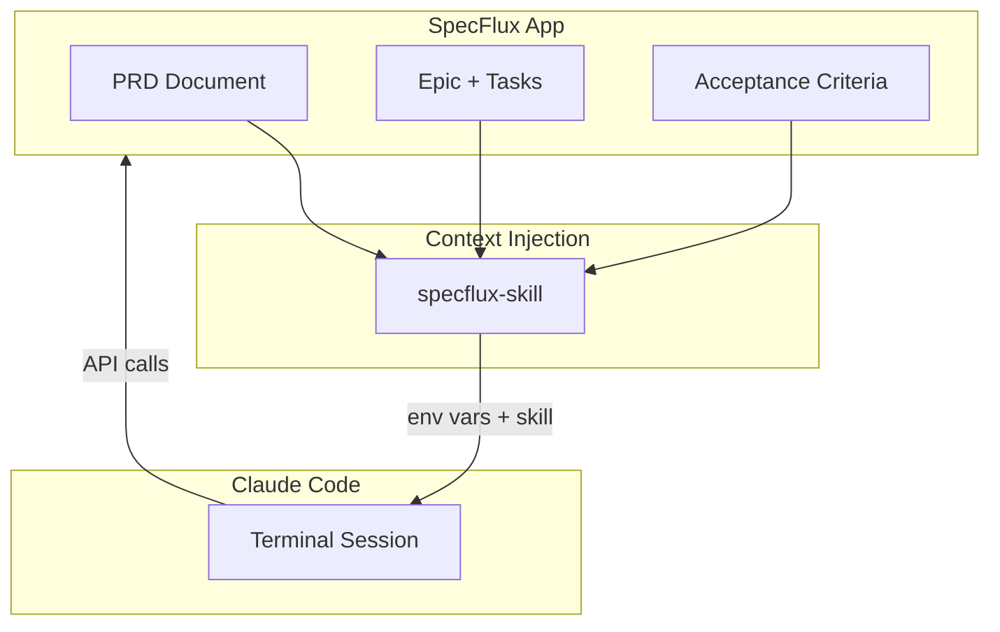
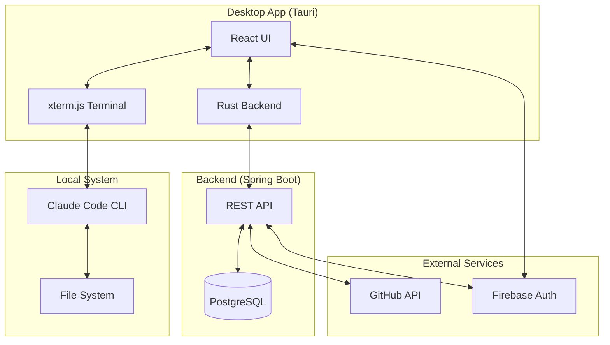
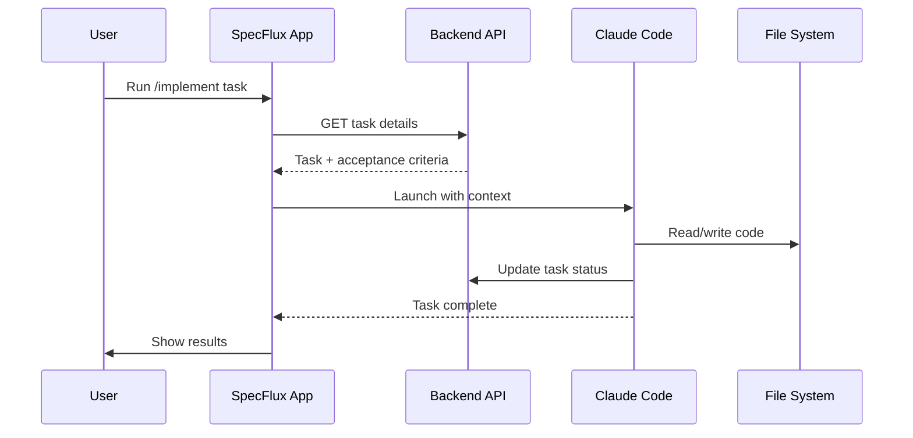

# Architecture

Technical overview for contributors and curious developers.

## AI-Assisted Development

Modern AI coding assistants like Claude Code work best with structure:

**Key concepts:**

| Concept | Purpose |
|---------|---------|
| **CLAUDE.md** | Project-level instructions, conventions, patterns |
| **Skills** | Reusable knowledge (API patterns, coding standards) |
| **Commands** | Workflows triggered by `/command` (e.g., `/prd`, `/epic`) |

Without structure, AI generates code in isolation. With structure, AI understands *how* your project works.

## How SpecFlux Adds Context

SpecFlux bridges the gap between project management and AI execution:

**What gets injected:**

1. **Environment variables** — `SPECFLUX_API_URL`, `SPECFLUX_API_KEY`
2. **specflux-skill** — API patterns for reading/updating tasks
3. **Task context** — Current epic, task, acceptance criteria

The AI agent can now:
- Read the full PRD to understand the goal
- Check task dependencies before starting
- Update task status as it works
- Mark acceptance criteria as complete

## System Architecture

## Component Overview

### Frontend (This Repo)

| Component | Technology | Purpose |
|-----------|------------|---------|
| Desktop shell | Tauri 2.x (Rust) | Native app, IPC, system access |
| UI | React 18 + TypeScript | Kanban board, forms, settings |
| Terminal | xterm.js | Claude Code sessions |
| Styling | TailwindCSS | Dark mode, responsive |
| Auth | Firebase SDK | Login, token management |

### Backend ([specflux-backend](https://github.com/specflux/specflux-backend))

| Component | Technology | Purpose |
|-----------|------------|---------|
| API | Spring Boot 4 | REST endpoints |
| Database | PostgreSQL | Projects, epics, tasks |
| Auth | Firebase Admin | Token verification |

### Data Flow

## Key Design Decisions

1. **Desktop-first** — Full filesystem access, native terminal, offline PRD editing
2. **Backend for state** — Tasks, progress, collaboration stored centrally
3. **Skill injection** — AI learns project patterns without manual prompting
4. **Human gates** — Every phase requires approval before proceeding

## Contributing

- **Frontend issues** — React, Tauri, UI/UX
- **Backend issues** — API, database, auth
- **Skill improvements** — Better context, new commands

See [CONTRIBUTING.md](../CONTRIBUTING.md) for setup instructions.
