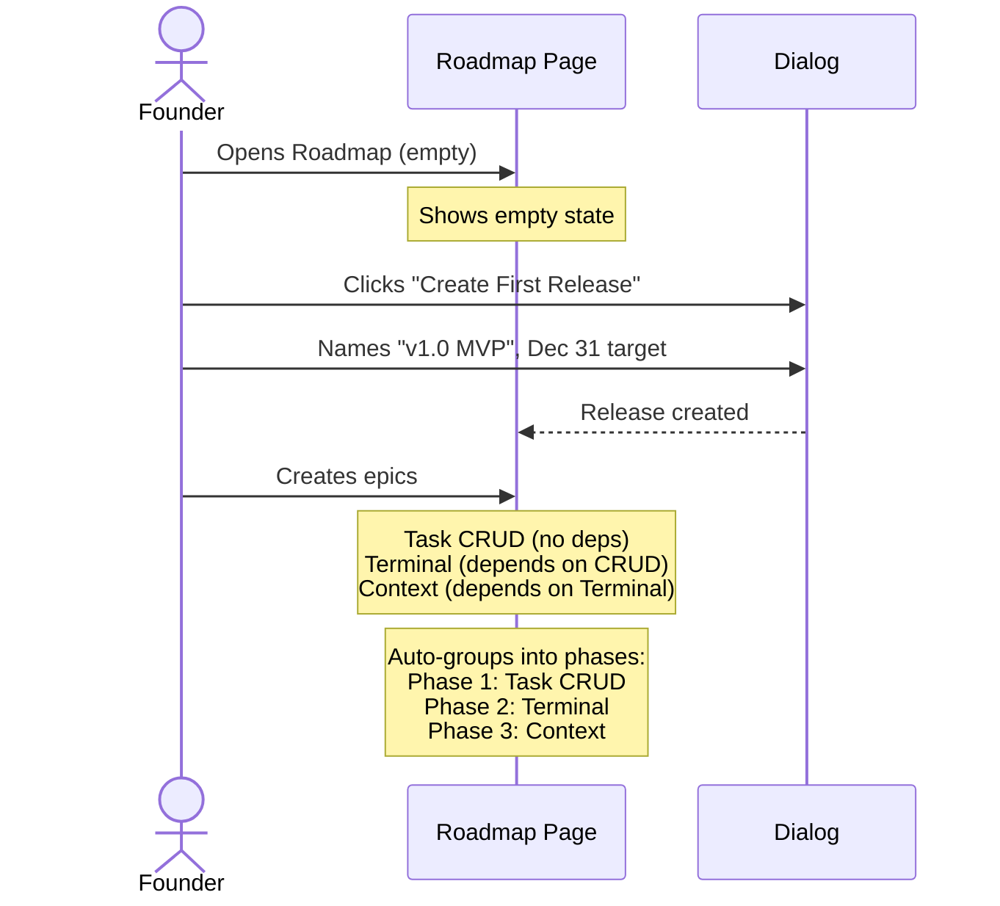
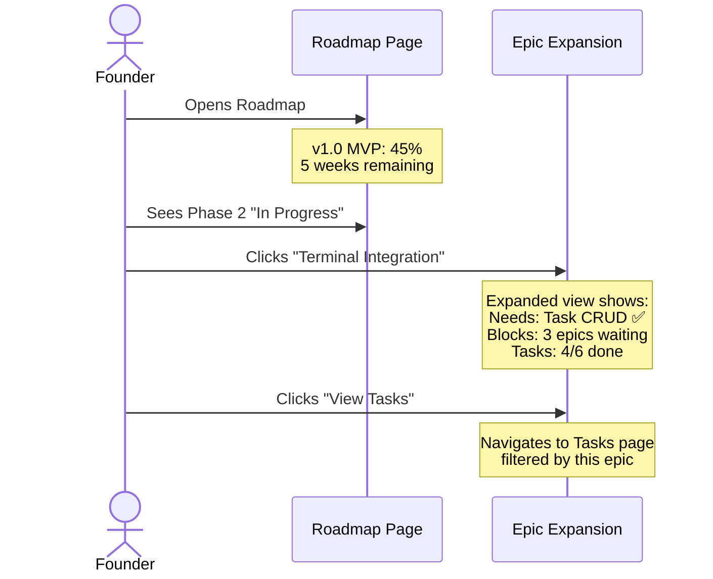
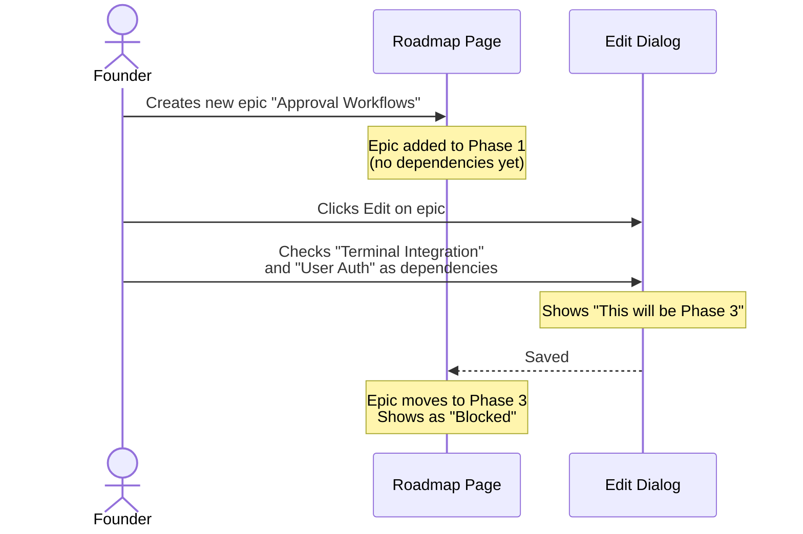

# PRD: Epic & Roadmap Page Redesign

## Executive Summary

Transform the flat Epic list into a strategic roadmap view that helps startup founders visualize their path to release. Uses **phase-based grouping** derived from epic dependencies to show execution order.

**Problem:** Current Epics page is a flat list without hierarchy, dependencies, or timeline. Founders can't see what needs to be done first or track progress toward release.

**Solution:** Rename "Epics" → "Roadmap" in navigation. Add releases, dependencies, and auto-calculated phases. Keep UI simple with collapsible list view.

---

## Table of Contents

1. [Design Decisions](#design-decisions)
2. [Data Model](#data-model)
3. [Wireframes](#wireframes)
4. [User Journeys](#user-journeys)
5. [Implementation Phases](#implementation-phases)

---

## Design Decisions

### Navigation: Rename Epics → Roadmap

No new tab. Transform existing Epics page:

```
Current                    Proposed
───────────────           ───────────────
📋 Board                  📋 Board
📝 Tasks                  📝 Tasks
🎯 Epics  ──────────────► 🗺️ Roadmap
📁 Files                  📁 Files
⚙️ Settings               ⚙️ Settings
```

**Rationale:** Epics don't exist in isolation—they're always part of a bigger picture. "Roadmap" is what founders actually think about.

### View: Phase-Based List (Not Graph)

Auto-group epics by **dependency depth** (phase):

```
Phase 1: Epics with no dependencies (can start immediately)
Phase 2: Epics that depend only on Phase 1 epics
Phase 3: Epics that depend on Phase 2 epics
...
```

**Why not a graph view?**
- Graphs get cluttered with many epics
- List scales better with collapsible phases
- Dependency details shown on-demand via inline expansion

### Hierarchy: Simplified for MVP

Skip "Initiatives" layer for MVP. Just:

```
Release (v1.0 MVP, target date)
  └── Epic (with dependencies)
       └── Tasks
```

Initiatives can be added later if needed for larger teams.

---

## Data Model

### New Table: Releases

```sql
CREATE TABLE releases (
    id INTEGER PRIMARY KEY,
    project_id INTEGER NOT NULL,
    name TEXT NOT NULL,              -- "v1.0 MVP"
    target_date DATE,                -- "2024-12-31"
    status TEXT DEFAULT 'planned',   -- planned, in_progress, released
    description TEXT,
    created_at DATETIME DEFAULT CURRENT_TIMESTAMP,
    FOREIGN KEY (project_id) REFERENCES projects(id)
);
```

### Epic Changes

```sql
-- Add to epics table
ALTER TABLE epics ADD COLUMN release_id INTEGER REFERENCES releases(id);
ALTER TABLE epics ADD COLUMN depends_on TEXT;  -- JSON array: "[1, 3]"
ALTER TABLE epics ADD COLUMN target_date DATE;
```

### Phase Calculation (Computed)

```typescript
function calculatePhase(epic: Epic, allEpics: Epic[]): number {
  const deps = epic.dependsOn || [];
  if (deps.length === 0) return 1;

  const depPhases = deps.map(depId => {
    const dep = allEpics.find(e => e.id === depId);
    return dep ? calculatePhase(dep, allEpics) : 0;
  });

  return Math.max(...depPhases) + 1;
}
```

### Progress Roll-up

```
Epic Progress    = Completed Tasks / Total Tasks
Release Progress = Sum(Epic Progress) / Epic Count
```

---

## Wireframes

### 1. Roadmap Overview (Default View)

Clean list with collapsible phase grouping:

```
┌─────────────────────────────────────────────────────────────────┐
│ Roadmap                                    [Filter ▼] [+ Epic]  │
├─────────────────────────────────────────────────────────────────┤
│                                                                 │
│ v1.0 MVP                                   ████████░░ 45%       │
│ Target: Dec 31, 2024                       5 weeks remaining    │
│                                                                 │
│ ┌─────────────────────────────────────────────────────────────┐ │
│ │ ▼ Phase 1 · Ready to Start                          2/2 ✅  │ │
│ ├─────────────────────────────────────────────────────────────┤ │
│ │   ✅ Task CRUD & Board                              100%    │ │
│ │   ✅ User Authentication                            100%    │ │
│ └─────────────────────────────────────────────────────────────┘ │
│                                                                 │
│ ┌─────────────────────────────────────────────────────────────┐ │
│ │ ▼ Phase 2 · In Progress                             1/2     │ │
│ ├─────────────────────────────────────────────────────────────┤ │
│ │   🔄 Terminal Integration                            66%    │ │
│ │   📋 API Refactoring                                  0%    │ │
│ └─────────────────────────────────────────────────────────────┘ │
│                                                                 │
│ ┌─────────────────────────────────────────────────────────────┐ │
│ │ ▶ Phase 3 · Blocked                                  0/4    │ │
│ └─────────────────────────────────────────────────────────────┘ │
│                                                                 │
│ ┌─────────────────────────────────────────────────────────────┐ │
│ │ ▶ Phase 4 · Blocked                                  0/2    │ │
│ └─────────────────────────────────────────────────────────────┘ │
│                                                                 │
│ ┌─────────────────────────────────────────────────────────────┐ │
│ │ ▶ Backlog · No Release Assigned                      3      │ │
│ └─────────────────────────────────────────────────────────────┘ │
│                                                                 │
└─────────────────────────────────────────────────────────────────┘
```

**Key behaviors:**
- Phases auto-calculated from dependencies
- Later phases collapsed by default (blocked anyway)
- "Backlog" section for epics not assigned to a release

### 2. Epic Row with Inline Dependency Expansion

Click epic to expand and see dependencies:

```
┌─────────────────────────────────────────────────────────────────┐
│ ▼ Phase 2 · In Progress                               1/2      │
├─────────────────────────────────────────────────────────────────┤
│                                                                 │
│   🔄 Terminal Integration                              66%      │
│   ┌─────────────────────────────────────────────────────────┐  │
│   │                                                         │  │
│   │  Needs (1):    ✅ Task CRUD & Board                     │  │
│   │                                                         │  │
│   │  Blocks (3):   📋 Task Detail Redesign                  │  │
│   │                ⏸️ Context Injection                      │  │
│   │                ⏸️ Approval Workflows                     │  │
│   │                                                         │  │
│   │  Tasks: 4/6 complete                                    │  │
│   │                                                         │  │
│   │  [View Tasks]  [Edit]                                   │  │
│   └─────────────────────────────────────────────────────────┘  │
│                                                                 │
│   📋 API Refactoring                                    0%      │
│                                                                 │
└─────────────────────────────────────────────────────────────────┘
```

**Dependency indicators:**
- `← Needs` = What must complete BEFORE this epic can start
- `Blocks →` = What's WAITING on this epic
- ✅ = Dependency satisfied
- ⏳ = Dependency pending

### 3. Create/Edit Epic with Dependencies

```
┌────────────────────────────────────────────────────────────────┐
│ Edit Epic                                                  ✕   │
├────────────────────────────────────────────────────────────────┤
│                                                                │
│ Title                                                          │
│ ┌────────────────────────────────────────────────────────────┐ │
│ │ Context Injection                                          │ │
│ └────────────────────────────────────────────────────────────┘ │
│                                                                │
│ Release                                                        │
│ ┌────────────────────────────────────────────────────────────┐ │
│ │ v1.0 MVP                                             ▼     │ │
│ └────────────────────────────────────────────────────────────┘ │
│                                                                │
│ Depends On (must finish before this can start)                 │
│ ┌────────────────────────────────────────────────────────────┐ │
│ │ ☑ Terminal Integration                                     │ │
│ │ ☑ Task Detail Redesign                                     │ │
│ │ ☐ Task CRUD & Board                                        │ │
│ │ ☐ API Refactoring                                          │ │
│ └────────────────────────────────────────────────────────────┘ │
│                                                                │
│ ⚠️ This will be Phase 3 (based on dependencies)                │
│                                                                │
│ Target Date (optional)                                         │
│ ┌────────────────────────────────────────────────────────────┐ │
│ │ November 30, 2024                                   📅     │ │
│ └────────────────────────────────────────────────────────────┘ │
│                                                                │
│                                    [Cancel]  [Save]            │
└────────────────────────────────────────────────────────────────┘
```

### 4. Create Release Dialog

```
┌────────────────────────────────────────────────────────────────┐
│ Create Release                                             ✕   │
├────────────────────────────────────────────────────────────────┤
│                                                                │
│ Name                                                           │
│ ┌────────────────────────────────────────────────────────────┐ │
│ │ v1.0 MVP                                                   │ │
│ └────────────────────────────────────────────────────────────┘ │
│                                                                │
│ Target Date                                                    │
│ ┌────────────────────────────────────────────────────────────┐ │
│ │ December 31, 2024                                   📅     │ │
│ └────────────────────────────────────────────────────────────┘ │
│                                                                │
│ Description (optional)                                         │
│ ┌────────────────────────────────────────────────────────────┐ │
│ │ First public release with core features.                   │ │
│ └────────────────────────────────────────────────────────────┘ │
│                                                                │
│                              [Cancel]  [Create Release]        │
└────────────────────────────────────────────────────────────────┘
```

### 5. Empty State

```
┌─────────────────────────────────────────────────────────────────┐
│ Roadmap                                                         │
├─────────────────────────────────────────────────────────────────┤
│                                                                 │
│                                                                 │
│                            🗺️                                   │
│                                                                 │
│                    No releases yet                              │
│                                                                 │
│         Create a release to start planning your roadmap.        │
│         A release is a milestone like "v1.0 MVP" with           │
│         a target date and collection of epics.                  │
│                                                                 │
│                    [Create First Release]                       │
│                                                                 │
│                                                                 │
└─────────────────────────────────────────────────────────────────┘
```

### 6. With Filters (Many Epics)

```
┌─────────────────────────────────────────────────────────────────┐
│ Roadmap                                                         │
├─────────────────────────────────────────────────────────────────┤
│                                                                 │
│ [All Releases ▼]  [All Status ▼]  [🔍 Search epics...]         │
│                                                                 │
│ Showing 8 of 24 epics                                           │
│                                                                 │
│ v1.0 MVP                                   ████████░░ 45%       │
│ ...                                                             │
└─────────────────────────────────────────────────────────────────┘
```

---

## Scaling Strategy

| # of Epics | UI Behavior |
|------------|-------------|
| 1-10 | All phases expanded |
| 10-20 | Later phases (blocked) collapsed by default |
| 20+ | Add filters + search, collapse all by default |

**Key principle:** Show just enough by default. Expand/filter to see details.

---

## User Journeys

### Journey 1: Founder Plans MVP Release



### Journey 2: Checking Progress



### Journey 3: Adding Dependencies



---

## Implementation Phases

### Phase 1: Data Model (3-4 days)
- [ ] Create `releases` table migration
- [ ] Add `release_id`, `depends_on`, `target_date` to epics
- [ ] API endpoints: CRUD for releases
- [ ] API: Update epic endpoints for new fields
- [ ] Update OpenAPI spec and regenerate client

### Phase 2: Roadmap View (4-5 days)
- [ ] Rename "Epics" → "Roadmap" in navigation
- [ ] Release header with progress bar
- [ ] Phase grouping logic (computed from dependencies)
- [ ] Collapsible phase sections
- [ ] Epic list within phases
- [ ] Create Release dialog

### Phase 3: Dependencies (3-4 days)
- [ ] Dependency multi-select in epic edit
- [ ] Inline expansion showing Needs/Blocks
- [ ] Phase preview when editing dependencies
- [ ] Circular dependency detection/prevention

### Phase 4: Polish (2-3 days)
- [ ] Empty states
- [ ] Loading states
- [ ] Filters (release, status, search)
- [ ] "Backlog" section for unassigned epics

---

## MVP vs Future

### MVP (This Release)

| Feature | Description |
|---------|-------------|
| Release creation | Name + target date |
| Phase-based grouping | Auto-calculated from dependencies |
| Epic dependencies | "Depends on" field with multi-select |
| Inline expansion | See Needs/Blocks on click |
| Progress roll-up | Release % from epic completion |

### Future Enhancements

| Feature | Description |
|---------|-------------|
| Timeline view | Gantt-style horizontal bars |
| Initiatives | Group epics by theme within release |
| Drag-drop reorder | Manual phase/priority override |
| Critical path | Highlight longest dependency chain |
| Export | PNG/PDF for stakeholders |

---

## Success Metrics

| Metric | Target |
|--------|--------|
| Time to create release + first epic | < 2 minutes |
| Understand "what's next" | Within 5 seconds |
| Set up dependencies for 5 epics | < 3 minutes |
| Clicks to see epic's blockers | 1 click |

---

## Open Questions

1. **Circular dependencies** - Just prevent, or show warning and allow?
2. **Manual phase override** - Allow dragging epic to different phase?
3. **Multiple releases** - Show one at a time or all together?
4. **Release completion** - Auto-mark "released" when 100%, or manual?
