# PRD: Task Detail Page Redesign

**Version:** 1.0 | **Date:** 2025-01-25 | **Status:** Draft

---

## Table of Contents

1. [Executive Summary](#executive-summary)
2. [AI-First Design Philosophy](#ai-first-design-philosophy)
3. [User Personas](#user-personas)
4. [Definition of Ready (DoR)](#definition-of-ready-dor)
5. [Epic Design](#epic-design)
6. [Task Assignment Model](#task-assignment-model)
7. [UI ↔ Terminal Synchronization](#ui--terminal-synchronization)
8. [User Journeys](#user-journeys)
   - [Journey 1: PM Defines → Agent Executes → Developer Reviews](#journey-1-pm-defines-task--agent-executes--developer-reviews)
   - [Journey 2: Agent Hits Blocker → Human Unblocks](#journey-2-agent-hits-blocker--human-unblocks)
   - [Journey 3: Multi-Task Epic with Chain Outputs](#journey-3-multi-task-epic-flow-with-chain-outputs)
9. [Wireframes](#wireframes)
   - [Task States](#1-task-in-backlog-not-ready) (Backlog, Ready, Running, Needs Input, PR Created)
   - [Epic Overview](#6-epic-overview-page)
10. [Chain Outputs](#chain-outputs)
11. [Implementation Phases](#implementation-phases)
12. [Success Metrics](#success-metrics)
13. [Open Questions](#open-questions)

---

## Executive Summary

Redesign the Task Detail page for **AI-first development** with clear task readiness, role-appropriate context, and seamless agent integration.

**Core Problems:**
1. Disconnected "Agent Controls" and "Open in Terminal"
2. No visibility into task readiness
3. Missing context for AI agents (acceptance criteria, scope, dependencies)
4. Hidden metadata (timestamps, progress, history)

---

## AI-First Design Philosophy


### AI Context Requirements

| Element | Purpose | Format |
|---------|---------|--------|
| Title + Description | What and why | Markdown |
| Acceptance Criteria | Verifiable success conditions | Checklist, testable |
| Scope Boundaries | What NOT to do | Explicit exclusions |
| Dependencies | Prior work context | Chain outputs from completed tasks |
| Approval Gates | When to pause | Checkpoint definitions |

---

## User Personas

| Persona | Key Needs |
|---------|-----------|
| **Developer** | Acceptance criteria, technical context, dependencies, repository location |
| **Product Manager** | Task readiness score, progress tracking, blockers, time estimates |
| **QA Engineer** | File changes, test criteria, PR status, before/after diffs |
| **AI Agent** | Structured context, scope boundaries, approval requirements |

---

## Definition of Ready (DoR)

Tasks must meet readiness criteria before execution:

| Criterion | Required |
|-----------|----------|
| Clear title | ✓ |
| Description (what + why) | ✓ |
| Acceptance criteria | ✓ |
| Dependencies resolved | ✓ |
| Repository assigned | ✓ |
| Estimate provided | Recommended |
| Assignee designated | For "Ready" status |

**Readiness Score:** Visual indicator (0-100%) based on criteria completion.

---

## Epic Design

```mermaid
flowchart TB
    Initiative["🎯 Initiative<br/>(6-12 months)"]
    Epic["📦 Epic<br/>(2-8 weeks, with PRD)"]
    Task1["📋 Task 1"]
    Task2["📋 Task 2"]
    Task3["📋 Task 3"]

    Initiative --> Epic
    Epic --> Task1
    Epic --> Task2
    Epic --> Task3
```



### Epic as Lightweight PRD

Epics provide strategic context that flows down to tasks:

| Section | Content |
|---------|---------|
| Problem Statement | Why we're building this |
| Business Value | Impact and priority |
| Success Metrics | Measurable outcomes |
| Scope | In-scope and out-of-scope |
| Task Breakdown | Sequenced with dependencies |
| Technical Notes | Architecture decisions |

### Context Inheritance


---

## Task Assignment Model

### Owner + Executor Model

```mermaid
flowchart LR
    subgraph Owner["👤 Owner (Human)"]
        O1[Accountable]
        O2[Reviews & Approves]
        O3[Merges Result]
    end

    subgraph Executor["Executor"]
        H["👤 Human Dev"]
        A["🤖 Agent"]
    end

    Owner --> Executor
```



| Role | Responsibility |
|------|----------------|
| **Owner** | Accountable for quality, reviews work, approves PRs. Always human. |
| **Executor** | Does the work. Can be human developer OR AI agent. |

### Agent Types

| Agent | Best For |
|-------|----------|
| `backend-dev` | API endpoints, databases, Node.js |
| `frontend-dev` | React, TypeScript, UI components |
| `fullstack-dev` | End-to-end features |
| `test-writer` | Unit and integration tests |

---

## UI ↔ Terminal Synchronization

**Problem:** Terminal is source of truth, but UI must reflect state without misleading users.

**Solution:** Use [Claude Code Hooks](https://code.claude.com/docs/en/hooks) for reliable event-driven state sync.


### Hook Configuration

Configure in `.claude/settings.json` per task worktree:

```json
{
  "hooks": {
    "PostToolUse": [{
      "matcher": "*",
      "hooks": [{ "type": "command", "command": "curl -X POST $SPECFLUX_API/agent-events -d '{\"event\":\"tool\",\"tool\":\"$TOOL_NAME\"}'" }]
    }],
    "Notification": [{
      "matcher": "*",
      "hooks": [{ "type": "command", "command": "curl -X POST $SPECFLUX_API/agent-events -d '{\"event\":\"notification\",\"type\":\"$NOTIFICATION_TYPE\"}'" }]
    }],
    "Stop": [{
      "matcher": "*",
      "hooks": [{ "type": "command", "command": "curl -X POST $SPECFLUX_API/agent-events -d '{\"event\":\"stopped\"}'" }]
    }]
  }
}
```

### Design Principles

1. **Terminal is primary** — Don't duplicate interaction in UI
2. **UI shows state, not controls** — Status display only
3. **Honest uncertainty** — Show "Check Terminal" rather than wrong status
4. **Direct to terminal** — Clear CTAs when action needed

### State Detection

| State | Detection | UI Display |
|-------|-----------|------------|
| Running | Process alive + recent output | `● Running` |
| Needs Input | Question pattern detected | `⚠️ Input Needed` + flash tab |
| Uncertain | No output for 30s | `○ Check Terminal` |
| Error | Error pattern / exit code | `✗ Error` |
| Complete | Success pattern / PR created | `✓ Done` |

### Terminal Tab Indicators

| State | Indicator |
|-------|-----------|
| Normal | `[Terminal]` |
| Running | `[Terminal ●]` green dot |
| Needs Input | `[Terminal ⚠️]` pulsing orange |
| Error | `[Terminal ✗]` red |
| Done | `[Terminal ✓]` green |

---

## User Journeys

### Journey 1: PM Defines Task → Agent Executes → Developer Reviews

A realistic end-to-end flow for AI-assisted task completion.

```mermaid
sequenceDiagram
    participant PM as 👤 PM (Sarah)
    participant UI as SpecFlux UI
    participant Agent as 🤖 Agent
    participant Dev as 👤 Developer (Alex)

    Note over PM,Dev: Phase 1: Task Definition
    PM->>UI: Creates task "Add rate limiting to API"
    PM->>UI: Writes description + acceptance criteria
    PM->>UI: Sets scope (in/out), links PRD
    UI-->>UI: Readiness: 60% (missing assignee)
    PM->>UI: Assigns Alex as owner, backend-dev as executor
    UI-->>UI: Readiness: 100% ✓

    Note over PM,Dev: Phase 2: Agent Execution
    Dev->>UI: Reviews task, clicks "Start Agent"
    UI->>Agent: Injects context (desc, criteria, deps, scope)
    Agent->>UI: Hook: SessionStart
    Agent-->>UI: Status: ● Running
    Agent->>Agent: Reads existing code
    Agent->>UI: Hook: PostToolUse (Read)
    Agent->>Agent: Creates rate-limit middleware
    Agent->>UI: Hook: PostToolUse (Write)
    Agent->>UI: Hook: Notification (needs input)
    UI-->>Dev: ⚠️ "Redis or in-memory for rate limit store?"
    Dev->>Agent: "Use Redis, we have it in prod"
    Agent->>Agent: Implements Redis-based limiter
    Agent->>Agent: Writes tests
    Agent->>UI: Hook: Stop (completed)
    UI-->>UI: Status: ✓ Done

    Note over PM,Dev: Phase 3: Human Review
    Dev->>UI: Reviews file changes in Files tab
    Dev->>UI: Checks test results (8/8 passing)
    Dev->>UI: Approves → Agent creates PR
    Dev->>UI: Merges PR
    UI-->>UI: Task → Done, generates chain output
```



**Key Interactions:**
1. PM ensures task is "Ready" before agent starts
2. Agent asks clarifying question via Notification hook
3. Developer answers in terminal, agent continues
4. Human reviews before PR merge

---

### Journey 2: Agent Hits Blocker → Human Unblocks

When AI encounters ambiguity or missing context.


**Key Insight:** Agent surfaces blockers early rather than guessing. Human provides decisions, agent executes.

---

### Journey 3: Multi-Task Epic Flow with Chain Outputs

How context flows between dependent tasks.

```mermaid
sequenceDiagram
    participant PM as 👤 PM
    participant Agent1 as 🤖 Agent (Task 1)
    participant Agent2 as 🤖 Agent (Task 2)
    participant Agent3 as 🤖 Agent (Task 3)

    Note over PM,Agent3: Epic: User Authentication

    PM->>Agent1: Start "Create user table schema"
    Agent1->>Agent1: Creates migration, schema types
    Agent1-->>PM: ✓ Done
    Note right of Agent1: Chain Output:<br/>- users table (id, email, hash)<br/>- TypeScript types exported

    PM->>Agent2: Start "Implement login endpoint"
    Note left of Agent2: Receives chain output from Task 1
    Agent2->>Agent2: Reads schema from Task 1 output
    Agent2->>Agent2: Implements POST /auth/login
    Agent2-->>PM: ✓ Done
    Note right of Agent2: Chain Output:<br/>- JWT service at src/auth/jwt.ts<br/>- Login returns {token, expiresIn}

    PM->>Agent3: Start "Add auth middleware"
    Note left of Agent3: Receives chain outputs from Task 1 & 2
    Agent3->>Agent3: Uses JWT service from Task 2
    Agent3->>Agent3: Protects /api/* routes
    Agent3-->>PM: ✓ Done
```



**Key Insight:** Each task's chain output becomes context for downstream tasks. Agent doesn't start from scratch.

---

## Wireframes

### 1. Task in Backlog (Not Ready)

```
┌────────────────────────────────────────────────────────────────┐
│ ← Board                                         [Edit] [⋮]     │
├────────────────────────────────────────────────────────────────┤
│ #43 Add password reset flow                                    │
│ [Backlog ▾]  Epic: Auth  Priority: Medium  👤 Unassigned      │
│                                                                │
│ ⚠️ NOT READY   ████░░░░░░ 40%                                  │
├────────────────────────────────────────────────────────────────┤
│ DEFINITION OF READY                                            │
│ ┌────────────────────────────────────────────────────────────┐ │
│ │ ✓ Title is clear                                           │ │
│ │ ✓ Description provided                                     │ │
│ │ ✗ Acceptance criteria missing              [+ Add]         │ │
│ │ ⏳ Dependency #42 not complete                              │ │
│ │ ✓ Repository assigned                                      │ │
│ │ ✗ No executor assigned                     [+ Assign]      │ │
│ └────────────────────────────────────────────────────────────┘ │
│                                                                │
│              [ Cannot Start - Requirements Missing ]           │
└────────────────────────────────────────────────────────────────┘
```

---

### 2. Task Ready for Execution

```
┌────────────────────────────────────────────────────────────────┐
│ ← Board                                         [Edit] [⋮]     │
├────────────────────────────────────────────────────────────────┤
│ #42 Implement JWT authentication                               │
│ [Ready ▾]  Epic: Auth  Priority: High                         │
│                                                                │
│ ✓ READY       ██████████ 100%                                 │
├────────────────────────────────────────────────────────────────┤
│                                                    │ SIDEBAR   │
│ [Overview] [Context] [Activity]                   │           │
│ ─────────────────────────────────────────────────  │ Owner     │
│                                                    │ 👤 Alex   │
│ ## Description                                     │           │
│ Implement JWT-based authentication for the API.   │ Executor  │
│ Users authenticate via POST /auth/login...        │ 🤖 backend │
│                                                    │           │
│ ## Acceptance Criteria                             │ Deps      │
│ ☐ POST /auth/login returns JWT token              │ ✓ #40     │
│ ☐ Token expires after 24 hours                    │ ✓ #41     │
│ ☐ Protected routes return 401 without token       │           │
│ ☐ Refresh token flow implemented                  │           │
│                                                    │           │
├────────────────────────────────────────────────────────────────┤
│ No terminal session.            [ Open in Terminal ]           │
└────────────────────────────────────────────────────────────────┘
```

---

### 3. Agent Running

```
┌────────────────────────────────────────────────────────────────┐
│ ← Board                                         [Edit] [⋮]     │
├────────────────────────────────────────────────────────────────┤
│ #42 Implement JWT authentication                               │
│ [In Progress ▾]  Epic: Auth  Priority: High                   │
│                                                                │
│ Owner: 👤 Alex    Executor: 🤖 backend-dev                     │
├────────────────────────────────────────────────────────────────┤
│                                                    │ SIDEBAR   │
│ [Overview] [Context] [Activity]                   │           │
│ ─────────────────────────────────────────────────  │ Deps      │
│                                                    │ ✓ #40     │
│ ## Description                                     │ ✓ #41     │
│ Implement JWT-based authentication for the API.   │           │
│                                                    │ PR        │
│ ## Acceptance Criteria                             │ None yet  │
│ ☐ POST /auth/login returns JWT token              │           │
│ ☐ Token expires after 24 hours                    │           │
│ ☐ Protected routes return 401 without token       │           │
│ ☐ Refresh token flow implemented                  │           │
│                                                    │           │
├────────────────────────────────────────────────────────────────┤
│ Terminal session active.        [ View Terminal ↓ ]            │
└────────────────────────────────────────────────────────────────┘
```

Note: Agent status (running/waiting/done) is shown in the terminal panel tab indicator.

---

### 4. Agent Needs Input

When agent needs input, the terminal tab pulses to get attention. The task detail page can optionally show a banner:

```
┌────────────────────────────────────────────────────────────────┐
│ ← Board                                         [Edit] [⋮]     │
├────────────────────────────────────────────────────────────────┤
│ #42 Implement JWT authentication                               │
│ [In Progress ▾]  Epic: Auth  Priority: High                   │
│                                                                │
│ Owner: 👤 Alex    Executor: 🤖 backend-dev                     │
├────────────────────────────────────────────────────────────────┤
│ ┌────────────────────────────────────────────────────────────┐ │
│ │ ⚠️ Agent is waiting for input     [ Go to Terminal ↓ ]    │ │
│ └────────────────────────────────────────────────────────────┘ │
│                                                    │ SIDEBAR   │
│ [Overview] [Context] [Activity]                   │           │
│ ─────────────────────────────────────────────────  │ Deps      │
│                                                    │ ✓ #40     │
│ ## Description                                     │ ✓ #41     │
│ ...                                                │           │
└────────────────────────────────────────────────────────────────┘
```

Note: The terminal panel tab shows `[#42 ⚠️]` with pulsing indicator.

---

### 5. Task with PR Created

After agent creates a PR, the task shows a link to review on GitHub:

```
┌────────────────────────────────────────────────────────────────┐
│ ← Board                                         [Edit] [⋮]     │
├────────────────────────────────────────────────────────────────┤
│ #42 Implement JWT authentication                               │
│ [In Progress ▾]  Epic: Auth  Priority: High                   │
│                                                                │
│ Owner: 👤 Alex    Executor: 🤖 backend-dev                     │
├────────────────────────────────────────────────────────────────┤
│                                                    │ SIDEBAR   │
│ [Overview] [Context] [Activity]                   │           │
│ ─────────────────────────────────────────────────  │ Deps      │
│                                                    │ ✓ #40     │
│ ## Description                                     │ ✓ #41     │
│ Implement JWT-based authentication for the API.   │           │
│                                                    │ PR        │
│ ## Acceptance Criteria                             │ #123 ↗    │
│ ☐ POST /auth/login returns JWT token              │           │
│ ☐ Token expires after 24 hours                    │           │
│ ☐ Protected routes return 401 without token       │           │
│ ☐ Refresh token flow implemented                  │           │
│                                                    │           │
├────────────────────────────────────────────────────────────────┤
│ PR created.                     [ Review on GitHub ↗ ]         │
└────────────────────────────────────────────────────────────────┘
```

**MVP Flow:** Review and merge happens on GitHub. When PR is merged, task can be marked "Done".

---

### 6. Epic Overview Page

```
┌────────────────────────────────────────────────────────────────┐
│ ← Epics                                         [Edit] [⋮]     │
├────────────────────────────────────────────────────────────────┤
│ EPIC #5: User Authentication System                            │
│ [Active ▾]   Priority: Critical   Target: Jan 29               │
│                                                                │
│ PROGRESS ████████████░░░░ 75%    4 of 5 tasks done            │
├────────────────────────────────────────────────────────────────┤
│ [Overview] [Tasks] [PRD] [Activity]                            │
│ ─────────────────────────────────────────────────────────────  │
│                                                                │
│ ## Problem Statement                                           │
│ API has no authentication, blocking production deployment.     │
│                                                                │
│ ## Success Metrics                                             │
│ ┌─────────────────────────────────────────────────────────┐   │
│ │ Metric              │ Target    │ Current  │ Status    │   │
│ │ Auth coverage       │ 100%      │ 100%     │ ✓         │   │
│ │ Latency (p99)       │ <50ms     │ 32ms     │ ✓         │   │
│ │ Refresh success     │ >99.9%    │ --       │ Pending   │   │
│ └─────────────────────────────────────────────────────────┘   │
│                                                                │
│ ## Task Progress                                               │
│ ✓ #40  DB Schema          Done        Jan 16                  │
│ ✓ #41  Route structure    Done        Jan 17                  │
│ ✓ #42  JWT auth           Done        Jan 19                  │
│ ✓ #43  Auth middleware    Done        Jan 20                  │
│ ● #44  Integration tests  In Progress 🤖 Running              │
│                                                                │
└────────────────────────────────────────────────────────────────┘
```

---

### Tab Definitions (MVP)

| Tab | Content | Primary User |
|-----|---------|--------------|
| Overview | Description, acceptance criteria | Everyone |
| Context | Dependencies, chain outputs from upstream tasks | Developer, Agent |
| Activity | Comments, status changes, history | PM, QA |

**Not in MVP:**
- Files tab (use GitHub PR for code review)
- Agent tab (status shown in terminal panel)

---

## Chain Outputs

When tasks complete, they generate structured outputs for downstream tasks:

```mermaid
flowchart LR
    T1["#40 DB Schema<br/>✓ Done"]
    T2["#41 Routes<br/>✓ Done"]
    T3["#42 JWT Auth<br/>● In Progress"]

    T1 -->|"chain output:<br/>User table schema"| T3
    T2 -->|"chain output:<br/>Route patterns"| T3
```



**Chain Output Contents:**
- Summary of what was built
- Key decisions made
- Files created/modified
- Exposed interfaces for downstream

---

## Implementation Phases

| Phase | Scope |
|-------|-------|
| **1** | Header redesign, readiness score, DoR checklist |
| **2** | Tabbed interface, Overview + Context tabs |
| **3** | Agent tab, terminal state sync, attention indicators |
| **4** | Files tab, Activity tab, chain outputs |

---

## Success Metrics

| Metric | Target |
|--------|--------|
| Time to understand task context | < 30 seconds |
| Tasks started without full context | < 10% |
| Agent context loading errors | < 5% |
| User satisfaction (task detail UX) | > 4.0/5.0 |

---

## Open Questions

1. Mobile/narrow view behavior for tabs?
2. Keyboard shortcuts for navigation?
3. Real-time updates via WebSocket?
4. Role-based field permissions?

---

## References

- [Atlassian: Definition of Ready](https://www.atlassian.com/agile/project-management/definition-of-ready)
- [Evil Martians: Dev Tool UI Patterns](https://evilmartians.com/chronicles/keep-it-together-5-essential-design-patterns-for-dev-tool-uis)
- [Linear App](https://linear.app/features/plan)
