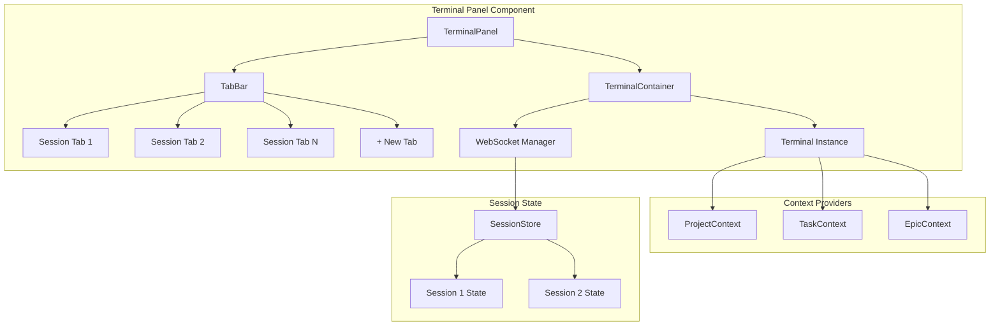
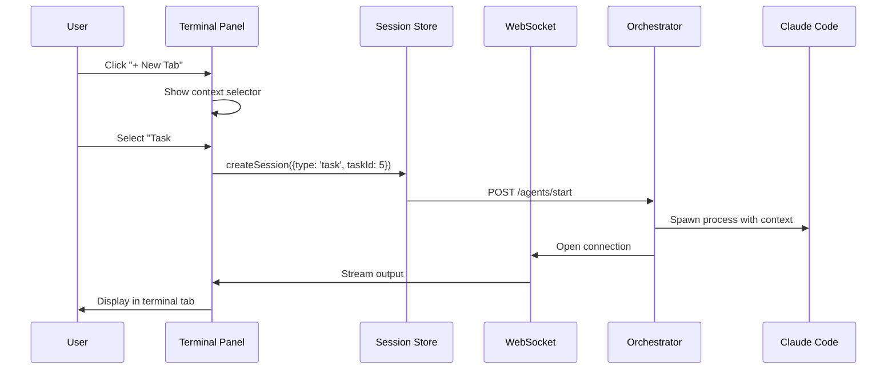
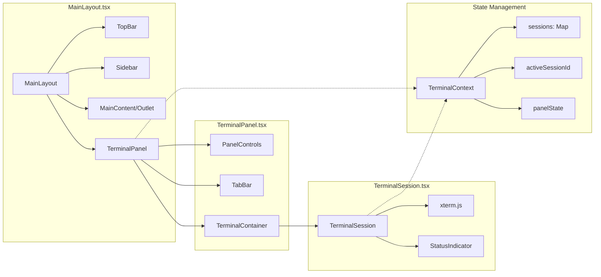

# PRD: Persistent Multi-Terminal Panel

## Overview

Redesign the Claude Code terminal from a task-scoped component embedded in TaskDetailPage to a persistent, multi-tab terminal panel accessible from anywhere in the app.

**Vision:** "Vibe coding is great, but you can't vibe code to production." SpecFlux bridges this gap by providing a structured environment where users can interact with Claude Code at any level - project, epic, or task - while maintaining production-level quality through specs, dependencies, and approval workflows.

## Problem Statement

### Current State
- Terminal is embedded in TaskDetailPage (right 2/3 panel)
- One terminal per task, only accessible when viewing that task
- Cannot interact with Claude from Board, Epics, or other pages
- No ability to run multiple agents in parallel
- Terminal disappears when navigating away from task

### User Pain Points
1. **Context Switching:** Must navigate to specific task to use Claude
2. **Limited Scope:** Can only work on one task at a time
3. **No Parallel Work:** Cannot monitor multiple agents simultaneously
4. **Lost Context:** Terminal state lost when leaving task page

## Solution

A VS Code-style integrated terminal panel that:
- Lives at the bottom of the app, always accessible
- Supports multiple tabs (parallel Claude sessions)
- Works in different context modes (Project, Task, Epic)
- Persists across page navigation

## User Stories

1. **As a developer**, I want to ask Claude questions while viewing the Kanban board, so I can get help without leaving my current view.

2. **As a PM**, I want to start multiple tasks in parallel and monitor their progress, so I can accelerate development.

3. **As a developer**, I want to right-click a task and "Open in Terminal", so I can quickly start working on it.

4. **As a user**, I want the terminal to remember my sessions, so I don't lose context when navigating.

## Wireframes

### Layout Overview

```
+------------------------------------------------------------------+
|  TopBar: Logo | Project Selector | Theme | Notifications  [Cmd+`] |
+--------+---------------------------------------------------------+
|        |                                                          |
|  Side  |  Main Content Area                                       |
|  bar   |  (Board / Tasks / Epics / Files / Settings)              |
|        |                                                          |
| Board  |  +----------------------------------------------------+  |
| Tasks  |  |                                                    |  |
| Epics  |  |  Page-specific content                             |  |
| Files  |  |  (varies by route)                                 |  |
| Settings|  |                                                    |  |
|        |  +----------------------------------------------------+  |
|        +----------------------------------------------------------+
|        | Terminal Panel                           [Resize][+][-][x]|
|        | [Session 1: Task #5] [Session 2: Project] [+New]          |
|        |-----------------------------------------------------------+
|        | $ claude "implement the feature"                          |
|        | Working on it...                                          |
|        |                                                           |
+--------+-----------------------------------------------------------+
```

### Terminal Panel States

```
COLLAPSED (minimized):
+------------------------------------------------------------------+
| [^] Terminal (2 active)                                    [+][-] |
+------------------------------------------------------------------+

EXPANDED (default):
+------------------------------------------------------------------+
| Terminal Panel                                    [Resize][+][-][x]|
| [Session 1: Task #5 *] [Session 2: Project] [+New]                 |
|-------------------------------------------------------------------|
| $ ...terminal output...                                            |
| (height: ~300px, resizable)                                        |
+------------------------------------------------------------------+

MAXIMIZED (fullscreen):
+------------------------------------------------------------------+
| Terminal Panel                                         [Restore][x]|
| [Session 1: Task #5 *] [Session 2: Project] [+New]                 |
|-------------------------------------------------------------------|
|                                                                    |
| $ ...terminal output...                                            |
| (full viewport height)                                             |
|                                                                    |
+------------------------------------------------------------------+
```

### New Session Dialog

```
+---------------------------------------+
|  New Terminal Session                 |
+---------------------------------------+
|                                       |
|  Context:                             |
|  ( ) Project - General development    |
|  ( ) Task - Work on specific task     |
|  ( ) Epic - Planning & review         |
|                                       |
|  [Select Task/Epic dropdown]          |
|                                       |
|  [Cancel]              [Create]       |
+---------------------------------------+
```

### Context Menu Integration

```
Board View - Right-click on Task Card:
+------------------------+
| View Details           |
| Edit Task              |
|------------------------|
| Open in Terminal  ->   |
| Start Agent            |
+------------------------+

Epic View - Actions:
+---------------------------+
| [Start Planning Session]  |  <- Opens terminal with epic context
+---------------------------+
```

## Information Architecture



## Data Flow



## Component Architecture



## Session State Model

```typescript
interface TerminalSession {
  id: string;
  type: 'project' | 'task' | 'epic';
  contextId?: number;        // taskId or epicId if applicable
  contextName: string;       // Display name for tab
  status: 'idle' | 'running' | 'completed' | 'error';
  wsConnection?: WebSocket;
  scrollback: string[];      // Preserved output history
  createdAt: Date;
}

interface TerminalPanelState {
  sessions: Map<string, TerminalSession>;
  activeSessionId: string | null;
  panelState: 'collapsed' | 'expanded' | 'maximized';
  panelHeight: number;       // For resizable panel
}
```

## Keyboard Shortcuts

| Shortcut | Action |
|----------|--------|
| `Cmd + `` | Toggle terminal panel |
| `Cmd + Shift + `` | Create new session |
| `Cmd + W` | Close active session |
| `Cmd + 1-9` | Switch to session 1-9 |
| `Cmd + Shift + [` | Previous session |
| `Cmd + Shift + ]` | Next session |

## Implementation Phases

### Phase 1: Extract Terminal to Bottom Panel
**Goal:** Move terminal from TaskDetailPage to a global panel in MainLayout

**Tasks:**
- Create TerminalPanel component with collapse/expand
- Create TerminalContext for state management
- Move existing Terminal component into panel
- Update TaskDetailPage to use panel instead of embedded terminal
- Add keyboard shortcut (Cmd+`) to toggle

**Acceptance Criteria:**
- Terminal panel visible at bottom of all pages
- Can collapse/expand panel
- Single session works as before

### Phase 2: Multi-Tab Support
**Goal:** Enable multiple concurrent Claude sessions

**Tasks:**
- Add TabBar component with session tabs
- Implement session creation/destruction
- Each tab maintains its own WebSocket connection
- Tab shows session name and status indicator
- Implement tab switching and keyboard shortcuts

**Acceptance Criteria:**
- Can create multiple terminal tabs
- Each tab is independent session
- Can switch between tabs
- Closing tab terminates session

### Phase 3: Context Modes
**Goal:** Support Project, Task, and Epic context modes

**Tasks:**
- Create NewSessionDialog with context selector
- Implement context injection for each mode
- Add "Open in Terminal" to task/epic context menus
- Pass appropriate context (CLAUDE.md, task description, PRD) to Claude

**Acceptance Criteria:**
- Can create session in any context mode
- Task context includes description, dependencies, chain outputs
- Epic context includes PRD and task list
- Right-click menu works on Board and list views

### Phase 4: Polish & Persistence
**Goal:** Production-ready experience

**Tasks:**
- Implement panel resize (drag divider)
- Add maximize/restore functionality
- Persist panel state across page navigation
- Save/restore session history on app restart
- Add session status indicators (running/idle/done)
- Terminal search functionality

**Acceptance Criteria:**
- Panel height persists
- Sessions survive page navigation
- Visual feedback for session status
- Can search terminal output

## Success Metrics

1. **Adoption:** % of users using terminal from non-task pages
2. **Parallel Usage:** Average concurrent sessions per user
3. **Efficiency:** Time to start working on a task (reduced clicks)
4. **Retention:** Session history preserved across navigation

## Risks & Mitigations

| Risk | Impact | Mitigation |
|------|--------|------------|
| Memory usage with many sessions | High | Limit max sessions, lazy-load terminal instances |
| WebSocket connection management | Medium | Connection pooling, graceful reconnection |
| Context conflicts | Medium | Clear visual indicators of which context is active |
| Learning curve | Low | Sensible defaults, tooltip hints |

## Open Questions

1. Should sessions auto-close when task is completed?
2. Maximum number of concurrent sessions?
3. Should we support "detaching" a session to a separate window?
4. Integration with notification system when background session completes?

## Appendix: Current vs Proposed

### Current Task Detail Page
```
+---------------------------+--------------------------------+
| Task Info (1/3)           | Terminal (2/3)                 |
| - Description             | Embedded, single instance      |
| - Dependencies            | Only available on this page    |
| - Status                  |                                |
| - Agent Controls          |                                |
+---------------------------+--------------------------------+
```

### Proposed Task Detail Page
```
+---------------------------+--------------------------------+
| Task Info (1/2)           | File Changes & Preview (1/2)   |
| - Description             | - Modified files list          |
| - Dependencies            | - Diff viewer                  |
| - Status                  | - PR creation                  |
+---------------------------+--------------------------------+
| Terminal Panel (Global)                           [Tabs]  |
| [Task #5] [Project] [+]                                   |
| $ ...                                                     |
+-----------------------------------------------------------+
```
