# Research: Building a Desktop App for Autonomous App Development

## Executive Summary

This document analyzes the autonomous coding agent pattern from Anthropic's engineering research and the `autonomous-coding` demo implementation. The goal is to design a general-purpose desktop application (macOS/Windows) that enables users to build applications through an autonomous multi-session AI agent workflow.

---

## Part 1: Process Analysis

### Core Problem Statement

AI agents face a fundamental challenge: **context window limitations**. A single session cannot build a complete application. The solution is a structured multi-session approach with:
1. Persistent progress tracking
2. Clear session handoffs
3. Incremental, verified feature completion

### The Two-Agent Pattern


### Session Lifecycle


### Progress Tracking Architecture


### Security Model


---

## Part 2: Key Failure Modes & Solutions

| Failure Mode | Problem | Solution |
|--------------|---------|----------|
| **Premature Victory** | Agent claims completion without verification | Comprehensive feature_list.json with mandatory browser testing |
| **Environmental Degradation** | Broken state between sessions | Git commits + progress file + regression testing |
| **Incomplete Marking** | Features marked done but broken | Screenshot verification + E2E browser automation |
| **Setup Confusion** | Agent doesn't know how to start | init.sh script created by initializer |
| **Context Exhaustion** | Mid-feature context overflow | One feature at a time + clean exit protocol |
| **Feature Drift** | Tests modified/removed | JSON format + strict "only change passes" rule |

---

## Part 3: Desktop App Architecture

### High-Level Architecture


### User Interface Components


### Session Management Flow


---

## Part 4: General-Purpose Tool Design

### Abstraction Layers

To make this a general-purpose tool, we need to abstract the domain-specific elements:


### Template System

```yaml
# Example: web-app-template.yaml
name: "Full-Stack Web Application"
description: "Next.js + Node.js web application"

prompts:
  initializer: "prompts/web/initializer.md"
  coding: "prompts/web/coding.md"

tools:
  allowed_commands:
    - npm
    - node
    - git
    - ls
    - cat
    # ... etc

  mcp_servers:
    - puppeteer  # Browser automation

verification:
  method: "browser"
  startup_command: "npm run dev"
  base_url: "http://localhost:3000"

feature_generation:
  min_features: 50
  max_features: 200
  categories:
    - functional
    - ui/ux
    - accessibility
    - performance
```

### Multi-Project Dashboard

```mermaid
flowchart TB
    subgraph "Dashboard View"
        subgraph "Project Cards"
            P1[Project 1<br/>E-commerce App<br/>75/200 features ✓<br/>🟢 Running]
            P2[Project 2<br/>Chat Application<br/>120/150 features ✓<br/>⏸️ Paused]
            P3[Project 3<br/>Portfolio Site<br/>50/50 features ✓<br/>✅ Complete]
        end

        subgraph "Actions"
            START[▶️ Start]
            PAUSE[⏸️ Pause]
            VIEW[👁️ View]
            EXPORT[📦 Export]
        end
    end

    P1 --> PAUSE
    P1 --> VIEW
    P2 --> START
    P2 --> VIEW
    P3 --> VIEW
    P3 --> EXPORT
```



---

## Part 5: Implementation Recommendations

### Technology Stack

| Component | Recommendation | Rationale |
|-----------|---------------|-----------|
| **Desktop Framework** | Tauri (Rust + Web) | Smaller bundle, better security, native performance |
| **Frontend** | React + TypeScript | Rich ecosystem, good for complex UIs |
| **State Management** | Zustand or Jotai | Simple, works well with React |
| **Terminal Emulation** | xterm.js | Battle-tested, good performance |
| **Browser Preview** | Embedded WebView | Native preview without external browser |
| **Agent SDK** | claude-code-sdk (Python) | Official SDK, spawn as subprocess |
| **IPC** | Tauri Commands | Type-safe Rust ↔ TypeScript communication |

### MVP Feature Set

1. **Project Creation**
   - Spec editor with markdown preview
   - Template selection (start with web app only)
   - Project directory configuration

2. **Session Management**
   - Start/pause/resume sessions
   - Auto-continue with configurable delay
   - Manual intervention capability

3. **Progress Visualization**
   - Feature list with pass/fail status
   - Progress bar and statistics
   - Session history timeline

4. **Live Output**
   - Terminal view of agent activity
   - Tool use visualization
   - Error highlighting

5. **App Preview**
   - Embedded browser for web apps
   - Auto-refresh on changes

### Security Considerations


---

## Part 6: Extensibility

### Plugin Architecture


### Future Enhancements

1. **Multi-Agent Specialization**
   - Separate QA agent for testing
   - Code review agent for quality
   - Documentation agent

2. **Collaboration Features**
   - Share projects
   - Export/import configurations
   - Team workspaces

3. **Learning & Adaptation**
   - Remember successful patterns
   - User feedback integration
   - Performance optimization over time

---

## Conclusion

The autonomous coding pattern from Anthropic's research provides a solid foundation for building a general-purpose app development tool. The key insights are:

1. **Structured Handoffs** - Persistent artifacts (feature_list.json, progress file, git) enable seamless session continuation
2. **Incremental Progress** - One feature at a time prevents context exhaustion
3. **Verification First** - Browser automation ensures features actually work
4. **Defense in Depth** - Multiple security layers protect the user's system

A desktop application can package these patterns into a user-friendly interface, allowing non-technical users to build applications by simply describing what they want. The template system enables expansion to different application types beyond web apps.

---

## References

- [Effective Harnesses for Long-Running Agents](https://www.anthropic.com/engineering/effective-harnesses-for-long-running-agents) - Anthropic Engineering Blog
- autonomous-coding demo in claude-quickstarts repository
- Claude Agent SDK documentation
