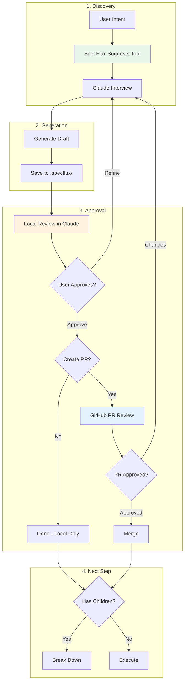
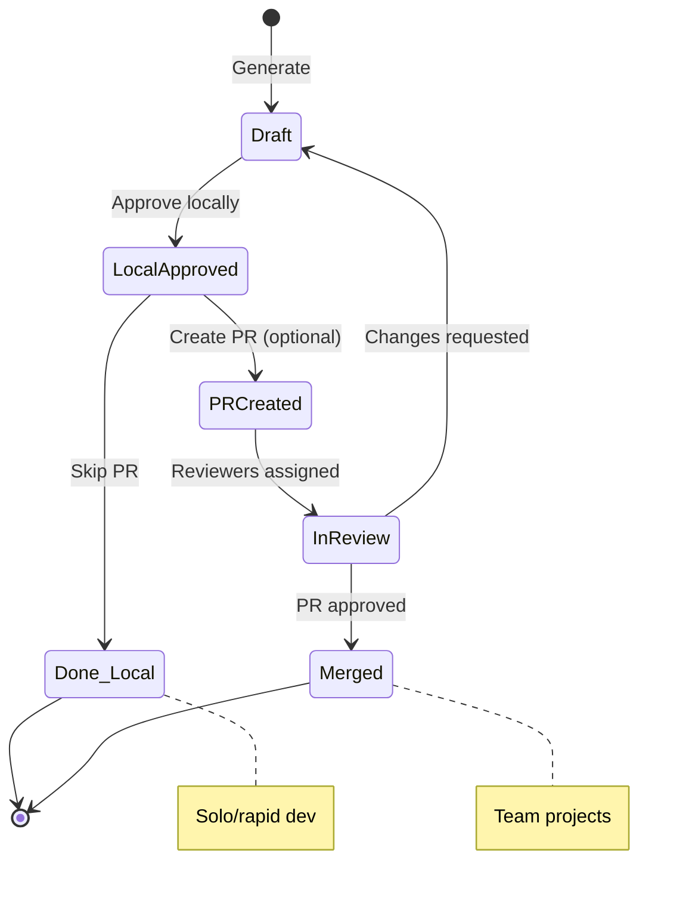
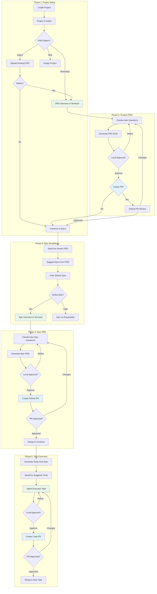
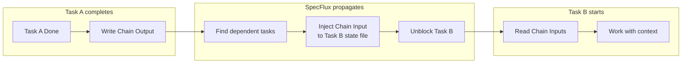

# Guided Spec Generation - Product Requirements Document

**Version:** 1.0
**Status:** Draft
**Date:** December 2024

---

## Table of Contents

1. [Vision](#1-vision)
2. [Problem Statement](#2-problem-statement)
3. [Core Workflow Pattern](#3-core-workflow-pattern)
4. [Tool Selection & Guidance](#4-tool-selection--guidance)
5. [Approval Workflow](#5-approval-workflow)
6. [User Journey Overview](#6-user-journey-overview)
7. [Detailed UX Flows](#7-detailed-ux-flows)
8. [File Structure & Conventions](#8-file-structure--conventions)
9. [Claude Code Integration](#9-claude-code-integration)
10. [UI Wireframes](#10-ui-wireframes)
11. [Data Model](#11-data-model)
12. [Implementation Phases](#12-implementation-phases)

---

## 1. Vision

**Transform SpecFlux from a Jira-like task tracker into a guided spec-driven development platform.**

The core insight: The magic of SpecFlux should happen in the **PRD generation phase**, not just task execution. Users should be guided from a vague idea to a detailed, structured specification through an interactive dialogue with Claude.

### The Fractal Nature of Specs

The same pattern applies at every level:

```
Product PRD → Epic PRD → Task Spec → Code
     ↓            ↓           ↓
  Interview    Interview   Interview
     ↓            ↓           ↓
  Document     Document    Document
     ↓            ↓           ↓
  Breakdown    Breakdown   Execute
```

Each level follows the same pattern:
1. **Discovery** - Claude asks questions to understand scope
2. **Generation** - Create document with right tool
3. **Approval** - Local approval + GitHub PR review
4. **Breakdown or Execute** - Identify children or write code

**Key Principle:** At every level, SpecFlux guides users to the right tool (agent, skill, MCP) to get the job done quickly with quality.

---

## 2. Problem Statement

### Current State

```
┌─────────────────────────────────────────────────────────────┐
│  ProjectCreateModal                                         │
├─────────────────────────────────────────────────────────────┤
│  Project Name: [________________]                           │
│  Local Path:   [________________]                           │
│                                                             │
│                          [Create Project]                   │
└─────────────────────────────────────────────────────────────┘
                              │
                              ▼
                    Project Created...
                         Now what?
```

**The Gap:** After project creation, users are dropped into an empty Jira-like board with no guidance on what to do next.

### Desired State

```
┌─────────────────────────────────────────────────────────────┐
│  New Project Created!                                       │
├─────────────────────────────────────────────────────────────┤
│                                                             │
│  Let's define what you're building.                         │
│                                                             │
│  ┌───────────────────────────────────────────────────────┐  │
│  │ 🤖 Claude is ready to help you create a product spec. │  │
│  │    This will guide the entire development process.    │  │
│  └───────────────────────────────────────────────────────┘  │
│                                                             │
│  [Start PRD Workshop →]   [Import Existing PRD →]           │
│                                                             │
│  Or skip for now and create PRDs later from the PRDs page.  │
│                                                             │
└─────────────────────────────────────────────────────────────┘
```

---

## 3. Core Workflow Pattern

Every artifact in SpecFlux (PRD, Epic, Design Doc, Task) follows the same workflow:



### Approval Options

| Stage | Purpose | Required? |
|-------|---------|-----------|
| **Local Approval** | Quick iteration with Claude, sanity check | Yes |
| **GitHub PR** | Team review, audit trail, async feedback | Optional (recommended for teams) |

**Local Approval:** Fast, interactive refinement with Claude. User can say "add more detail to section X" or "this feature should be out of scope." Once approved, spec is saved locally.

**GitHub PR (Optional):** Recommended for team projects. Provides visibility, formal review, and version history. Solo developers or rapid prototyping can skip this step.

---

## 4. Tool Selection & Guidance

SpecFlux guides users to the right tool for each task type. This is the core differentiator from "just using Claude Code."

### Tool Categories

| Category | Tools | Purpose |
|----------|-------|---------|
| **Agents** | `product-manager`, `backend-dev`, `frontend-dev`, `fullstack-dev` | Specialized Claude Code personas with domain expertise |
| **Skills** | `api-design`, `database-migrations`, `typescript-patterns`, `ui-patterns` | Reusable coding pattern guides injected as context |
| **MCP Servers** | `github`, `filesystem`, `playwright` | External integrations for PRs, file ops, browser testing |
| **Slash Commands** | `/prd`, `/epic`, `/design`, `/tasks` | Structured workflows for spec generation |

### Tool Selection Matrix

| Task Type | Primary Tool | Supporting Tools | Output |
|-----------|--------------|------------------|--------|
| **Product PRD** | `/prd` command | `product-manager` agent | `.specflux/prds/*.md` |
| **Epic PRD** | `/epic` command | `product-manager` agent | `.specflux/epics/*/epic.md` |
| **Design Doc** | `/design <type>` | Relevant skill | `.specflux/epics/*/docs/*.md` |
| **Backend Task** | `backend-dev` agent | `typescript-patterns`, `api-design` | Code + tests |
| **Frontend Task** | `frontend-dev` agent | `ui-patterns`, `typescript-patterns` | Code + tests |
| **Full-stack Task** | `fullstack-dev` agent | All relevant skills | Code + tests |

### Guidance UX

When user is about to start work, SpecFlux suggests the right tool:

```
┌─────────────────────────────────────────────────────────────┐
│  Task #101: Create user authentication API                  │
├─────────────────────────────────────────────────────────────┤
│                                                             │
│  🎯 Recommended Approach                                    │
│  ─────────────────────────────────────────────────────────  │
│                                                             │
│  Agent: backend-dev                                         │
│  ┌─────────────────────────────────────────────────────┐    │
│  │ Specialized for Node.js, TypeScript, Express.       │    │
│  │ Has context for REST API endpoints and testing.     │    │
│  └─────────────────────────────────────────────────────┘    │
│                                                             │
│  Skills to activate:                                        │
│  ☑ api-design         - REST endpoint patterns             │
│  ☑ typescript-patterns - Type safety, error handling       │
│  ☐ database-migrations - Only if schema changes needed     │
│                                                             │
│  Context injected:                                          │
│  • Epic PRD: Authentication                                 │
│  • Design Doc: backend-design.md                            │
│  • Chain inputs from Task #100 (if any)                     │
│                                                             │
│  [Start with Recommended Setup →]  [Customize...]           │
│                                                             │
└─────────────────────────────────────────────────────────────┘
```

### Smart Tool Selection Logic

```typescript
function suggestTools(task: Task, epic: Epic): ToolSuggestion {
  const suggestions: ToolSuggestion = {
    agent: null,
    skills: [],
    mcpServers: [],
    context: []
  };

  // Determine agent based on task type/labels
  if (task.labels.includes('backend') || task.title.match(/api|endpoint|database/i)) {
    suggestions.agent = 'backend-dev';
    suggestions.skills.push('api-design', 'typescript-patterns');
  } else if (task.labels.includes('frontend') || task.title.match(/ui|component|page/i)) {
    suggestions.agent = 'frontend-dev';
    suggestions.skills.push('ui-patterns', 'typescript-patterns');
  } else {
    suggestions.agent = 'fullstack-dev';
  }

  // Add database skill if schema-related
  if (task.title.match(/schema|migration|table/i)) {
    suggestions.skills.push('database-migrations');
  }

  // Inject relevant context
  if (epic.designDocs.backend) {
    suggestions.context.push(epic.designDocs.backend);
  }
  if (task.dependencies.length > 0) {
    suggestions.context.push(...getChainInputs(task.dependencies));
  }

  return suggestions;
}
```

---

## 5. Approval Workflow

### 5.1 Workflow States



### 5.2 Approval Flow by Artifact Type

| Artifact | Local Approval | GitHub PR | When to Use PR |
|----------|----------------|-----------|----------------|
| **Product PRD** | Required | Optional | Team projects, formal review |
| **Epic PRD** | Required | Optional | Team alignment needed |
| **Design Doc** | Required | Optional | Cross-team dependencies |
| **Task Spec** | Optional | Optional | - |
| **Code (Task)** | Required | Recommended | Production code |

GitHub PRs are recommended for team projects but optional for solo developers or rapid prototyping.

### 5.3 Local Approval UX

```
┌─────────────────────────────────────────────────────────────┐
│  Terminal - PRD Workshop                                    │
├─────────────────────────────────────────────────────────────┤
│                                                             │
│  🤖 I've drafted your product PRD.                          │
│                                                             │
│  ───────────────────────────────────────────────────────    │
│  # Reading Tracker                                          │
│                                                             │
│  ## Problem Statement                                       │
│  Avid readers forget what they've read...                   │
│  [truncated for display]                                    │
│  ───────────────────────────────────────────────────────    │
│                                                             │
│  📋 Review Checklist:                                       │
│  • Does the problem statement resonate?                     │
│  • Are the core features correctly prioritized?             │
│  • Is the scope appropriately limited?                      │
│                                                             │
│  Options:                                                   │
│  1. "approve" - Save locally                                │
│  2. "approve and create PR" - Save + create GitHub PR       │
│  3. "refine <feedback>" - Iterate on specific areas         │
│  4. "expand <section>" - Add more detail                    │
│  5. "restart" - Start over with different direction         │
│                                                             │
│  > approve                                                  │
│                                                             │
│  🤖 ✅ PRD saved to .specflux/prds/reading-tracker.md       │
│                                                             │
│     Want to create a GitHub PR for team review? (y/n)       │
│     (Recommended for team projects)                         │
│                                                             │
│  > n                                                        │
│                                                             │
│  🤖 Done! Your PRD is saved locally.                        │
│     Run `/epic` to start breaking it into epics.            │
│                                                             │
└─────────────────────────────────────────────────────────────┘
```

### 5.4 GitHub PR Integration (Optional)

When user chooses to create a PR, Claude Code:

1. **Creates branch:** `specflux/{artifact-type}-{name}`
2. **Commits file:** With conventional commit message
3. **Creates PR:** With structured description
4. **Assigns reviewers:** Based on project config (if configured)

```markdown
## PR Template: Product PRD

**Type:** Product Specification
**Status:** Awaiting Review

### Summary
{Auto-generated summary of the PRD}

### Review Checklist
- [ ] Problem statement is clear and compelling
- [ ] Target users are well-defined
- [ ] Core features are appropriately scoped for MVP
- [ ] Out of scope items are explicitly listed
- [ ] Technical constraints are realistic

### Files Changed
- `.specflux/prds/{prd-name}.md` (new)

---
🤖 Generated with SpecFlux
```

### 5.5 PR Status in SpecFlux UI (MVP)

For MVP, show basic PR status only:

```
┌─────────────────────────────────────────────────────────────┐
│  📋 Product PRD                                             │
│  ─────────────────────────────────────────────────────────  │
│                                                             │
│  Status: 🔄 PR Open                                         │
│  PR #42: PRD - Reading Tracker           [View on GitHub →] │
│                                                             │
│  (or)                                                       │
│                                                             │
│  Status: ✅ Merged                                          │
│  PR #42: PRD - Reading Tracker           [View on GitHub →] │
│                                                             │
│  (or)                                                       │
│                                                             │
│  Status: 📄 Local Only (no PR)                              │
│                                                             │
└─────────────────────────────────────────────────────────────┘
```

**Future Enhancement:** Rich PR feedback integration (reviewer status, comments, "Address Feedback" button) planned for post-MVP.

---

### 5.6 Context-Aware Terminal (Always Visible)

The terminal with Claude Code should always be visible at the bottom of the screen. The key question: **How does Claude Code know what context it's in?**

**Context Types:**

| Page | Context Type | Claude Code Receives |
|------|--------------|---------------------|
| **Project Home / PRD View** | `product` | Product PRD path, `/prd` suggested |
| **Epic Detail** | `epic` | Epic ID, Epic PRD path, Product PRD as parent context |
| **Task Detail** | `task` | Task ID, Epic PRD, Design docs, Chain inputs |

### Implementation in TerminalContext

Extend existing `TerminalContext` to track page context:

```typescript
// TerminalContext.tsx additions

export type PageContext =
  | { type: 'product'; projectId: string }
  | { type: 'epic'; projectId: string; epicId: string }
  | { type: 'task'; projectId: string; epicId?: string; taskId: string };

interface TerminalContextValue {
  // ... existing fields ...

  // New: Current page context
  pageContext: PageContext | null;
  setPageContext: (context: PageContext | null) => void;

  // New: Launch Claude with context
  launchClaudeWithContext: (context: PageContext) => void;
}
```

Pages update context on mount:

```typescript
// EpicDetailPage.tsx
useEffect(() => {
  if (epic) {
    setPageContext({
      type: 'epic',
      projectId: projectRef,
      epicId: epic.v2Id || epic.id.toString(),
    });
  }
  return () => setPageContext(null);
}, [epic]);
```

### Suggested Actions by Context

The terminal header shows context-aware suggestions:

```
┌─────────────────────────────────────────────────────────────┐
│ Terminal │ Context: Epic - Authentication           [−][□] │
├─────────────────────────────────────────────────────────────┤
│ Suggested: [/epic auth] [/design backend] [/tasks auth]    │
├─────────────────────────────────────────────────────────────┤
│                                                             │
│  $ claude                                                   │
│  > _                                                        │
│                                                             │
└─────────────────────────────────────────────────────────────┘
```

Clicking a suggestion injects the command into the terminal.

---

## 6. User Journey Overview



### Key Insight: Consistent Pattern at Every Level

| Phase | Discovery Tool | Approval Flow | Output |
|-------|---------------|---------------|--------|
| Product PRD | `/prd` + product-manager | Local (+ PR optional) | `.specflux/prds/*.md` |
| Epic PRD | `/epic` + product-manager | Local (+ PR optional) | `.specflux/epics/*/epic.md` |
| Design Doc | `/design` + skill | Local (+ PR optional) | `docs/*.md` |
| Task Code | agent + skills | Local (+ PR recommended) | Code + tests |

### Implementation Flexibility: Epic vs Task Level

Users choose the granularity based on epic complexity:

| Approach | When to Use | How It Works |
|----------|-------------|--------------|
| **Epic-level** | Simple epics, experienced devs | Run `/implement <epic>`. Claude works through all acceptance criteria, creates tasks as needed, updates progress. |
| **Task-level** | Complex epics, multiple contributors | Break into tasks first, then start individual tasks. Each task tracked separately. |

**Progress Updates:** Claude Code updates SpecFlux via API as it works:
- Checks off acceptance criteria (epic or task level)
- Updates task status (in_progress → complete)
- Writes chain outputs for downstream dependencies
- Works from embedded terminal or external Claude Code session

---

## 7. Detailed UX Flows

### 7.1 Layout Structure

The layout matches the current SpecFlux implementation:
- **TopBar**: Project selector (switches between isolated projects), notifications, user menu
- **Sidebar**: Navigation + Repositories list for current project
- **Main Content**: Page-specific content
- **Terminal Panel**: Always visible at bottom, shows which repo it's working in

```
┌─────────────────────────────────────────────────────────────────────────────┐
│  TopBar: [WealthTrack ▼]                             🔔  [User ▼]           │
│          ├─ WealthTrack (2 repos)                                           │
│          ├─ Reading Tracker (1 repo)                                        │
│          └─ + New Project                                                   │
├────────────┬────────────────────────────────────────────────────────────────┤
│            │                                                                │
│  Sidebar   │  Main Content Area                                             │
│            │                                                                │
│  📄 PRDs   │  (varies by page)                                              │
│  📋 Board  │                                                                │
│  📦 Epics  │                                                                │
│  ✓ Tasks   │                                                                │
│  🗺 Roadmap│                                                                │
│  ─────────-│                                                                │
│  Repos     │                                                                │
│  📂 backend│                                                                │
│  📂 frontend                                                                │
│  ⚙ Settings│                                                                │
│            │                                                                │
├────────────┴────────────────────────────────────────────────────────────────┤
│  Terminal │ Repo: backend │ [/implement] [/task]                 [−][□][×] │
│  ┌────────────────────────────────────────────────────────────────────────┐ │
│  │  ~/specflux-projects/wealthtrack/wealthtrack-backend $ claude          │ │
│  │  > _                                                                   │ │
│  └────────────────────────────────────────────────────────────────────────┘ │
└─────────────────────────────────────────────────────────────────────────────┘
```

### 7.2 PRDs Page (New)

Lists all PRDs in the project. This is the starting point for spec-driven development.

```
┌─────────────────────────────────────────────────────────────────────────────┐
│  [Project ▼] Reading Tracker                               🔔  [User ▼]    │
├────────────┬────────────────────────────────────────────────────────────────┤
│            │                                                                │
│  📄 PRDs ← │  PRDs                              [+ New PRD] [Import PRD]   │
│  📋 Board  │  ───────────────────────────────────────────────────────────   │
│  📦 Epics  │                                                                │
│  ✓ Tasks   │  ┌──────────────────────────────────────────────────────────┐  │
│  🗺 Roadmap│  │ 📄 Product Vision v1                       ✅ Approved   │  │
│  📁 Files  │  │    Created: Nov 2024 · Epics: 3                          │  │
│  ⚙ Settings│  │    "Personal reading tracker with habit features"        │  │
│            │  │                                                          │  │
│            │  │    Epics: Authentication, Reading Log, Stats & Streaks   │  │
│            │  │                                           [View →]       │  │
│            │  └──────────────────────────────────────────────────────────┘  │
│            │                                                                │
│            │  ┌──────────────────────────────────────────────────────────┐  │
│            │  │ 📄 Payments Integration                    🔄 Draft      │  │
│            │  │    Created: Dec 2024 · Epics: 0                          │  │
│            │  │    "Add subscription billing and payment processing"     │  │
│            │  │                                                          │  │
│            │  │                              [Continue Editing →]        │  │
│            │  └──────────────────────────────────────────────────────────┘  │
│            │                                                                │
│            │  ┌ ─ ─ ─ ─ ─ ─ ─ ─ ─ ─ ─ ─ ─ ─ ─ ─ ─ ─ ─ ─ ─ ─ ─ ─ ─ ─ ─ ─ ┐  │
│            │    + Create your first PRD                                    │
│            │  │   Click "New PRD" to start a guided workshop with Claude │  │
│            │  └ ─ ─ ─ ─ ─ ─ ─ ─ ─ ─ ─ ─ ─ ─ ─ ─ ─ ─ ─ ─ ─ ─ ─ ─ ─ ─ ─ ─ ┘  │
│            │                                                                │
├────────────┴────────────────────────────────────────────────────────────────┤
│  Terminal │ Context: PRDs │ Suggested: [/prd new] [/prd list]    [−][□][×] │
│  ┌────────────────────────────────────────────────────────────────────────┐ │
│  │  $ claude                                                              │ │
│  │  > _                                                                   │ │
│  └────────────────────────────────────────────────────────────────────────┘ │
└─────────────────────────────────────────────────────────────────────────────┘
```

### 7.3 PRD Detail Page

View and refine a specific PRD.

```
┌─────────────────────────────────────────────────────────────────────────────┐
│  [Project ▼] Reading Tracker                               🔔  [User ▼]    │
├────────────┬────────────────────────────────────────────────────────────────┤
│            │                                                                │
│  📄 PRDs   │  ← Back to PRDs                                                │
│  📋 Board  │                                                                │
│  📦 Epics  │  Product Vision v1                    ✅ Approved   [Edit]    │
│  ✓ Tasks   │  ───────────────────────────────────────────────────────────   │
│  🗺 Roadmap│                                                                │
│  📁 Files  │  # Reading Tracker                                             │
│  ⚙ Settings│                                                                │
│            │  ## Problem Statement                                          │
│            │  Avid readers forget what they've read and struggle to         │
│            │  build consistent reading habits...                            │
│            │                                                                │
│            │  ## Target Users                                               │
│            │  - Primary: Personal use                                       │
│            │  - Future: Friends who share recommendations                   │
│            │                                                                │
│            │  ## Core Features (MVP)                                        │
│            │  1. Quick Reading Log                                          │
│            │  2. Reading History                                            │
│            │  3. Stats & Streaks                                            │
│            │                                                                │
│            │  ───────────────────────────────────────────────────────────   │
│            │                                                                │
│            │  Epics from this PRD                              [+ Add]      │
│            │  ┌────────────────────────────────────────────────────────┐    │
│            │  │ 📦 Authentication        ✅ Defined    4 tasks         │    │
│            │  │ 📦 Reading Log           🔄 Draft      0 tasks         │    │
│            │  │ 📦 Stats & Streaks       ⚪ Not started                │    │
│            │  └────────────────────────────────────────────────────────┘    │
│            │                                                                │
├────────────┴────────────────────────────────────────────────────────────────┤
│  Terminal │ Context: PRD - Product Vision v1 │ [/prd refine]    [−][□][×]  │
│  ┌────────────────────────────────────────────────────────────────────────┐ │
│  │  $ claude                                                              │ │
│  │  > _                                                                   │ │
│  └────────────────────────────────────────────────────────────────────────┘ │
└─────────────────────────────────────────────────────────────────────────────┘
```

### 7.4 New PRD Workshop

When user clicks "New PRD", terminal focuses with pre-populated prompt.

```
┌─────────────────────────────────────────────────────────────────────────────┐
│  [Project ▼] Reading Tracker                               🔔  [User ▼]    │
├────────────┬────────────────────────────────────────────────────────────────┤
│            │                                                                │
│  📄 PRDs ← │  New PRD                                                       │
│  📋 Board  │  ───────────────────────────────────────────────────────────   │
│  📦 Epics  │                                                                │
│  ✓ Tasks   │  ┌──────────────────────────────────────────────────────────┐  │
│  🗺 Roadmap│  │                                                          │  │
│  📁 Files  │  │  💡 Claude is helping you create a new PRD.              │  │
│  ⚙ Settings│  │                                                          │  │
│            │  │  The terminal below will guide you through:              │  │
│            │  │  1. Understanding what you're building                   │  │
│            │  │  2. Defining target users and problems                   │  │
│            │  │  3. Scoping core features                                │  │
│            │  │  4. Generating the PRD document                          │  │
│            │  │                                                          │  │
│            │  │  When complete, the PRD will be saved to:                │  │
│            │  │  .specflux/prds/{name}.md                                │  │
│            │  │                                                          │  │
│            │  └──────────────────────────────────────────────────────────┘  │
│            │                                                                │
├────────────┴────────────────────────────────────────────────────────────────┤
│  Terminal │ Context: New PRD │ Workshop Active                   [−][□][×] │
│  ┌────────────────────────────────────────────────────────────────────────┐ │
│  │                                                                        │ │
│  │  🤖 Let's create a new PRD. What are you building?                     │ │
│  │                                                                        │ │
│  │     Give me a brief description - just a sentence or two.             │ │
│  │                                                                        │ │
│  │  > A subscription billing system for our SaaS product_                │ │
│  │                                                                        │ │
│  └────────────────────────────────────────────────────────────────────────┘ │
└─────────────────────────────────────────────────────────────────────────────┘
```

### 7.5 Epic Detail Page (Enhanced)

The existing Epic detail page, enhanced with PRD context and design docs.

```
┌─────────────────────────────────────────────────────────────────────────────┐
│  [Project ▼] Reading Tracker                               🔔  [User ▼]    │
├────────────┬────────────────────────────────────────────────────────────────┤
│            │                                                                │
│  📄 PRDs   │  ← Back to Epics                                               │
│  📋 Board  │                                                                │
│  📦 Epics← │  Authentication                    🔄 In Progress    Phase 1   │
│  ✓ Tasks   │  ───────────────────────────────────────────────────────────   │
│  🗺 Roadmap│  Parent PRD: Product Vision v1                                 │
│  📁 Files  │                                                                │
│  ⚙ Settings│  ┌─────────────────────┐  ┌─────────────────────────────────┐  │
│            │  │ Progress             │  │ Tasks: 4                       │  │
│            │  │ ████████░░░░ 40%     │  │ Done: 1 · In Progress: 1       │  │
│            │  └─────────────────────┘  └─────────────────────────────────┘  │
│            │                                                                │
│            │  Description                                                   │
│            │  User authentication with email/password, JWT sessions...      │
│            │                                                                │
│            │  Acceptance Criteria                                [+ Add]    │
│            │  ☑ Users can sign up with email/password                       │
│            │  ☑ Email verification required                                 │
│            │  ☐ Login returns JWT token                                     │
│            │  ☐ Password reset via email                                    │
│            │                                                                │
│            │  Supporting Documents                              [+ Add]    │
│            │  ┌────────────────────────────────────────────────────────┐    │
│            │  │ 📄 backend-api.md       API Design         [View]      │    │
│            │  │ 📄 db-schema.md         Database           [View]      │    │
│            │  │ 🖼️ login-mockup.png     Wireframe          [View]      │    │
│            │  └────────────────────────────────────────────────────────┘    │
│            │                                                                │
│            │  Implementation                            [Implement Epic →]  │
│            │  ┌────────────────────────────────────────────────────────┐    │
│            │  │ Or work task-by-task:                      [+ Add Task]│    │
│            │  │ #101 DB Schema        ✅ Done                          │    │
│            │  │ #102 Auth endpoints   🔄 In Progress   [Continue →]    │    │
│            │  │ #103 Login UI         ⚪ Blocked                        │    │
│            │  │ #104 Signup UI        ⚪ Blocked                        │    │
│            │  └────────────────────────────────────────────────────────┘    │
│            │                                                                │
├────────────┴────────────────────────────────────────────────────────────────┤
│  Terminal │ Context: Epic - Authentication │ [/implement] [/task] [−][□][×]│
│  ┌────────────────────────────────────────────────────────────────────────┐ │
│  │  $ claude                                                              │ │
│  │  > _                                                                   │ │
│  └────────────────────────────────────────────────────────────────────────┘ │
└─────────────────────────────────────────────────────────────────────────────┘
```

### 7.6 Flow A: New Project → PRD Workshop

#### Step 1: Enhanced Project Creation Modal

```
┌─────────────────────────────────────────────────────────────┐
│  Create New Project                                    [×]  │
├─────────────────────────────────────────────────────────────┤
│                                                             │
│  Project Name *                                             │
│  ┌─────────────────────────────────────────────────────┐    │
│  │ Reading Tracker                                     │    │
│  └─────────────────────────────────────────────────────┘    │
│                                                             │
│  Local Path *                                               │
│  ┌─────────────────────────────────────────────────────┐    │
│  │ /Users/me/projects/reading-tracker                  │    │
│  └─────────────────────────────────────────────────────┘    │
│                                                             │
│  What are you building? (optional)                          │
│  ┌─────────────────────────────────────────────────────┐    │
│  │ An app to track my reading habits and remember      │    │
│  │ what I've read                                      │    │
│  └─────────────────────────────────────────────────────┘    │
│  💡 This helps Claude understand your vision                │
│                                                             │
│  After creation:                                            │
│  ◉ Start PRD Workshop (Claude helps you write a PRD)        │
│  ○ Import existing PRD (upload markdown file)               │
│  ○ Skip for now (add PRDs later)                            │
│                                                             │
│                    [Cancel]  [Create Project]               │
└─────────────────────────────────────────────────────────────┘
```

When "Import existing PRD" is selected:

```
┌─────────────────────────────────────────────────────────────┐
│  Import PRD                                            [×]  │
├─────────────────────────────────────────────────────────────┤
│                                                             │
│  Select file:                                               │
│  ┌─────────────────────────────────────────────────────┐    │
│  │ /Users/me/docs/reading-tracker-prd.md          [📁] │    │
│  └─────────────────────────────────────────────────────┘    │
│  → Will copy to .specflux/prds/reading-tracker-prd.md       │
│                                                             │
│  ☐ Refine with Claude after import                          │
│                                                             │
│                    [Cancel]  [Import]                       │
└─────────────────────────────────────────────────────────────┘
```

Import copies the file to `.specflux/prds/` using the original filename.

### 7.7 Flow B: Epic Definition

When user clicks "Define Epic →" from the PRD page or Epics page, the terminal opens with the epic context pre-loaded.

#### Step 1: Terminal Opens with Epic Context

```
┌─────────────────────────────────────────────────────────────────────────────┐
│  [Project ▼] Reading Tracker                               🔔  [User ▼]    │
├────────────┬────────────────────────────────────────────────────────────────┤
│            │                                                                │
│  📄 PRDs   │  ← Back to Epics                                               │
│  📋 Board  │                                                                │
│  📦 Epics← │  Quick Reading Log                              🔄 Defining    │
│  ✓ Tasks   │  ───────────────────────────────────────────────────────────   │
│  🗺 Roadmap│                                                                │
│  📁 Files  │  ┌──────────────────────────────────────────────────────────┐  │
│  ⚙ Settings│  │                                                          │  │
│            │  │  💡 Claude is helping you define this epic.              │  │
│            │  │                                                          │  │
│            │  │  The terminal below will guide you through:              │  │
│            │  │  1. Understanding the epic scope from the product PRD    │  │
│            │  │  2. Defining user stories and acceptance criteria        │  │
│            │  │  3. Breaking down into implementable tasks               │  │
│            │  │                                                          │  │
│            │  └──────────────────────────────────────────────────────────┘  │
│            │                                                                │
├────────────┴────────────────────────────────────────────────────────────────┤
│  Terminal │ Context: Epic - Quick Reading Log │ Active        [−][□][×]    │
│  ┌────────────────────────────────────────────────────────────────────────┐ │
│  │                                                                        │ │
│  │  > /epic quick-reading-log                                             │ │
│  │                                                                        │ │
│  │  🤖 I'll help you define the "Quick Reading Log" epic.                 │ │
│  │                                                                        │ │
│  │     From your product PRD, I see this is about:                        │ │
│  │     ┌───────────────────────────────────────────────────┐              │ │
│  │     │ "Fast capture of what you just read"              │              │ │
│  │     └───────────────────────────────────────────────────┘              │ │
│  │                                                                        │ │
│  │     **What info do you want to capture?**                              │ │
│  │     - Just title/author?                                               │ │
│  │     - Also page count, date finished?                                  │ │
│  │     - Ratings, notes, quotes?                                          │ │
│  │                                                                        │ │
│  │  > Title, author, and optionally a quick note_                         │ │
│  │                                                                        │ │
│  └────────────────────────────────────────────────────────────────────────┘ │
└─────────────────────────────────────────────────────────────────────────────┘
```

#### Step 2: Epic Defined, Tasks Generated

After the Claude interview completes, the epic is saved and tasks are created:

```
┌─────────────────────────────────────────────────────────────────────────────┐
│  [Project ▼] Reading Tracker                               🔔  [User ▼]    │
├────────────┬────────────────────────────────────────────────────────────────┤
│            │                                                                │
│  📄 PRDs   │  ← Back to Epics                                               │
│  📋 Board  │                                                                │
│  📦 Epics← │  Quick Reading Log                         ✅ Defined   [Edit] │
│  ✓ Tasks   │  ───────────────────────────────────────────────────────────   │
│  🗺 Roadmap│  Parent PRD: Product Vision v1                                 │
│  📁 Files  │                                                                │
│  ⚙ Settings│  ┌─────────────────────┐  ┌─────────────────────────────────┐  │
│            │  │ Progress             │  │ Tasks: 4                       │  │
│            │  │ ░░░░░░░░░░░░ 0%      │  │ Done: 0 · Ready: 4             │  │
│            │  └─────────────────────┘  └─────────────────────────────────┘  │
│            │                                                                │
│            │  Description                                                   │
│            │  Fast capture of finished readings with title search...        │
│            │                                                                │
│            │  Acceptance Criteria                                [+ Add]    │
│            │  ☐ Add reading form accessible from main screen                │
│            │  ☐ Title search via Google Books API                           │
│            │  ☐ Manual entry fallback                                       │
│            │  ☐ Optional notes field (max 500 chars)                        │
│            │  ☐ Save to local database                                      │
│            │                                                                │
│            │  Tasks                                              [+ Add]    │
│            │  ┌────────────────────────────────────────────────────────┐    │
│            │  │ #101 Database schema        ⚪ Ready         [Start →] │    │
│            │  │ #102 Google Books API       ⚪ Blocked   Depends: #101 │    │
│            │  │ #103 Add Reading form UI    ⚪ Blocked   Depends: #102 │    │
│            │  │ #104 Save reading endpoint  ⚪ Blocked   Depends: #101 │    │
│            │  └────────────────────────────────────────────────────────┘    │
│            │                                                                │
├────────────┴────────────────────────────────────────────────────────────────┤
│  Terminal │ Context: Epic - Quick Reading Log │ [/design backend] [−][□][×]│
│  ┌────────────────────────────────────────────────────────────────────────┐ │
│  │                                                                        │ │
│  │  🤖 Epic defined! 4 tasks created in SpecFlux.                         │ │
│  │                                                                        │ │
│  │     Next steps:                                                        │ │
│  │     • Run `/design backend` to create API design                       │ │
│  │     • Or start Task #101 (Database schema) directly                    │ │
│  │                                                                        │ │
│  │  > _                                                                   │ │
│  │                                                                        │ │
│  └────────────────────────────────────────────────────────────────────────┘ │
└─────────────────────────────────────────────────────────────────────────────┘
```

### 7.8 Flow C: Adding Supporting Documents

Users can add any supporting documents to an epic - API designs, wireframes, mockups, specs, etc. These are tagged and injected as context when tasks start.

```
┌─────────────────────────────────────────────────────────────────────────────┐
│  [Project ▼] Reading Tracker                               🔔  [User ▼]    │
├────────────┬────────────────────────────────────────────────────────────────┤
│            │                                                                │
│  📄 PRDs   │  Authentication                                                │
│  📋 Board  │  ───────────────────────────────────────────────────────────   │
│  📦 Epics← │                                                                │
│  ✓ Tasks   │  Supporting Documents                              [+ Add]    │
│  🗺 Roadmap│  ┌────────────────────────────────────────────────────────┐    │
│  📁 Files  │  │ 📄 backend-api.md       api-design        [View] [×]  │    │
│  ⚙ Settings│  │ 📄 db-schema.md         database          [View] [×]  │    │
│            │  │ 🖼️ login-flow.png       wireframe         [View] [×]  │    │
│            │  └────────────────────────────────────────────────────────┘    │
│            │                                                                │
│            │  ┌──────────────────────────────────────────────────────────┐  │
│            │  │  Add Document                                        [×] │  │
│            │  │  ──────────────────────────────────────────────────────  │  │
│            │  │  File: [.specflux/epics/auth/docs/api-spec.md    ] [📁] │  │
│            │  │  Tags: [api-design, backend                       ] [+] │  │
│            │  │                                    [Cancel] [Add]        │  │
│            │  └──────────────────────────────────────────────────────────┘  │
│            │                                                                │
├────────────┴────────────────────────────────────────────────────────────────┤
│  Terminal │ Context: Epic - Authentication                      [−][□][×]  │
└─────────────────────────────────────────────────────────────────────────────┘
```

Documents can also be generated via `/design <epic>` which asks what type of doc to create.

### 7.9 Flow D: External Terminal Usage

Users can also use Claude Code in a separate terminal (not embedded in SpecFlux). SpecFlux watches the `.specflux/` directory for changes.

```
External Terminal:                          SpecFlux UI:
┌────────────────────────────────┐         ┌──────────────────────────────┐
│ $ cd ~/projects/reading-tracker│         │ 📄 Reading Tracker           │
│ $ claude                       │         ├──────────────────────────────┤
│                                │         │                              │
│ > /epic quick-reading-log      │    ←→   │ 🔄 External session detected │
│                                │         │                              │
│ 🤖 I'll help you define...     │         │ Epic: quick-reading-log      │
│                                │         │ Status: In progress...       │
│ > ...                          │         │                              │
│                                │         │ 💡 Watching for file changes │
└────────────────────────────────┘         └──────────────────────────────┘
```

**Key:** SpecFlux watches `.specflux/` directory. When files change, UI updates automatically.

---

## 8. File Structure & Conventions

### 8.1 Multi-Repository Project Structure

A SpecFlux project can span multiple repositories. The **project folder** contains `.specflux/` specs and nested **code repos**.

```
# Example: WealthTrack app
~/specflux-projects/
├── wealthtrack/                     # Project folder (contains specs)
│   ├── .specflux/                   # All specs live here
│   │   ├── config.yaml
│   │   ├── prds/
│   │   ├── epics/
│   │   └── task-states/
│   │
│   ├── .claude/                     # Project-level Claude config
│   │   ├── commands/                # Slash commands for this project
│   │   │   ├── prd.md
│   │   │   ├── epic.md
│   │   │   ├── implement.md
│   │   │   └── task.md
│   │   ├── skills/                  # Skills aware of all repos
│   │   │   ├── api-design/
│   │   │   └── ui-patterns/
│   │   └── agents/                  # Agents for this project
│   │       ├── backend-dev.md
│   │       └── frontend-dev.md
│   │
│   ├── CLAUDE.md                    # Project-level context
│   │
│   ├── wealthtrack-backend/         # Backend repo (nested)
│   │   ├── src/
│   │   └── CLAUDE.md                # Backend-specific context
│   │
│   └── wealthtrack-web/             # Frontend repo (nested)
│       ├── src/
│       └── CLAUDE.md                # Frontend-specific context
│
└── sportspazz/                      # Another project
    ├── .specflux/
    ├── .claude/
    └── ...
```

User can start Claude Code from:
- `wealthtrack/` - Project level, has access to specs + all repos
- `wealthtrack/wealthtrack-backend/` - Backend repo (inherits project-level .claude/)
- `wealthtrack/wealthtrack-web/` - Frontend repo (inherits project-level .claude/)

**Key benefit:** Project-level `.claude/` folder contains commands and skills that understand the full project structure, not just one repo.

**Template system:** SpecFlux ships with template `.claude/` files (commands, skills, agents). On project creation, these are copied to the project folder. Users can customize per-project.

**config.yaml** defines repositories:
```yaml
project: wealthtrack
repositories:
  - name: backend
    path: ./wealthtrack-backend
    type: backend
  - name: frontend
    path: ./wealthtrack-web
    type: frontend
```

**Note:** If checking `wealthtrack/` into GitHub, add code repos to `.gitignore`:
```
# .gitignore in wealthtrack/
wealthtrack-backend/
wealthtrack-web/
```

Each code repo is its own git repository and checked in separately.

### 8.2 Specs Directory Layout

```
.specflux/
├── config.yaml                     # Project config (repos, settings)
├── prds/                           # PRD documents
│   ├── product-vision.md
│   └── portfolio-tracking.md
├── epics/
│   ├── user-auth/
│   │   ├── epic.md
│   │   ├── docs/                   # Supporting documents
│   │   └── repo: backend           # Default repo for this epic (in epic.md)
│   └── dashboard-ui/
│       ├── epic.md
│       └── repo: frontend          # This epic targets frontend repo
├── task-states/
│   ├── task-101-state.md
│   └── task-102-state.md
└── archives/
```

Tasks specify which repo they target. Claude Code uses this to:
1. `cd` to the correct directory before implementing
2. Create PRs in the right repository
3. Inject repo-specific context (CLAUDE.md, existing code)

### 8.3 PRD Document Format

PRD documents are stored in `.specflux/prds/` and can represent different scopes:

```markdown
# {Project Name}

## Problem Statement
{Why does this need to exist? Who has this problem?}

## Target Users
- Primary: {who}
- Secondary: {who}

## Core Features (MVP)
1. {Feature 1} - {brief description}
2. {Feature 2} - {brief description}
3. {Feature 3} - {brief description}

## Out of Scope (for now)
- {Feature that's explicitly not in MVP}

## Technical Constraints
- {Platform, language, integration requirements}

## Success Metrics
- {How do we know this is working?}
```

### 8.4 Epic PRD Format

```markdown
# Epic: {Epic Name}

## Summary
{One paragraph describing the epic}

## Parent PRD Context
> {Relevant excerpt from product.md}

## User Stories
- As a {user}, I can {action} so that {benefit}
- ...

## Acceptance Criteria
- [ ] {Criterion 1}
- [ ] {Criterion 2}
- ...

## Target Repository
{repo name from config.yaml, e.g., "orchestrator", "frontend"}

## Technical Approach
{High-level approach, chosen patterns}

## Dependencies
- Depends on: {Epic/Task IDs}
- Blocks: {Epic/Task IDs}

## Suggested Tasks
1. {Task 1} [repo: orchestrator]
2. {Task 2} [repo: frontend]
...
```

### 8.5 Supporting Document Format

Supporting documents are user-added and tagged for context injection. Common types:

| Tag | Examples | Injected When |
|-----|----------|---------------|
| `api-design` | REST endpoints, GraphQL schema | Backend tasks |
| `database` | Schema, migrations, ERD | Database tasks |
| `wireframe` | Mockups, UI flows | Frontend tasks |
| `architecture` | System diagrams, tech decisions | All tasks |
| `spec` | Requirements, constraints | All tasks |

Documents can be markdown files, images, or links. SpecFlux injects relevant docs as context when agent starts a task based on tags.

---

## 9. Claude Code Integration

### 9.1 CLAUDE.md Template (Auto-generated)

When SpecFlux initializes a project, it creates/updates CLAUDE.md:

```markdown
# CLAUDE.md

## SpecFlux Project

This project is managed by SpecFlux. Specs and state are stored in `.specflux/`.

## Available Commands

| Command | Description |
|---------|-------------|
| `/prd` | Create or refine product PRD |
| `/epic <name>` | Define or refine an epic |
| `/design <epic>` | Create supporting document for epic |
| `/implement <epic>` | Implement epic directly (creates tasks as needed) |
| `/task <id>` | Work on a specific task |

## File Conventions

- PRD documents: `.specflux/prds/*.md` (supports multiple PRDs)
- Epic PRDs: `.specflux/epics/{name}/epic.md`
- Supporting docs: `.specflux/epics/{name}/docs/*` (user-added, tagged)
- Task states: `.specflux/task-states/task-{id}-state.md`

## When Working on Tasks

1. Read task from SpecFlux API: `GET /api/tasks/{id}`
2. Read state file for progress context
3. Implement directly (don't just suggest)
4. Check off acceptance criteria via API
5. Update progress log in state file

See `docs/research/unified-task-state-design.md` for full protocol.
```

### 9.2 Slash Command: /prd

```markdown
# .claude/commands/prd.md

Help the user create or refine a product specification.

## Process

1. Check if `.specflux/prds/` has existing PRDs
   - If yes: List them and ask "Want to refine an existing PRD or create a new one?"
   - If no: Start fresh with a new PRD

2. Interview (ask one question at a time, conversationally):
   - What are you building? (if not already provided)
   - What problem does it solve? Who has this problem?
   - What's the simplest version that would be useful?
   - List 3-5 core features for MVP
   - Any technical constraints or preferences?

3. Generate PRD using this structure:
   
   # {Project Name}

   ## Problem Statement
   ## Target Users
   ## Core Features (MVP)
   ## Out of Scope
   ## Technical Constraints
   ## Success Metrics
   

4. Save to `.specflux/prds/{prd-name}.md`

5. After saving, suggest:
   "I've identified these potential epics from your PRD:
   1. {Epic 1}
   2. {Epic 2}
   3. {Epic 3}

   Run `/epic {name}` to define any of these in detail."
```

### 9.3 Slash Command: /epic

```markdown
# .claude/commands/epic.md

Define or refine an epic specification.

## Usage
/epic <epic-name>

## Process

1. Read PRDs from `.specflux/prds/` for context
2. Search for mentions of <epic-name> in the PRDs
3. Check if `.specflux/epics/<epic-name>/epic.md` exists
   - If yes: Read and offer to refine
   - If no: Start definition

4. Interview:
   - What are the specific user stories for this epic?
   - Any edge cases or error scenarios to handle?
   - Technical approach preferences?
   - Dependencies on other epics or external systems?

5. Generate epic PRD with:
   - Summary
   - User Stories
   - Acceptance Criteria (as checkable items)
   - Technical Approach
   - Dependencies
   - Suggested Tasks

6. Save to `.specflux/epics/<epic-name>/epic.md`

7. Ask: "Want me to create these tasks in SpecFlux? (yes/no)"
   - If yes: Call SpecFlux API to create tasks
```

### 9.4 Slash Command: /design

```markdown
# .claude/commands/design.md

Create a design document for an epic.

## Usage
/design <epic-name>

## Process
1. Read `.specflux/epics/<epic-name>/epic.md`
2. Ask what type of document to create
3. Generate the document
4. Save to `.specflux/epics/<epic-name>/docs/<name>.md`
5. Register with SpecFlux API (tags for context injection)
```

### 9.5 Slash Command: /implement

```markdown
# .claude/commands/implement.md

Implement an epic directly, working through acceptance criteria.

## Usage
/implement <epic-name>

## Process
1. Read epic from SpecFlux API: GET /epics/:id
2. Read supporting docs from `.specflux/epics/<name>/docs/`
3. Review acceptance criteria
4. For each criterion:
   - Implement the requirement
   - Test it works
   - Check off via API: PUT /epics/:id/criteria/:cid
5. If epic is complex, create tasks via API and switch to task-level
6. When all criteria done, mark epic complete
```

### 9.6 Slash Command: /task

```markdown
# .claude/commands/task.md

Work on a specific task.

## Usage
/task <task-id>

## Process
1. Read task context from API: GET /tasks/:id/context
   - Task definition + acceptance criteria
   - Target repo path (cd to it)
   - Chain inputs from dependencies
   - Relevant supporting docs
2. Change to target repo directory
3. Read state file for progress context
4. Work through acceptance criteria
5. Check off each criterion via API as completed
6. Update progress log in state file
7. When done, write chain output for downstream tasks
```

### 9.7 Triggering Commands from SpecFlux UI

When user clicks "Define Epic →" in SpecFlux:

```typescript
// SpecFlux injects command into terminal
const injectCommand = (command: string) => {
  // Option 1: Write to terminal stdin
  terminal.write(command + '\n');

  // Option 2: Use Claude Code's --command flag (if available)
  spawn('claude', ['--command', command], { cwd: projectPath });
};

// Usage
onDefineEpicClick(epicName: string) {
  openTerminalPanel();
  injectCommand(`/epic ${epicName}`);
}
```

---

## 10. UI Wireframes

### 10.1 Project Home - PRD View

```
┌─────────────────────────────────────────────────────────────────────────────┐
│  📄 Reading Tracker                                              [⚙] [×]   │
├─────────────────────────────────────────────────────────────────────────────┤
│ ┌─────────┐ ┌─────────────────────────────────────────────────────────────┐ │
│ │         │ │ [PRD] [Epics] [Tasks] [Settings]                            │ │
│ │ 📋 PRD  │ ├─────────────────────────────────────────────────────────────┤ │
│ │ ✅      │ │                                                             │ │
│ │         │ │  # Reading Tracker                             [Edit] [🤖]  │ │
│ │ ─────── │ │                                                             │ │
│ │         │ │  ## Problem Statement                                       │ │
│ │ 📁 Epics│ │  Avid readers forget what they've read and struggle to      │ │
│ │ 3 total │ │  build consistent reading habits. There's no simple way     │ │
│ │ 1 ready │ │  to quickly log a finished book and track progress.         │ │
│ │         │ │                                                             │ │
│ │ ─────── │ │  ## Target Users                                            │ │
│ │         │ │  - **Primary:** Personal use - tracking own reading         │ │
│ │ ✓ Tasks │ │  - **Future:** Friends who want to share recommendations    │ │
│ │ 8 total │ │                                                             │ │
│ │ 0 done  │ │  ## Core Features (MVP)                                     │ │
│ │         │ │  1. **Quick Reading Log** - Fast capture of finished books  │ │
│ │         │ │  2. **Reading History** - Browse and search past readings   │ │
│ │         │ │  3. **Stats & Streaks** - Track habits over time            │ │
│ │         │ │                                                             │ │
│ │         │ │  ## Out of Scope                                            │ │
│ │         │ │  - Social features (sharing, following)                     │ │
│ │         │ │  - Book recommendations                                     │ │
│ │         │ │  - Reading progress (page tracking)                         │ │
│ │         │ │                                                             │ │
│ │         │ │  ## Technical Constraints                                   │ │
│ │         │ │  - Web app (React + Node.js)                                │ │
│ │         │ │  - Local-first with optional sync                           │ │
│ │         │ │  - Google Books API for book data                           │ │
│ │         │ │                                                             │ │
│ └─────────┘ └─────────────────────────────────────────────────────────────┘ │
├─────────────────────────────────────────────────────────────────────────────┤
│ Terminal                                                          [−] [□]  │
│ ┌─────────────────────────────────────────────────────────────────────────┐ │
│ │ $ claude                                                                │ │
│ │ > _                                                                     │ │
│ └─────────────────────────────────────────────────────────────────────────┘ │
└─────────────────────────────────────────────────────────────────────────────┘
```

### 10.2 Epics Tab

```
┌─────────────────────────────────────────────────────────────────────────────┐
│  📄 Reading Tracker                                              [⚙] [×]   │
├─────────────────────────────────────────────────────────────────────────────┤
│ │ [PRD] [Epics] [Tasks] [Settings]                                        │ │
│ ├─────────────────────────────────────────────────────────────────────────┤ │
│ │                                                                         │ │
│ │  Epics                                              [+ Create Epic]     │ │
│ │  ─────────────────────────────────────────────────────────────────────  │ │
│ │                                                                         │ │
│ │  ┌───────────────────────────────────────────────────────────────────┐  │ │
│ │  │ 📦 Quick Reading Log                                              │  │ │
│ │  │ ──────────────────────────────────────────────────────────────    │  │ │
│ │  │ Status: Ready to Build    PRD: ✅ Defined    Tasks: 4             │  │ │
│ │  │                                                                   │  │ │
│ │  │ Fast capture of finished readings with title search and notes.   │  │ │
│ │  │                                                                   │  │ │
│ │  │ Acceptance Criteria: 5 items (0 complete)                         │  │ │
│ │  │                                                                   │  │ │
│ │  │ [View Details →]                    [Start Building →]            │  │ │
│ │  └───────────────────────────────────────────────────────────────────┘  │ │
│ │                                                                         │ │
│ │  ┌───────────────────────────────────────────────────────────────────┐  │ │
│ │  │ 📦 Reading History                                                │  │ │
│ │  │ ──────────────────────────────────────────────────────────────    │  │ │
│ │  │ Status: Needs Definition    PRD: ⚪ Not Started    Tasks: 0       │  │ │
│ │  │                                                                   │  │ │
│ │  │ Browse and search past readings.                                  │  │ │
│ │  │                                                                   │  │ │
│ │  │ [Define Epic →]                                                   │  │ │
│ │  └───────────────────────────────────────────────────────────────────┘  │ │
│ │                                                                         │ │
│ │  ┌───────────────────────────────────────────────────────────────────┐  │ │
│ │  │ 📦 Stats & Streaks                                                │  │ │
│ │  │ ──────────────────────────────────────────────────────────────    │  │ │
│ │  │ Status: Needs Definition    PRD: ⚪ Not Started    Tasks: 0       │  │ │
│ │  │                                                                   │  │ │
│ │  │ Track reading habits over time.                                   │  │ │
│ │  │                                                                   │  │ │
│ │  │ [Define Epic →]                                                   │  │ │
│ │  └───────────────────────────────────────────────────────────────────┘  │ │
│ │                                                                         │ │
│ └─────────────────────────────────────────────────────────────────────────┘ │
└─────────────────────────────────────────────────────────────────────────────┘
```

### 10.3 Epic Detail View

```
┌─────────────────────────────────────────────────────────────────────────────┐
│  ← Back to Epics    Quick Reading Log                            [⚙] [×]   │
├─────────────────────────────────────────────────────────────────────────────┤
│ │ [Overview] [PRD] [Design] [Tasks]                                       │ │
│ ├─────────────────────────────────────────────────────────────────────────┤ │
│ │                                                                         │ │
│ │ ┌───────────────────────────────┐ ┌───────────────────────────────────┐ │ │
│ │ │ Status                        │ │ Progress                          │ │ │
│ │ │ ────────────────────────────  │ │ ────────────────────────────────  │ │ │
│ │ │ ● Ready to Build              │ │ ██░░░░░░░░░░░░░░░░░░ 10%          │ │ │
│ │ │                               │ │                                   │ │ │
│ │ │ Phase: 1                      │ │ Tasks: 0/4 complete               │ │ │
│ │ │ Priority: P0                  │ │ Criteria: 0/5 checked             │ │ │
│ │ └───────────────────────────────┘ └───────────────────────────────────┘ │ │
│ │                                                                         │ │
│ │ ┌─────────────────────────────────────────────────────────────────────┐ │ │
│ │ │ Acceptance Criteria                                      [+ Add]   │ │ │
│ │ │ ─────────────────────────────────────────────────────────────────  │ │ │
│ │ │ □ Add reading form accessible from main screen                     │ │ │
│ │ │ □ Title search via Google Books API                                │ │ │
│ │ │ □ Manual entry fallback when search fails                          │ │ │
│ │ │ □ Optional notes field (max 500 chars)                             │ │ │
│ │ │ □ Readings persist to local database                               │ │ │
│ │ └─────────────────────────────────────────────────────────────────────┘ │ │
│ │                                                                         │ │
│ │ ┌─────────────────────────────────────────────────────────────────────┐ │ │
│ │ │ Supporting Documents                                    [+ Add]    │ │ │
│ │ │ ─────────────────────────────────────────────────────────────────  │ │ │
│ │ │ (No documents yet - add API designs, wireframes, specs, etc.)     │ │ │
│ │ └─────────────────────────────────────────────────────────────────────┘ │ │
│ │                                                                         │ │
│ │ ┌─────────────────────────────────────────────────────────────────────┐ │ │
│ │ │ Tasks                                                  [+ Add]     │ │ │
│ │ │ ─────────────────────────────────────────────────────────────────  │ │ │
│ │ │ #101 Database schema for readings    Ready       [Start →]         │ │ │
│ │ │ #102 Google Books API integration    Blocked     Depends: #101     │ │ │
│ │ │ #103 Add Reading form UI             Blocked     Depends: #102     │ │ │
│ │ │ #104 Save reading endpoint           Blocked     Depends: #101     │ │ │
│ │ └─────────────────────────────────────────────────────────────────────┘ │ │
│ │                                                                         │ │
│ └─────────────────────────────────────────────────────────────────────────┘ │
├─────────────────────────────────────────────────────────────────────────────┤
│ Terminal                                                          [−] [□]  │
│ ┌─────────────────────────────────────────────────────────────────────────┐ │
│ │ $ claude                                                                │ │
│ │ > _                                                                     │ │
│ └─────────────────────────────────────────────────────────────────────────┘ │
└─────────────────────────────────────────────────────────────────────────────┘
```

### 10.4 Refinement Progress Dashboard

```
┌─────────────────────────────────────────────────────────────────────────────┐
│  📄 Reading Tracker - Refinement Progress                        [⚙] [×]   │
├─────────────────────────────────────────────────────────────────────────────┤
│                                                                             │
│  📊 Overall Progress                                                        │
│  ─────────────────────────────────────────────────────────────────────────  │
│                                                                             │
│  Product PRD              ████████████████████████████████████████ 100%    │
│                                                                             │
│  Epic: Quick Reading Log  ████████████████████████░░░░░░░░░░░░░░░░  60%    │
│    ├─ PRD                 ████████████████████████████████████████ Done    │
│    ├─ Backend Design      ████████████████████████████████████████ Done    │
│    ├─ Frontend Design     ░░░░░░░░░░░░░░░░░░░░░░░░░░░░░░░░░░░░░░░░ -       │
│    ├─ Database Design     ████████████████████████████████████████ Done    │
│    └─ Tasks (4)           ████████░░░░░░░░░░░░░░░░░░░░░░░░░░░░░░░░ 1/4     │
│        ├─ #101 DB Schema  ████████████████████████████████████████ Done    │
│        ├─ #102 Books API  ████████████████░░░░░░░░░░░░░░░░░░░░░░░░ 40%     │
│        ├─ #103 Form UI    ░░░░░░░░░░░░░░░░░░░░░░░░░░░░░░░░░░░░░░░░ Blocked │
│        └─ #104 Save API   ░░░░░░░░░░░░░░░░░░░░░░░░░░░░░░░░░░░░░░░░ Blocked │
│                                                                             │
│  Epic: Reading History    ░░░░░░░░░░░░░░░░░░░░░░░░░░░░░░░░░░░░░░░░   0%    │
│    └─ PRD                 ░░░░░░░░░░░░░░░░░░░░░░░░░░░░░░░░░░░░░░░░ -       │
│                                                                             │
│  Epic: Stats & Streaks    ░░░░░░░░░░░░░░░░░░░░░░░░░░░░░░░░░░░░░░░░   0%    │
│    └─ PRD                 ░░░░░░░░░░░░░░░░░░░░░░░░░░░░░░░░░░░░░░░░ -       │
│                                                                             │
│  ─────────────────────────────────────────────────────────────────────────  │
│                                                                             │
│  🎯 Suggested Next Action:                                                  │
│  ┌─────────────────────────────────────────────────────────────────────┐    │
│  │ Continue task #102 "Google Books API integration"                   │    │
│  │ Last session: 2 hours ago                                           │    │
│  │ Next steps: Handle rate limiting, add error handling                │    │
│  │                                                        [Resume →]   │    │
│  └─────────────────────────────────────────────────────────────────────┘    │
│                                                                             │
└─────────────────────────────────────────────────────────────────────────────┘
```

---

## 11. Data Model

### 11.1 Integration with Unified Task State Design

This PRD builds on `docs/research/unified-task-state-design.md`. Key addition: **chain inputs are injected dynamically when dependencies complete**, not at task creation.



**Chain Propagation Flow:**

| Event | Action | Who |
|-------|--------|-----|
| Task A completes | Agent writes Chain Output to `task-A-state.md` | Claude Agent |
| Task A marked done | SpecFlux extracts Chain Output, injects into dependent tasks' state files | Backend |
| Task B starts | Agent reads Chain Inputs section for upstream context | Claude Agent |

This ensures downstream tasks always have fresh context from completed dependencies, not stale data from creation time.

### 11.2 New Database Tables

```sql
-- Project repositories
CREATE TABLE repositories (
  id INTEGER PRIMARY KEY,
  project_id INTEGER NOT NULL REFERENCES projects(id),
  name TEXT NOT NULL,                           -- 'orchestrator', 'frontend', etc.
  path TEXT NOT NULL,                           -- absolute path
  type TEXT,                                    -- 'backend', 'frontend', 'mobile', etc.
  UNIQUE(project_id, name)
);

-- Track spec documents (PRDs, epic specs, supporting docs)
CREATE TABLE spec_documents (
  id INTEGER PRIMARY KEY,
  project_id INTEGER NOT NULL REFERENCES projects(id),
  epic_id INTEGER REFERENCES epics(id),
  type TEXT NOT NULL,                           -- 'prd', 'epic', or user-defined tag
  name TEXT NOT NULL,
  file_path TEXT NOT NULL,
  tags TEXT,                                    -- comma-separated: api-design,backend
  status TEXT DEFAULT 'draft',
  created_at TEXT DEFAULT CURRENT_TIMESTAMP
);

-- Epics and tasks have target_repo
ALTER TABLE epics ADD COLUMN target_repo_id INTEGER REFERENCES repositories(id);
ALTER TABLE tasks ADD COLUMN target_repo_id INTEGER REFERENCES repositories(id);
```

### 11.3 API Endpoints

```
# Project Repositories
GET    /projects/:id/repos                    # List all repos in project
POST   /projects/:id/repos                    # Add repo (name, path, type)

# Spec Documents
GET    /projects/:id/specs                    # List all specs for project
GET    /epics/:id/specs                       # Get epic PRD + supporting docs
POST   /epics/:id/docs                        # Add supporting doc (file path + tags)

# Epic Lifecycle
PUT    /epics/:id/criteria/:cid               # Check off epic acceptance criterion
POST   /epics/:id/complete                    # Mark epic complete

# Task Lifecycle
PUT    /tasks/:id/criteria/:cid               # Check off task acceptance criterion
POST   /tasks/:id/complete                    # Mark complete, propagate chain outputs
GET    /tasks/:id/context                     # Get chain inputs, supporting docs, repo path
```

---

## 12. Implementation Phases

Implementation is organized into small, testable increments. Each phase has a clear "Test It" checkpoint.

### Phase 1A: Project Structure Setup

**Goal:** New projects get `.specflux/` and `.claude/` folders

**Build:**
- [x] Create `.specflux/` directory on project creation (prds/, epics/, task-states/)
- [x] Create `.claude/` directory with template commands (prd.md, epic.md, implement.md, task.md)
- [x] Create project-level CLAUDE.md from template
- [x] Update project creation modal (add description field, PRD options radio buttons)

**Test It:** Create new project → verify folders created → open external Claude Code in project folder → run `/prd` command

---

### Phase 1B: PRD Import Flow

**Goal:** Users can import existing PRD files

**Build:**
- [x] Import PRD modal (file picker)
- [x] Copy file to `.specflux/prds/` on import
- [ ] File watcher detects new PRDs in `.specflux/prds/`

**Test It:** Create project → Import PRD → file appears in `.specflux/prds/` → SpecFlux detects it

---

### Phase 2A: PRDs Page

**Goal:** View PRDs in SpecFlux UI

**Build:**
- [x] Create prd.md, epic.md, implement.md, task.md templates
- [x] Add "PRDs" nav item to sidebar (before Board)
- [x] PRDs list page (shows files from `.specflux/prds/`)
- [x] PRD detail page with markdown rendering
- [x] "New PRD" and "Import PRD" buttons on PRDs page

**Test It:** Navigate to PRDs page → see imported PRD → click to view rendered markdown

---

### Phase 2B: PRD Workshop Integration

**Goal:** Terminal helps create PRDs

**Build:**
- [ ] "Start PRD Workshop" opens terminal with `/prd` pre-typed
- [ ] Terminal context header shows "Context: PRD Workshop"
- [ ] Refine `/prd` slash command template based on testing

**Test It:** Create project with "Start PRD Workshop" → terminal opens → walk through PRD interview → PRD saved → appears in PRDs page

---

### Phase 3A: Epic-PRD Linking

**Goal:** Epics link to PRDs and show in UI

**Build:**
- [ ] Add `parent_prd` field to epics (file path reference)
- [ ] Epic detail page shows "Parent PRD" link
- [ ] `/epic` command reads parent PRD for context

**Test It:** Create epic via `/epic` → epic.md created in `.specflux/epics/` → view in Epic detail page → see parent PRD link

---

### Phase 3B: Supporting Documents

**Goal:** Add supporting docs to epics

**Build:**
- [ ] "Supporting Documents" section in Epic detail page
- [ ] "Add Document" modal (file path + tags)
- [ ] Store doc references in `.specflux/epics/{name}/docs/`
- [ ] Display docs list with tags

**Test It:** Open epic → add supporting doc (API design) → see it listed with tag → click to view

---

### Phase 4A: Multi-Repo Setup

**Goal:** Projects support multiple repositories

**Build:**
- [ ] `repositories` table (already exists, verify schema)
- [ ] Settings page: Repositories section to add/remove repos
- [ ] `config.yaml` generation from repositories table
- [ ] Sidebar shows repos list for current project

**Test It:** Add two repos in Settings → see them in sidebar → config.yaml reflects both

---

### Phase 4B: Task Context Injection

**Goal:** Tasks know which repo and get relevant context

**Build:**
- [ ] Add `target_repo_id` to tasks table
- [ ] Task creation allows selecting target repo
- [ ] `/task` command reads repo path, chain inputs, supporting docs
- [ ] `GET /tasks/:id/context` endpoint returns full context

**Test It:** Create task with target repo → run `/task {id}` → Claude knows correct directory and has context

---

### Phase 5: Implementation Commands

**Goal:** `/implement` works at epic level

**Build:**
- [ ] `/implement` slash command template
- [ ] Epic-level acceptance criteria checking via API
- [ ] Progress updates visible in Epic detail page

**Test It:** Run `/implement {epic}` → Claude works through acceptance criteria → checkboxes update in UI

---

### Future Enhancements (Post-MVP)

- [ ] Rich PR feedback integration (reviewer status, comments in UI)
- [ ] "Address Feedback" button to launch Claude with PR context
- [ ] Chain output propagation to dependent tasks
- [ ] External Claude Code session detection
- [ ] Progress dashboard with refinement visualization

---

## Appendix: Example Session

### Complete Flow: New Project to First Task

```
User: [Creates project "Reading Tracker" with description "Track my reading habits"]

SpecFlux: [Opens terminal, injects initial prompt]

Terminal:
> Help me create a product spec for "Reading Tracker".
  I want to build: Track my reading habits

🤖 I'll help you create a structured product specification.

   What problem are you trying to solve? Who has this problem?

> I forget what I've read and want to build a reading habit

🤖 Got it - memory and habit building.

   What's the simplest version that would be useful to you?

> Just log what I finish and see my history

🤖 Minimal but valuable.

   Any specific features beyond logging?

> Maybe streaks or stats to motivate me

🤖 Perfect. I'll draft your PRD now...

   [Writes .specflux/prds/reading-tracker.md]

   I've created your product spec. Here's a summary:

   # Reading Tracker

   ## Core Features (MVP)
   1. Quick Reading Log
   2. Reading History
   3. Stats & Streaks

   Does this capture your vision? Say "yes" or tell me what to change.

> yes, looks good

🤖 Great! I've identified 3 epics from your PRD.

   Run `/epic quick-reading-log` to define the first one.

> /epic quick-reading-log

🤖 I'll help you define "Quick Reading Log".

   From your PRD: "Fast capture of finished readings"

   What info do you want to capture for each reading?

> Title, author, and maybe a quick note

🤖 Minimal required, optional notes.

   How should users find books - manual entry, search, or barcode?

> Search by title would be nice

🤖 I'll use Google Books API for search.

   [Writes .specflux/epics/quick-reading-log/epic.md]

   Epic defined! Here are the suggested tasks:

   1. Database schema for readings
   2. Google Books API integration
   3. Add Reading form UI
   4. Save reading endpoint

   Want me to create these in SpecFlux?

> yes

🤖 [Calls API to create tasks]

   Done! 4 tasks created.

   Run `/design backend quick-reading-log` to create API design,
   or start Task #101 with the agent.

[SpecFlux UI updates to show PRD, epic, and tasks]
```

---

**End of PRD**
