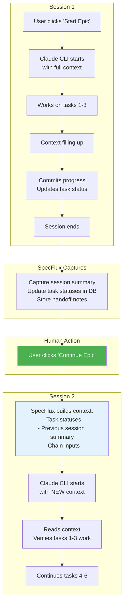
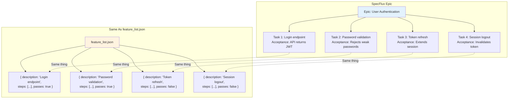
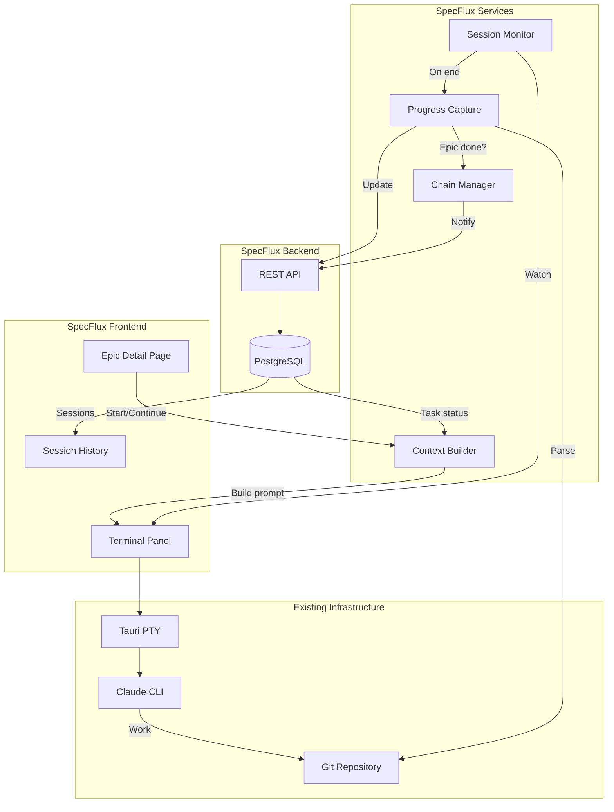

# SpecFlux + Autonomous Coding Integration

**From Idea to Production: CLI with Seamless Session Bridging**

---

## Executive Summary

SpecFlux and the autonomous-coding pattern are naturally aligned:

| SpecFlux Concept | Autonomous Coding Equivalent | Insight |
|------------------|------------------------------|---------|
| **Epic** | `feature_list.json` | Epic IS the feature contract |
| **Task** | Feature item | Task = one testable unit |
| **Task acceptance criteria** | `steps[]` array | Defines "passing" |
| **Task status (done/not done)** | `passes: true/false` | Same concept |

**The Approach:** Keep using Claude CLI (interactive, transparent, works today) but add **session bridging** - when one session ends, the next session automatically gets full context. Human clicks "Continue", but Claude knows exactly where to pick up.

---

## Part 1: The Model

### CLI + Session Bridging



### Why This Works

1. **Human stays in control** - Explicit "Continue" action
2. **Claude gets full context** - No manual re-explaining
3. **Uses existing infrastructure** - CLI, terminal, Tauri PTY
4. **Transparent** - User sees everything in terminal
5. **Simple** - No subprocess management, no SDK dependency

---

## Part 2: The Natural Mapping

### Epic = Feature List

An Epic in SpecFlux is a collection of tasks that together deliver a complete feature. This maps directly to `feature_list.json` in the autonomous-coding pattern.



### No Duplication

- Tasks ARE the feature list
- Task status IS the passes field
- Single source of truth in SpecFlux DB

---

## Part 3: What SpecFlux Provides

### 1. Context Injection on Session Start

When user clicks "Start Epic" or "Continue Epic", SpecFlux builds a rich prompt:

```markdown
## Epic: User Authentication
Repository: /path/to/backend
Branch: feat/user-auth

## PRD Reference
Users need to securely authenticate via email/password.
Must support session management and token refresh.

## Tasks Status
- [x] #101 Login endpoint - DONE (Session 1, commit abc123)
      Acceptance: POST /login returns JWT token
- [x] #102 Password validation - DONE (Session 1, commit def456)
      Acceptance: Rejects passwords < 8 chars, requires symbol
- [x] #103 JWT generation - DONE (Session 1, commit ghi789)
      Acceptance: Token expires in 1 hour, contains user ID
- [ ] #104 Token refresh - IN PROGRESS
      Acceptance: POST /refresh extends session, old token invalid
- [ ] #105 Session logout - NOT STARTED
      Acceptance: POST /logout invalidates token immediately
- [ ] #106 Rate limiting - NOT STARTED
      Acceptance: Max 5 login attempts per minute per IP

## Previous Session Summary
Session 1 (25 min, 3 commits):
- Completed tasks #101, #102, #103
- Started #104 (token refresh) - endpoint exists but needs testing
- Left off: Need to add token invalidation logic

## Chain Inputs (from dependency epics)
Epic "Database Schema" completed:
- Users table with id, email, password_hash
- Sessions table with token, user_id, expires_at
- See migration: 001_create_users.sql

## Your Goal This Session
1. Verify tasks #101-103 still work (quick check)
2. Complete task #104 (Token refresh)
3. Continue with #105, #106 if time permits
4. Commit progress before context fills
5. Update task status when verified complete
```

### 2. Progress Capture on Session End

When a session ends, SpecFlux captures:

```typescript
interface SessionSummary {
  sessionNumber: number;
  epicId: string;
  startTime: Date;
  endTime: Date;
  duration: number;  // minutes

  // What happened
  tasksCompleted: TaskId[];
  tasksInProgress: TaskId[];
  tasksVerified: TaskId[];  // Re-verified from previous sessions

  // For next session
  handoffNotes: string;  // From claude-progress.txt or parsed output
  lastCommit: string;
  lastWorkingOn: string;

  // Git activity
  commits: GitCommit[];
  filesChanged: string[];
}
```

### 3. Chain Output on Epic Complete

When all tasks pass:

```typescript
interface ChainOutput {
  epicId: string;
  epicTitle: string;
  completedAt: Date;

  // Summary for dependent epics
  summary: string;
  keyFiles: string[];
  apiEndpoints: string[];
  dataModels: string[];

  // What dependents need to know
  context: string;
}
```

---

## Part 4: Implementation

### Architecture



### New Services

#### 1. Context Builder

```typescript
// src/services/contextBuilder.ts

export class ContextBuilder {
  constructor(
    private api: SpecFluxAPI,
    private git: GitService,
  ) {}

  async buildSessionContext(epicId: string): Promise<string> {
    // Fetch all data
    const epic = await this.api.getEpic(epicId);
    const tasks = await this.api.getTasksForEpic(epicId);
    const prd = epic.prdId ? await this.api.getPRD(epic.prdId) : null;
    const sessions = await this.api.getSessionsForEpic(epicId);
    const chainInputs = await this.api.getChainInputs(epicId);

    // Build the prompt
    return this.formatPrompt({
      epic,
      tasks,
      prd,
      sessions,
      chainInputs,
    });
  }

  private formatPrompt(data: ContextData): string {
    return `
## Epic: ${data.epic.title}
Repository: ${data.epic.repository.localPath}
${data.epic.branch ? `Branch: ${data.epic.branch}` : ''}

${this.formatPRD(data.prd)}

## Tasks Status
${this.formatTasks(data.tasks)}

${this.formatPreviousSessions(data.sessions)}

${this.formatChainInputs(data.chainInputs)}

## Your Goal This Session
1. Verify completed tasks still work (quick check)
2. Pick next incomplete task by priority
3. Implement and test thoroughly
4. Commit progress before context fills
5. Update task status when verified
`;
  }

  private formatTasks(tasks: Task[]): string {
    return tasks.map(task => {
      const status = task.status === 'done' ? 'x' : ' ';
      const sessionInfo = task.completedInSession
        ? `(Session ${task.completedInSession}, commit ${task.completedCommit?.slice(0, 7)})`
        : task.status === 'in_progress' ? 'IN PROGRESS' : 'NOT STARTED';

      return `- [${status}] #${task.displayKey} ${task.title} - ${sessionInfo}
      Acceptance: ${task.acceptanceCriteria.join('; ')}`;
    }).join('\n');
  }

  private formatPreviousSessions(sessions: SessionSummary[]): string {
    if (sessions.length === 0) return '';

    const lastSession = sessions[sessions.length - 1];
    return `
## Previous Session Summary
Session ${lastSession.sessionNumber} (${lastSession.duration} min, ${lastSession.commits.length} commits):
- Completed: ${lastSession.tasksCompleted.map(t => `#${t}`).join(', ') || 'None'}
- In progress: ${lastSession.tasksInProgress.map(t => `#${t}`).join(', ') || 'None'}
- Last working on: ${lastSession.lastWorkingOn}
${lastSession.handoffNotes ? `\nNotes: ${lastSession.handoffNotes}` : ''}
`;
  }

  private formatChainInputs(inputs: ChainOutput[]): string {
    if (inputs.length === 0) return '';

    return `
## Chain Inputs (from dependency epics)
${inputs.map(input => `
Epic "${input.epicTitle}" completed:
${input.context}
Key files: ${input.keyFiles.join(', ')}
`).join('\n')}
`;
  }
}
```

#### 2. Session Monitor

```typescript
// src/services/sessionMonitor.ts

export class SessionMonitor {
  private activeSession: SessionInfo | null = null;

  startMonitoring(epicId: string, sessionId: string) {
    this.activeSession = {
      epicId,
      sessionId,
      startTime: new Date(),
      tasksAtStart: [], // Snapshot of task statuses
    };
  }

  async captureSessionEnd(workingDirectory: string): Promise<SessionSummary> {
    if (!this.activeSession) throw new Error('No active session');

    const { epicId, startTime } = this.activeSession;

    // Get current task statuses (compare to start)
    const tasksNow = await this.api.getTasksForEpic(epicId);

    // Parse git log since session start
    const commits = await this.git.getCommitsSince(workingDirectory, startTime);

    // Read progress file if exists
    const handoffNotes = await this.readProgressFile(workingDirectory);

    // Determine what was completed
    const tasksCompleted = this.findCompletedTasks(
      this.activeSession.tasksAtStart,
      tasksNow
    );

    const summary: SessionSummary = {
      sessionNumber: await this.getNextSessionNumber(epicId),
      epicId,
      startTime,
      endTime: new Date(),
      duration: this.calculateDuration(startTime),
      tasksCompleted: tasksCompleted.map(t => t.id),
      tasksInProgress: tasksNow.filter(t => t.status === 'in_progress').map(t => t.id),
      tasksVerified: [], // Could parse from output
      handoffNotes,
      lastCommit: commits[0]?.sha || '',
      lastWorkingOn: this.parseLastWorkingOn(handoffNotes, commits),
      commits,
      filesChanged: this.extractFilesChanged(commits),
    };

    // Store in DB
    await this.api.saveSessionSummary(summary);

    // Check if epic is complete
    if (tasksNow.every(t => t.status === 'done')) {
      await this.onEpicComplete(epicId, tasksNow);
    }

    this.activeSession = null;
    return summary;
  }

  private async readProgressFile(dir: string): Promise<string> {
    try {
      const content = await fs.readFile(
        path.join(dir, 'claude-progress.txt'),
        'utf-8'
      );
      // Get last section (most recent notes)
      const sections = content.split(/^## Session/m);
      return sections[sections.length - 1]?.trim() || '';
    } catch {
      return '';
    }
  }

  private async onEpicComplete(epicId: string, tasks: Task[]) {
    // Generate chain output
    const chainOutput = await this.generateChainOutput(epicId, tasks);
    await this.api.saveChainOutput(chainOutput);

    // Notify dependent epics are unblocked
    const dependents = await this.api.getDependentEpics(epicId);
    for (const dep of dependents) {
      await this.api.notifyEpicUnblocked(dep.id);
    }
  }
}
```

#### 3. Enhanced Terminal Integration

```typescript
// src/components/epic/EpicTerminalLauncher.tsx

interface EpicTerminalLauncherProps {
  epic: Epic;
  sessions: SessionSummary[];
}

export function EpicTerminalLauncher({ epic, sessions }: EpicTerminalLauncherProps) {
  const { openTerminalForContext } = useTerminal();
  const contextBuilder = useContextBuilder();
  const sessionMonitor = useSessionMonitor();

  const handleStartSession = async () => {
    // Build context for this session
    const context = await contextBuilder.buildSessionContext(epic.id);

    // Write context file to repo (Claude will see via CLAUDE.md include)
    await writeContextFile(epic.repository.localPath, context);

    // Start monitoring this session
    sessionMonitor.startMonitoring(epic.id, `epic-${epic.id}`);

    // Open terminal with Claude
    openTerminalForContext({
      type: 'epic',
      id: epic.id,
      title: epic.title,
      displayKey: epic.displayKey,
      workingDirectory: epic.repository.localPath,
      initialCommand: 'claude',
    });
  };

  const isFirstSession = sessions.length === 0;
  const lastSession = sessions[sessions.length - 1];

  return (
    <div className="flex flex-col gap-4">
      {/* Session History */}
      {sessions.length > 0 && (
        <div className="bg-slate-800 rounded-lg p-4">
          <h3 className="text-sm font-medium text-slate-300 mb-2">
            Session History
          </h3>
          {sessions.map(session => (
            <SessionCard key={session.sessionNumber} session={session} />
          ))}
        </div>
      )}

      {/* Start/Continue Button */}
      <button
        onClick={handleStartSession}
        className="flex items-center gap-2 px-4 py-2 bg-brand-600
                   hover:bg-brand-700 text-white rounded-lg"
      >
        <PlayIcon className="w-5 h-5" />
        {isFirstSession ? 'Start Epic' : 'Continue Epic'}
      </button>

      {!isFirstSession && (
        <p className="text-sm text-slate-500">
          Session {sessions.length + 1} will start with full context from
          previous sessions. Claude will know exactly where to pick up.
        </p>
      )}
    </div>
  );
}
```

---

## Part 5: User Experience

### Epic Detail Page

```
┌────────────────────────────────────────────────────────────────┐
│  Epic: User Authentication                    [Edit] [Archive] │
│  Repository: backend  |  Branch: feat/user-auth               │
├────────────────────────────────────────────────────────────────┤
│                                                                  │
│  Progress: ████████████░░░░░░░░  3/6 tasks (50%)               │
│                                                                  │
│  ┌─────────────────────────────────────────────────────────┐   │
│  │  Session History                                         │   │
│  │  ─────────────────                                      │   │
│  │  Session 1 • 25 min • 3 commits                         │   │
│  │    ✓ Completed #101, #102, #103                         │   │
│  │    → Left off: Token refresh needs testing              │   │
│  └─────────────────────────────────────────────────────────┘   │
│                                                                  │
│  Tasks                                                           │
│  ─────                                                          │
│  ✓ #101 Login endpoint                     Session 1           │
│  ✓ #102 Password validation                Session 1           │
│  ✓ #103 JWT generation                     Session 1           │
│  ⚙ #104 Token refresh                      In Progress         │
│  ○ #105 Session logout                                          │
│  ○ #106 Rate limiting                                           │
│                                                                  │
│  ┌─────────────────────────────────────────────────────────┐   │
│  │  [▶ Continue Epic]                                       │   │
│  │                                                          │   │
│  │  Session 2 will include:                                │   │
│  │  • Task statuses from Session 1                         │   │
│  │  • Handoff notes and last commit                        │   │
│  │  • Chain inputs from Database Schema epic               │   │
│  └─────────────────────────────────────────────────────────┘   │
│                                                                  │
│  Chain Dependencies                                              │
│  ─────────────────                                              │
│  ← Database Schema (completed) - provides Users, Sessions tables│
│  → API Gateway (blocked) - waiting for this epic               │
│                                                                  │
└────────────────────────────────────────────────────────────────┘
```

### Terminal With Context

When user clicks "Continue Epic", terminal opens and shows:

```
┌────────────────────────────────────────────────────────────────┐
│  🤖 Claude  |  Epic: User Auth [Session 2]  |  ✕              │
├────────────────────────────────────────────────────────────────┤
│                                                                  │
│  $ claude                                                        │
│                                                                  │
│  ╭─────────────────────────────────────────────────────────────╮│
│  │ Claude Code                                                 ││
│  │                                                             ││
│  │ I see you're continuing work on Epic: User Authentication. ││
│  │                                                             ││
│  │ Previous session completed tasks #101-103. Task #104       ││
│  │ (Token refresh) is in progress - endpoint exists but       ││
│  │ needs testing.                                              ││
│  │                                                             ││
│  │ Let me first verify the completed tasks still work,        ││
│  │ then continue with #104.                                   ││
│  │                                                             ││
│  │ > Checking login endpoint... ✓                             ││
│  │ > Checking password validation... ✓                        ││
│  │ > Checking JWT generation... ✓                             ││
│  │                                                             ││
│  │ All verified. Now implementing token refresh testing...    ││
│  ╰─────────────────────────────────────────────────────────────╯│
│                                                                  │
└────────────────────────────────────────────────────────────────┘
```

---

## Part 6: Context File Strategy

### Option A: Write to .specflux/context.md

```typescript
async function writeContextFile(repoPath: string, context: string) {
  const contextDir = path.join(repoPath, '.specflux');
  await fs.mkdir(contextDir, { recursive: true });
  await fs.writeFile(
    path.join(contextDir, 'session-context.md'),
    context
  );
}
```

Then in repo's `CLAUDE.md`:
```markdown
# Project CLAUDE.md

## Current Work
See `.specflux/session-context.md` for current epic and task context.
```

### Option B: Pass as Initial Prompt

```typescript
// Instead of writing file, pass context as first message
openTerminalForContext({
  type: 'epic',
  id: epic.id,
  title: epic.title,
  workingDirectory: epic.repository.localPath,
  // Claude CLI accepts --print for initial context
  initialCommand: `claude --print "$(cat .specflux/session-context.md)"`,
});
```

### Option C: Use Claude's Resume Feature

```typescript
// If Claude supports session resume, use that
initialCommand: `claude --resume ${lastSessionId}`,
```

---

## Part 7: Implementation Plan

### Phase 1: Context Builder (Core)

| Task | Description |
|------|-------------|
| Create `ContextBuilder` service | Build prompts from Epic/Task/PRD data |
| Create `SessionSummary` model | Track what happened each session |
| Add API endpoints | Get/save session summaries |
| Write context file on session start | `.specflux/session-context.md` |
| Update CLAUDE.md template | Include context file reference |

### Phase 2: Session Monitoring

| Task | Description |
|------|-------------|
| Create `SessionMonitor` service | Track session start/end |
| Parse progress on session end | Git commits, progress file |
| Update task statuses | Mark completed tasks in DB |
| Store session summaries | For next session context |

### Phase 3: Chain Management

| Task | Description |
|------|-------------|
| Create `ChainOutput` model | Summary for dependent epics |
| Generate chain output on epic complete | Key files, endpoints, context |
| Include chain inputs in context | From dependency epics |
| Notify when epics unblocked | Dependent epic can start |

### Phase 4: UI Polish

| Task | Description |
|------|-------------|
| Session history component | Show past sessions on epic page |
| "Continue Epic" button | With context preview |
| Progress indicators | Tasks completed per session |
| Chain visualization | Show epic dependencies |

---

## Part 8: Benefits

### Compared to Pure Manual

| Before | After |
|--------|-------|
| User re-explains context each session | Context auto-injected |
| Forget what was completed | Task statuses tracked |
| Lose handoff notes | Notes captured and included |
| Manual dependency tracking | Chain inputs auto-included |

### Compared to Full Autonomous

| Aspect | CLI + Bridging | Full Autonomous |
|--------|---------------|-----------------|
| Human control | Full - explicit continue | Less - auto-runs |
| Transparency | Full terminal visibility | Abstracted |
| Complexity | Low - enhance existing | High - new subprocess |
| Dependencies | None - uses CLI | Python SDK required |
| Intervention | Natural - between sessions | Must pause/stop |

### The Sweet Spot

- **Human clicks "Continue"** - stays in control
- **Claude gets full context** - no manual re-explaining
- **Terminal stays transparent** - see everything
- **Simple implementation** - enhance, don't replace

---

## Conclusion

The CLI + Session Bridging approach is the pragmatic choice:

1. **Uses what works** - Existing terminal, CLI, Tauri PTY
2. **Adds what's missing** - Context injection, progress tracking
3. **Keeps human in loop** - Explicit "Continue" action
4. **Enables chain workflow** - Epic outputs feed into dependents

This is not about automating away the human - it's about making the human's job easier by eliminating the tedious context re-building between sessions.

---

## Appendix: Mapping Reference

| SpecFlux | Autonomous Coding | Notes |
|----------|-------------------|-------|
| Epic | `feature_list.json` | Epic's tasks = the feature list |
| Task | Feature item | One testable unit |
| Task.title | `description` | What to implement |
| Task.acceptanceCriteria | `steps[]` | How to verify |
| Task.status = 'done' | `passes: true` | Same meaning |
| Epic.repository | Project directory | Where to run |
| PRD + Epic.description | `app_spec.txt` | Full context |
| Task dependencies | Task order in Epic | What to do first |
| SessionSummary | `claude-progress.txt` | Handoff between sessions |
| ChainOutput | Chain inputs | Epic-to-epic context |
