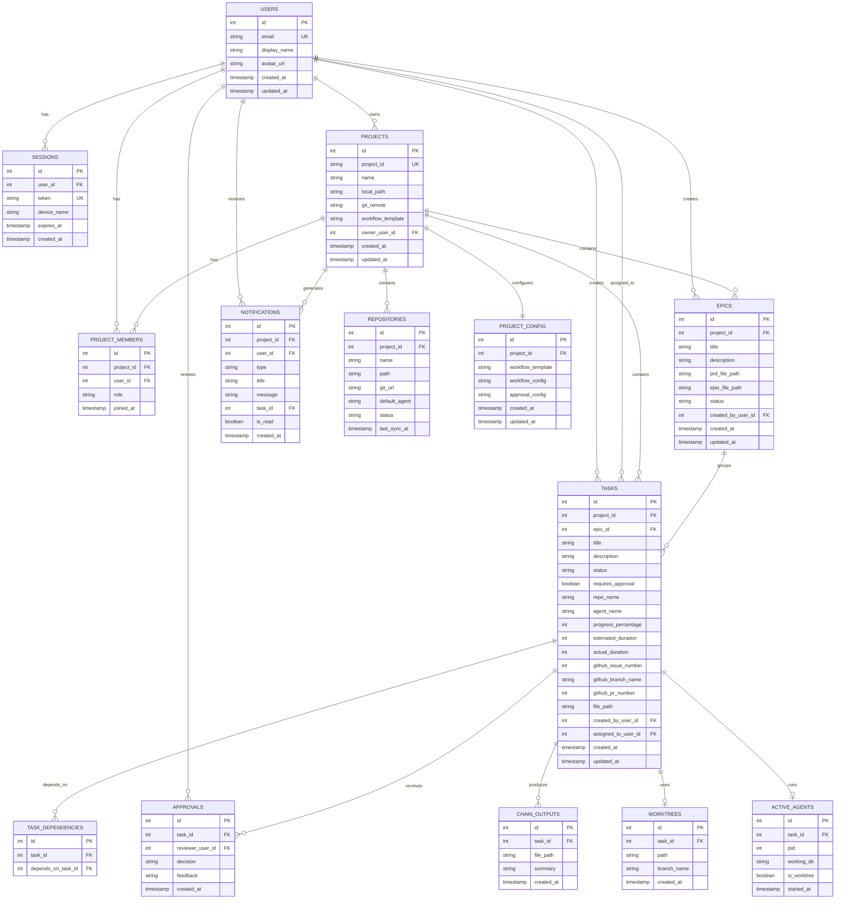

# SpecFlux - Development Roadmap

**Goal:** Build MVP in 8-12 weeks, then use SpecFlux to build itself (dogfooding)

---

## 📋 Development Tools: Claude Code Setup

To build SpecFlux faster, we'll use Claude Code's advanced features in our own development workflow. These help agents understand the SpecFlux codebase and boost our productivity.

**Setup once (Week 2), benefit throughout development:**

### Our Development Setup
```
specflux/
├── orchestrator/
│   ├── CLAUDE.md              # Documents SpecFlux architecture
│   ├── .claude/
│   │   ├── skills/            # SpecFlux development patterns
│   │   ├── agents/            # Specialists for subsystems
│   │   └── commands/          # Common dev workflows
│   ├── .mcp.json              # Our tool integrations
│   └── hooks/                 # Our quality gates
```

**These are OUR development tools - separate from the product features SpecFlux provides to users.**

---

## Overview

### Development Philosophy
1. **Build foundation first** - Backend service, database, file system
2. **Add UI incrementally** - Start with basic Kanban, add features
3. **Dogfood early** - Use SpecFlux to build SpecFlux starting Week 7
4. **Iterate based on usage** - Real-world feedback drives priorities

### Key Milestone: Self-Hosting
**Week 7:** SpecFlux becomes usable enough to manage its own development
- Basic project management works
- Can create epics and tasks
- Agent launching works (even if rough)
- Use it to build remaining features

---

## Phase 1: Foundation (Weeks 1-2)

### Week 1: Project Setup & Backend Core

#### Backend Service
- [x] Initialize Node.js + TypeScript project
  - [x] Setup Express/Fastify
  - [x] Configure ESLint, Prettier
  - [x] Setup hot reload (nodemon)
- [x] **API-First Design**
  - [x] Install Swagger/OpenAPI tools
    - [x] `swagger-jsdoc` for documentation
    - [x] `swagger-ui-express` for interactive docs
  - [x] Create OpenAPI spec (YAML)
    - [x] Define all endpoints
    - [x] Request/response schemas
    - [x] Error responses
  - [x] Setup code generation
    - [x] `openapi-generator` for TypeScript client
    - [x] Auto-generate API client for frontend
    - [x] Auto-generate types for backend
- [x] Database setup
  - [x] Install better-sqlite3
  - [x] Create initial schema (13 tables with proper user model)
  - [x] Write migration system
  - [x] **Add user initialization**
    - [x] Function to create user from OS (git config)
    - [x] Auto-create user on first app launch
    - [x] Store current user in app state
- [x] File system integration
  - [x] Create orchestrator folder structure
  - [x] Implement markdown file readers/writers
  - [x] Add file watching (chokidar)
- [x] Git integration
  - [x] Install simple-git
  - [x] Implement basic git operations (init, add, commit, push, pull)
  - [x] Test auto-commit functionality

**Database Schema (Week 1):**

**Design Philosophy:** Proper multi-user schema from day 1, used simply at first (1 user per project), scales naturally to teams later (no migrations needed).

**Entity Relationship Diagram:**


**SQL Schema:**
```sql
-- ============================================================================
-- USERS & AUTHENTICATION
-- ============================================================================

-- Users (proper normalization from day 1)
CREATE TABLE users (
  id INTEGER PRIMARY KEY,
  email TEXT UNIQUE NOT NULL,
  display_name TEXT NOT NULL,
  avatar_url TEXT,
  created_at TIMESTAMP DEFAULT CURRENT_TIMESTAMP,
  updated_at TIMESTAMP DEFAULT CURRENT_TIMESTAMP
);

-- Sessions (for future web version)
CREATE TABLE sessions (
  id INTEGER PRIMARY KEY,
  user_id INTEGER NOT NULL,
  token TEXT UNIQUE NOT NULL,
  device_name TEXT,
  expires_at TIMESTAMP NOT NULL,
  created_at TIMESTAMP DEFAULT CURRENT_TIMESTAMP,
  FOREIGN KEY (user_id) REFERENCES users(id) ON DELETE CASCADE
);

-- ============================================================================
-- PROJECTS & TEAM MEMBERSHIP
-- ============================================================================

-- Projects
CREATE TABLE projects (
  id INTEGER PRIMARY KEY,
  project_id TEXT UNIQUE NOT NULL,
  name TEXT NOT NULL,
  local_path TEXT NOT NULL,
  git_remote TEXT,
  workflow_template TEXT DEFAULT 'startup-fast',
  owner_user_id INTEGER NOT NULL,
  created_at TIMESTAMP DEFAULT CURRENT_TIMESTAMP,
  updated_at TIMESTAMP DEFAULT CURRENT_TIMESTAMP,
  FOREIGN KEY (owner_user_id) REFERENCES users(id)
);

-- Project Members (scales from 1 to N users per project)
CREATE TABLE project_members (
  id INTEGER PRIMARY KEY,
  project_id INTEGER NOT NULL,
  user_id INTEGER NOT NULL,
  role TEXT NOT NULL DEFAULT 'developer',  -- owner, admin, developer, viewer
  joined_at TIMESTAMP DEFAULT CURRENT_TIMESTAMP,
  FOREIGN KEY (project_id) REFERENCES projects(id) ON DELETE CASCADE,
  FOREIGN KEY (user_id) REFERENCES users(id) ON DELETE CASCADE,
  UNIQUE(project_id, user_id)
);

-- Project Configuration
CREATE TABLE project_config (
  id INTEGER PRIMARY KEY,
  project_id INTEGER NOT NULL UNIQUE,
  workflow_template TEXT NOT NULL,
  workflow_config TEXT,  -- JSON
  approval_config TEXT,  -- JSON
  created_at TIMESTAMP DEFAULT CURRENT_TIMESTAMP,
  updated_at TIMESTAMP DEFAULT CURRENT_TIMESTAMP,
  FOREIGN KEY (project_id) REFERENCES projects(id) ON DELETE CASCADE
);

-- ============================================================================
-- REPOSITORIES
-- ============================================================================

CREATE TABLE repositories (
  id INTEGER PRIMARY KEY,
  project_id INTEGER NOT NULL,
  name TEXT NOT NULL,
  path TEXT NOT NULL,
  git_url TEXT,
  default_agent TEXT,
  status TEXT DEFAULT 'ready',
  last_sync_at TIMESTAMP,
  FOREIGN KEY (project_id) REFERENCES projects(id) ON DELETE CASCADE
);

-- ============================================================================
-- EPICS
-- ============================================================================

CREATE TABLE epics (
  id INTEGER PRIMARY KEY,
  project_id INTEGER NOT NULL,
  title TEXT NOT NULL,
  description TEXT,
  prd_file_path TEXT,
  epic_file_path TEXT,
  status TEXT NOT NULL DEFAULT 'planning',
  created_by_user_id INTEGER NOT NULL,
  created_at TIMESTAMP DEFAULT CURRENT_TIMESTAMP,
  updated_at TIMESTAMP DEFAULT CURRENT_TIMESTAMP,
  FOREIGN KEY (project_id) REFERENCES projects(id) ON DELETE CASCADE,
  FOREIGN KEY (created_by_user_id) REFERENCES users(id)
);

-- ============================================================================
-- TASKS
-- ============================================================================

CREATE TABLE tasks (
  id INTEGER PRIMARY KEY,
  project_id INTEGER NOT NULL,
  epic_id INTEGER,
  title TEXT NOT NULL,
  description TEXT,
  status TEXT NOT NULL DEFAULT 'backlog',
  requires_approval BOOLEAN DEFAULT TRUE,
  repo_name TEXT,
  agent_name TEXT,
  progress_percentage INTEGER DEFAULT 0,
  estimated_duration INTEGER,
  actual_duration INTEGER,
  github_issue_number INTEGER,
  github_branch_name TEXT,
  github_pr_number INTEGER,
  file_path TEXT,
  created_by_user_id INTEGER NOT NULL,
  assigned_to_user_id INTEGER,  -- Optional: who's working on it
  created_at TIMESTAMP DEFAULT CURRENT_TIMESTAMP,
  updated_at TIMESTAMP DEFAULT CURRENT_TIMESTAMP,
  FOREIGN KEY (project_id) REFERENCES projects(id) ON DELETE CASCADE,
  FOREIGN KEY (epic_id) REFERENCES epics(id) ON DELETE SET NULL,
  FOREIGN KEY (created_by_user_id) REFERENCES users(id),
  FOREIGN KEY (assigned_to_user_id) REFERENCES users(id) ON DELETE SET NULL
);

CREATE INDEX idx_tasks_status ON tasks(status);
CREATE INDEX idx_tasks_project_id ON tasks(project_id);
CREATE INDEX idx_tasks_assigned_to ON tasks(assigned_to_user_id);

-- ============================================================================
-- TASK DEPENDENCIES
-- ============================================================================

CREATE TABLE task_dependencies (
  id INTEGER PRIMARY KEY,
  task_id INTEGER NOT NULL,
  depends_on_task_id INTEGER NOT NULL,
  FOREIGN KEY (task_id) REFERENCES tasks(id) ON DELETE CASCADE,
  FOREIGN KEY (depends_on_task_id) REFERENCES tasks(id) ON DELETE CASCADE,
  UNIQUE(task_id, depends_on_task_id)
);

-- ============================================================================
-- APPROVALS
-- ============================================================================

CREATE TABLE approvals (
  id INTEGER PRIMARY KEY,
  task_id INTEGER NOT NULL,
  reviewer_user_id INTEGER NOT NULL,
  decision TEXT NOT NULL,
  feedback TEXT,
  created_at TIMESTAMP DEFAULT CURRENT_TIMESTAMP,
  FOREIGN KEY (task_id) REFERENCES tasks(id) ON DELETE CASCADE,
  FOREIGN KEY (reviewer_user_id) REFERENCES users(id)
);

-- ============================================================================
-- CHAIN OUTPUTS
-- ============================================================================

CREATE TABLE chain_outputs (
  id INTEGER PRIMARY KEY,
  task_id INTEGER NOT NULL,
  file_path TEXT NOT NULL,
  summary TEXT,
  created_at TIMESTAMP DEFAULT CURRENT_TIMESTAMP,
  FOREIGN KEY (task_id) REFERENCES tasks(id) ON DELETE CASCADE
);

-- ============================================================================
-- WORKTREES
-- ============================================================================

CREATE TABLE worktrees (
  id INTEGER PRIMARY KEY,
  task_id INTEGER NOT NULL,
  path TEXT NOT NULL,
  branch_name TEXT NOT NULL,
  created_at TIMESTAMP DEFAULT CURRENT_TIMESTAMP,
  FOREIGN KEY (task_id) REFERENCES tasks(id) ON DELETE CASCADE
);

-- ============================================================================
-- ACTIVE AGENTS
-- ============================================================================

CREATE TABLE active_agents (
  id INTEGER PRIMARY KEY,
  task_id INTEGER NOT NULL,
  pid INTEGER NOT NULL,
  working_dir TEXT NOT NULL,
  is_worktree BOOLEAN DEFAULT FALSE,
  started_at TIMESTAMP DEFAULT CURRENT_TIMESTAMP,
  FOREIGN KEY (task_id) REFERENCES tasks(id) ON DELETE CASCADE
);

-- ============================================================================
-- NOTIFICATIONS
-- ============================================================================

CREATE TABLE notifications (
  id INTEGER PRIMARY KEY,
  project_id INTEGER NOT NULL,
  user_id INTEGER NOT NULL,  -- Who receives this notification
  type TEXT NOT NULL,
  title TEXT NOT NULL,
  message TEXT,
  task_id INTEGER,
  is_read BOOLEAN DEFAULT FALSE,
  created_at TIMESTAMP DEFAULT CURRENT_TIMESTAMP,
  FOREIGN KEY (project_id) REFERENCES projects(id) ON DELETE CASCADE,
  FOREIGN KEY (user_id) REFERENCES users(id) ON DELETE CASCADE,
  FOREIGN KEY (task_id) REFERENCES tasks(id) ON DELETE CASCADE
);

CREATE INDEX idx_notifications_user_id ON notifications(user_id);
CREATE INDEX idx_notifications_is_read ON notifications(is_read);
```

**Usage Pattern (Single User for Now):**
```typescript
// Desktop app auto-creates user from OS on first launch
const user = await initializeUser();  // Gets email from git config

// Creating project auto-adds owner as member
const project = await createProject({
  name: "My Project",
  owner_user_id: user.id  // Current user
});
// Backend auto-creates project_member with role='owner'

// Creating tasks auto-assigns to current user
const task = await createTask({
  title: "Build feature",
  created_by_user_id: user.id,
  assigned_to_user_id: user.id  // Self-assign
});

// Later: Scale to teams by adding more project_members
// No schema changes needed!
```

#### Tauri Desktop Shell
- [x] Initialize Tauri project
  - [x] Setup React + TypeScript + Vite
  - [x] Configure TailwindCSS
  - [ ] Setup Tauri IPC commands (deferred - add as needed)
- [x] Basic window setup
  - [x] Configure window size (1200x800 default)
  - [ ] Add app icon (placeholder for now)
  - [x] Setup dev environment

---

### Week 2: REST API & Basic UI

#### Development Tools Setup
*One-time setup to help Claude Code build SpecFlux faster*

**📖 See [QUICK-START-CLAUDE-SETUP.md](../QUICK-START-CLAUDE-SETUP.md) for complete setup guide**

This section sets up your development environment with Claude Code skills, agents, and MCP servers to accelerate development.

- [x] **Create project structure**
  ```bash
  mkdir -p specflux/.claude/{skills,agents,commands}
  cd specflux
  ```

- [x] **Setup .mcp.json for GitHub integration**
  ```json
  {
    "mcpServers": {
      "github": {
        "command": "npx",
        "args": ["-y", "@modelcontextprotocol/server-github"],
        "env": {
          "GITHUB_PERSONAL_ACCESS_TOKEN": "your_token"
        }
      }
    }
  }
  ```
  **What it does:** Gives Claude Code access to GitHub (create issues, PRs, search code)

- [x] **Create Claude skills** (4 total)
  - [x] typescript-patterns - Coding standards, async/await patterns, error handling
  - [x] tauri-dev - IPC communication, window management
  - [x] api-design - REST conventions, OpenAPI-first workflow
  - [x] database-migrations - Migration patterns, SQLite best practices

  **What they do:** Teach Claude your project's patterns and conventions

- [x] **Create Claude agents** (3 total)
  - [x] backend-dev.md - Specializes in API endpoints, database, tests
  - [x] frontend-dev.md - Specializes in React, Tauri, UI components
  - [x] fullstack-dev.md - End-to-end feature implementation

  **What they do:** Give Claude different "personas" for different types of work

- [x] **Create Claude commands** (4 total)
  - [x] test-all.md - Run all tests across backend and frontend
  - [x] build-prod.md - Build production artifacts
  - [x] db-migrate.md - Run database migrations
  - [x] api-spec-update.md - Update OpenAPI spec and regenerate client

  **What they do:** Automate common development tasks

- [x] **Create root CLAUDE.md**
  High-level context about SpecFlux architecture, build commands, file structure

- [x] **Create orchestrator/CLAUDE.md**
  Backend-specific context (services, routes, database patterns)

- [x] **Create frontend/CLAUDE.md**
  Frontend-specific context (React patterns, API client usage, TailwindCSS)

**Benefit:** Claude Code will understand your codebase, follow your patterns, and work 10x faster. You'll spend less time explaining and more time building.

**Time investment:** ~30 minutes
**Time saved:** Hours every day

#### UI Foundation
- [x] Setup Tauri + React project structure
- [x] Configure TailwindCSS for styling
- [x] **Setup API Client (Auto-Generated)**
  - [x] Install generated TypeScript client from backend
  - [x] Configure base URL for API
  - [ ] Setup error handling interceptors
  - [ ] Add request/response logging (dev mode)
- [x] **Create main layout with navigation**
  - [x] Top bar (logo, project selector, notifications, user profile)
  - [x] Left sidebar (5 nav items: Board, Tasks, Epics, Files, Settings)
  - [ ] Responsive layout (collapsible sidebar)
  - [x] Active state highlighting
- [x] **Create navigation components**
  - [x] Sidebar component
  - [x] TopBar component
  - [x] ProjectSelector dropdown
  - [x] NotificationBell component
- [x] Setup React Router
  - [x] /board - Board view (default)
  - [x] /tasks - Tasks list view
  - [x] /epics - Epics view
  - [x] /files - Files browser
  - [x] /settings - Settings

#### REST API Endpoints

**Authentication:** All endpoints accept `X-User-Id` header (optional during development, required in production)

**Backend Tasks:**
- [x] **Implement authentication middleware**
  - [x] Extract user_id from `X-User-Id` header
  - [x] Validate user exists in database
  - [x] Set `req.user` for all endpoints
  - [x] Return 401 if unauthorized
- [x] **Auto-set user context in endpoints**
  - [x] created_by_user_id from req.user
  - [x] assigned_to_user_id defaults to req.user
  - [x] reviewer_user_id from req.user

**Users (2 endpoints):**
- [x] `GET    /users/me` - Get current user
- [x] `PUT    /users/me` - Update user profile

**Projects (7 endpoints):**
- [x] `POST   /projects` - Create new project
- [x] `GET    /projects` - List all projects
- [x] `GET    /projects/:id` - Get project details
- [x] `GET    /projects/:id/config` - Get project config
- [x] `PUT    /projects/:id/config` - Update project config
- [x] `GET    /projects/:id/dashboard` - Dashboard data (active tasks, pending review, repos, notifications)
- [x] `GET    /projects/:id/stats` - Project statistics

**Project Members (4 endpoints - Future):**
- [ ] `GET    /projects/:id/members` - List project members
- [ ] `POST   /projects/:id/members` - Invite member
- [ ] `PUT    /projects/:id/members/:userId` - Update member role
- [ ] `DELETE /projects/:id/members/:userId` - Remove member

**Epics (7 endpoints):**
- [x] `GET    /projects/:id/epics` - List all epics
- [x] `POST   /projects/:id/epics` - Create epic
- [x] `GET    /epics/:id` - Get epic details
- [x] `PUT    /epics/:id` - Update epic
- [x] `DELETE /epics/:id` - Delete epic
- [x] `GET    /epics/:id/tasks` - Get tasks in epic
- [x] `GET    /epics/:id/progress` - Get epic progress stats

**Tasks (17 endpoints):**
- [x] `GET    /projects/:id/tasks` - List tasks (with filters)
- [x] `POST   /projects/:id/tasks` - Create task
- [x] `GET    /tasks/:id` - Get task details
- [x] `PUT    /tasks/:id` - Update task
- [x] `PUT    /tasks/:id/assign` - Assign task to user
- [x] `DELETE /tasks/:id` - Delete task
- [x] `POST   /tasks/:id/dependencies` - Add dependency
- [x] `GET    /tasks/:id/dependencies` - Get dependencies
- [ ] `POST   /tasks/:id/start` - Start agent (Phase 2: Claude Code Integration)
- [ ] `POST   /tasks/:id/pause` - Pause agent (Phase 2)
- [ ] `POST   /tasks/:id/resume` - Resume agent (Phase 2)
- [ ] `POST   /tasks/:id/stop` - Stop agent (Phase 2)
- [x] `GET    /tasks/:id/terminal-output` - Get terminal logs
- [x] `GET    /tasks/:id/files-changed` - List changed files
- [x] `GET    /tasks/:id/diff` - Get code diff
- [x] `POST   /tasks/:id/approve` - Approve task
- [x] `POST   /tasks/:id/reject` - Request changes

**Repositories (5 endpoints):**
- [x] `GET    /projects/:id/repositories` - List repos
- [x] `POST   /projects/:id/repositories` - Add repo
- [x] `PUT    /repositories/:id` - Update repo
- [x] `DELETE /repositories/:id` - Remove repo
- [x] `POST   /repositories/:id/sync` - Sync with remote

**Notifications (4 endpoints):**
- [x] `GET    /projects/:id/notifications` - List notifications
- [x] `PUT    /notifications/:id/read` - Mark as read
- [x] `DELETE /notifications/:id` - Delete notification
- [x] `POST   /notifications/mark-all-read` - Mark all as read

**Files (3 endpoints):**
- [x] `GET    /projects/:id/files` - List files in orchestrator/
- [x] `GET    /files/:path` - Get file content
- [x] `PUT    /files/:path` - Update file content

**Total: 53 endpoints** (MVP: 49, Future: 4 team management)
**Implemented: 44 endpoints** (Agent control endpoints deferred to Phase 2)

**OpenAPI Specification Example:**
```yaml
# openapi.yaml
openapi: 3.0.0
info:
  title: SpecFlux API
  version: 1.0.0
  description: API for SpecFlux orchestrator

paths:
  /projects:
    post:
      summary: Create new project
      tags: [Projects]
      requestBody:
        required: true
        content:
          application/json:
            schema:
              $ref: '#/components/schemas/CreateProjectRequest'
      responses:
        201:
          description: Project created
          content:
            application/json:
              schema:
                $ref: '#/components/schemas/Project'
    get:
      summary: List all projects
      tags: [Projects]
      responses:
        200:
          description: List of projects
          content:
            application/json:
              schema:
                type: array
                items:
                  $ref: '#/components/schemas/Project'

  /tasks/{id}:
    get:
      summary: Get task details
      tags: [Tasks]
      parameters:
        - name: id
          in: path
          required: true
          schema:
            type: integer
      responses:
        200:
          description: Task details
          content:
            application/json:
              schema:
                $ref: '#/components/schemas/Task'
        404:
          description: Task not found

components:
  schemas:
    Project:
      type: object
      required:
        - id
        - name
        - local_path
      properties:
        id:
          type: integer
        project_id:
          type: string
        name:
          type: string
        local_path:
          type: string
        git_remote:
          type: string
        workflow_template:
          type: string
          enum: [startup-fast, full-lifecycle, custom]
        created_at:
          type: string
          format: date-time
    
    Epic:
      type: object
      required:
        - id
        - title
        - status
      properties:
        id:
          type: integer
        project_id:
          type: integer
        title:
          type: string
        description:
          type: string
        prd_file_path:
          type: string
        epic_file_path:
          type: string
        status:
          type: string
          enum: [planning, active, completed]
        task_stats:
          type: object
          properties:
            total:
              type: integer
            done:
              type: integer
            in_progress:
              type: integer
        progress_percentage:
          type: integer
        created_at:
          type: string
          format: date-time
        updated_at:
          type: string
          format: date-time
    
    Task:
      type: object
      required:
        - id
        - title
        - status
      properties:
        id:
          type: integer
        project_id:
          type: integer
        epic_id:
          type: integer
        title:
          type: string
        description:
          type: string
        status:
          type: string
          enum: [backlog, ready, in-progress, pending-review, approved, done]
        requires_approval:
          type: boolean
        repo_name:
          type: string
        agent_name:
          type: string
        progress_percentage:
          type: integer
        estimated_duration:
          type: integer
        actual_duration:
          type: integer
        github_issue_number:
          type: integer
        github_branch_name:
          type: string
        github_pr_number:
          type: integer
        created_by_email:
          type: string
        created_at:
          type: string
          format: date-time
        updated_at:
          type: string
          format: date-time
    
    Notification:
      type: object
      properties:
        id:
          type: integer
        project_id:
          type: integer
        type:
          type: string
          enum: [review_requested, task_completed, task_failed, dependency_unblocked]
        title:
          type: string
        message:
          type: string
        task_id:
          type: integer
        is_read:
          type: boolean
        created_at:
          type: string
          format: date-time
    
    DashboardResponse:
      type: object
      properties:
        active_tasks:
          type: array
          items:
            $ref: '#/components/schemas/Task'
        pending_review:
          type: array
          items:
            $ref: '#/components/schemas/Task'
        repositories:
          type: array
          items:
            $ref: '#/components/schemas/Repository'
        notifications_count:
          type: integer
    
    Repository:
      type: object
      properties:
        id:
          type: integer
        project_id:
          type: integer
        name:
          type: string
        path:
          type: string
        git_url:
          type: string
        default_agent:
          type: string
        status:
          type: string
          enum: [ready, error, syncing]
        last_sync_at:
          type: string
          format: date-time
    
    CreateProjectRequest:
      type: object
      required:
        - name
        - local_path
      properties:
        name:
          type: string
        local_path:
          type: string
        git_remote:
          type: string
        workflow_template:
          type: string
          enum: [startup-fast, full-lifecycle]
```

**Code Generation Workflow:**
```bash
# Backend generates OpenAPI spec
npm run generate:openapi

# Generate TypeScript client for frontend
npx openapi-generator-cli generate \
  -i openapi.yaml \
  -g typescript-fetch \
  -o frontend/src/api/generated

# Frontend uses generated client
import { ProjectsApi, TasksApi } from '@/api/generated';

const projectsApi = new ProjectsApi({ basePath: 'http://localhost:3000' });
const tasks = await projectsApi.getProjectTasks({ id: 1 });
```

#### Basic UI Components
- [x] Project selector dropdown (wired to API with ProjectContext)
- [x] Simple task list view (TasksPage with filters, status badges, progress bars)
- [x] Task creation form (TaskCreateModal with validation)
- [x] Basic layout with sidebar

**Wireframe: Basic UI (Week 2)**
```
┌────────────────────────────────────────────────────────────┐
│  SpecFlux          [Select Project ▼]          ⚙️         │
├────────────────────────────────────────────────────────────┤
│                                                            │
│  Tasks (List View)                                         │
│                                                            │
│  ┌──────────────────────────────────────────────────────┐ │
│  │ #1 Setup Backend                          [Ready]    │ │
│  │ #2 Create Database Schema                 [Done]     │ │
│  │ #3 Build REST API                         [Ready]    │ │
│  └──────────────────────────────────────────────────────┘ │
│                                                            │
│  [+ New Task]                                             │
│                                                            │
└────────────────────────────────────────────────────────────┘
```

**Testing:**
- [ ] Create test project manually
- [ ] Add test tasks via API
- [ ] Verify UI displays tasks correctly

---

## Phase 2: Claude Code Integration (Weeks 3-4)

### Week 3: Process Spawning & Terminal

#### Claude Code Integration
- [x] Install node-pty
- [x] Implement process spawning
  - [x] Create AgentService class
  - [x] Spawn Claude Code with arguments
  - [x] Capture stdout/stderr
- [x] Basic context injection
  - [x] Generate context files from tasks
  - [x] Pass PRD/Epic paths to Claude
- [x] **Worktree Management** (for parallel execution)
  - [x] Create WorktreeManager class
  - [x] Auto-detect conflicts (multiple tasks in same repo)
  - [x] Auto-create worktree if needed
  - [x] Launch agent in appropriate directory (main or worktree)
- [x] Process management
  - [x] Track running agents (in-memory)
  - [x] Stop/pause agent endpoints
  - [x] Track worktree assignments

#### Terminal Embedding
- [x] Install xterm.js
- [x] Create Terminal React component
- [x] Setup WebSocket for terminal streams
  - [x] Backend: ws library
  - [x] Frontend: WebSocket client
- [x] Connect PTY output to WebSocket
- [ ] Display terminal in UI (integrate into Task Detail view - Week 6)

**Wireframe: Task with Terminal (Target UI - implemented in Week 6)**

*Note: Week 3 builds the terminal infrastructure (Terminal component, WebSocket, PTY).
The full UI integration below is part of the Task Detail Modal in Week 6.*

```
┌────────────────────────────────────────────────────────────┐
│  Active Tasks (2)                          [Tabbed View]  │
├────────────────────────────────────────────────────────────┤
│  [#101 JWT Service 75%] [#102 DB Schema 40%]              │
│   ^^^^^^^^^^^^^^^^^^^^                                     │
│   Active tab                                               │
├────────────────────────────────────────────────────────────┤
│  Task #101: JWT Service Implementation                    │
│  Status: In Progress                                       │
│  Agent: backend-developer                                  │
│  Repo: backend/ (isolated workspace)                       │
│                                                            │
│  Terminal:                                                 │
│  ┌──────────────────────────────────────────────────────┐ │
│  │ $ claude --agent backend-developer                   │ │
│  │                                                      │ │
│  │ [Agent] Creating JWT service...                     │ │
│  │ [File] Created: src/auth/jwt.service.ts              │ │
│  │ [Test] Running tests... ✓ 15/15 passed               │ │
│  │ [Agent] Task 75% complete                            │ │
│  │                                                      │ │
│  │ $ █                                                  │ │
│  └──────────────────────────────────────────────────────┘ │
│                                                            │
│  [⏸ Pause]  [⏹ Stop]  [👀 Review Code]                   │
└────────────────────────────────────────────────────────────┘

💡 Both tasks run simultaneously without conflicts
```

**Testing:**
- [x] Launch Claude Code manually (via API)
- [ ] Verify terminal output appears in UI (requires Task Detail integration)
- [x] Test pause/stop functionality (API endpoints)

---

### Week 4: Progress Tracking & File Watching

#### Progress Tracking
- [ ] Implement terminal output parser
  - [ ] Detect "Created file: X" patterns
  - [ ] Detect "Test passed/failed" patterns
  - [ ] Calculate progress percentage
- [ ] Update task status automatically
  - [ ] In Progress when agent starts
  - [ ] Progress % based on terminal output
- [ ] File change tracking
  - [ ] Watch repository directories
  - [ ] Log file modifications
  - [ ] Display in UI

#### Worktree Lifecycle Management
- [ ] Auto-commit changes in worktree on completion
- [ ] Create PR or merge back to main
- [ ] Auto-cleanup worktrees after task completion
- [ ] Handle worktree errors gracefully
- [ ] Cleanup stale worktrees on startup

#### Agent Context Files
- [ ] Auto-generate task context files
  - [ ] Include PRD reference
  - [ ] Include Epic reference
  - [ ] Include acceptance criteria
- [ ] Store in `.specflux/tasks/` directory

**Testing:**
- [ ] Run Claude Code on real task
- [ ] Verify progress updates in real-time
- [ ] Check file changes are tracked
- [ ] Start 2 tasks in same repo, verify both run
- [ ] Complete task, verify worktree cleanup

---

## Phase 3: Core Kanban UI (Weeks 5-6)

### Week 5: Kanban Board & Views

#### Skill Template System (Product Feature)
*Build the system that installs skills for users*

- [ ] Create skill template library
  ```
  backend/templates/skills/
  ├── worktree-management/SKILL.md
  ├── chain-context/SKILL.md
  └── progress-tracking/SKILL.md
  ```

- [ ] Implement `installSkills()` function
  ```typescript
  async function installSkills(project: Project) {
    const skills = getSkillsForWorkflow(project.workflow);
    
    for (const skill of skills) {
      await copySkillTemplate({
        from: `templates/skills/${skill}/`,
        to: `${project.path}/orchestrator/.claude/skills/${skill}/`
      });
    }
  }
  ```

- [ ] Call on project creation
  - [ ] Startup Fast: worktree-management, chain-context
  - [ ] Full Lifecycle: + progress-tracking, testing-patterns

**Result:** When users create projects, SpecFlux auto-installs relevant skills.

#### Kanban Board Component
- [ ] Install react-beautiful-dnd or dnd-kit
- [ ] **Board View (/board)**
  - [ ] Create Board component
  - [ ] Columns: Backlog, Ready, In Progress, Pending Review, Approved, Done
  - [ ] Drag and drop tasks between columns
  - [ ] Visual indicators (repo color, agent icon, blocked status)
  - [ ] Filter by repository
  - [ ] Filter by epic
  - [ ] Search tasks
- [ ] Task card component
  - [ ] Title, description preview
  - [ ] Status badge
  - [ ] Assigned repo/agent
  - [ ] Dependency indicators (🔒 if blocked)
  - [ ] Progress bar

#### Additional Views
- [ ] **Tasks View (/tasks)**
  - [ ] Table view of all tasks
  - [ ] Sortable columns (id, title, status, repo, progress)
  - [ ] Filter by status
  - [ ] Search functionality
  - [ ] Pagination (20 per page)
  - [ ] Quick actions (approve, view details)

- [ ] **Epics View (/epics)**
  - [ ] Epic cards with progress bars
  - [ ] Show task count (total, done, in progress)
  - [ ] Link to PRD
  - [ ] Filter by status
  - [ ] Create new epic button

- [ ] **Files View (/files)**
  - [ ] Tree view of orchestrator/devflow/
  - [ ] File browser (folders collapsible)
  - [ ] Quick links to PRDs, epics, tasks
  - [ ] Edit button (opens in default editor)
  - [ ] Preview markdown files

- [ ] **Settings View (/settings)**
  - [ ] Project configuration
  - [ ] Repository management
  - [ ] Workflow selection
  - [ ] Approval settings
  - [ ] Team members (future)

#### Backend Support
- [ ] `PUT /tasks/:id/status` - Update status via drag-drop
- [ ] `GET /projects/:id/board` - Get board view data
- [ ] Auto-unblock dependent tasks when blockers complete

**Testing:**
- [ ] Create multiple tasks
- [ ] Drag tasks between columns
- [ ] Verify status updates in database

---

### Week 6: Task Detail View & Dependencies

#### Task Detail Modal
- [ ] Task detail modal component
  - [ ] Full description
  - [ ] File references (PRD, Epic)
  - [ ] Dependencies list
  - [ ] Agent configuration
  - [ ] Start/Stop buttons
  - [ ] **Embedded Terminal** (use Terminal component from Week 3)
  - [ ] **Approval controls** (when status = pending-review)
- [ ] Dependency visualization
  - [ ] Show blocking tasks
  - [ ] Show blocked tasks
  - [ ] Visual indicators (✓ approved, ⏳ in progress, 🔒 blocked)

#### Approval System
- [ ] Approval UI component
  - [ ] Review task output
  - [ ] View file diffs
  - [ ] View chain output
  - [ ] Approve button (anyone can approve)
  - [ ] Request changes button
  - [ ] Comment system for feedback
- [ ] Approval workflow
  - [ ] Task completes → Check if requires_approval
  - [ ] If yes → Status: Pending Review, notify team
  - [ ] If no → Status: Approved, unblock immediately
  - [ ] Any team member can review
  - [ ] First to approve → unblock dependents
  - [ ] If changes requested → provide feedback, restart agent
- [ ] Approval history
  - [ ] Track who approved
  - [ ] Show creator, reviewer, decision
  - [ ] Display timeline in task detail

**Simple Workflow:**
```typescript
async function onTaskComplete(task: Task) {
  if (!task.requires_approval) {
    // Auto-approve, unblock immediately
    await updateTaskStatus(task.id, 'approved');
    await unblockDependentTasks(task.id);
    return;
  }
  
  // Requires approval
  await updateTaskStatus(task.id, 'pending-review');
  
  // Notify everyone (or just online users)
  await sendNotification({
    type: 'review_requested',
    task_id: task.id,
    message: `Task #${task.id} ready for review`
  });
}
```

#### Dependency Management
- [ ] Add dependency UI
- [ ] Remove dependency UI
- [ ] **Auto-unblock logic on approval** (not just completion)
- [ ] Validation (prevent circular dependencies)
- [ ] Visual blocked indicators on Kanban

**Wireframe: Task Detail with Review (Week 6)**
```
┌────────────────────────────────────────────────────────────┐
│  Task #42: JWT Service                    [Pending Review]│
│  Created by: alice@company.com                            │
├────────────────────────────────────────────────────────────┤
│                                                            │
│  Agent Output                                              │
│  ┌──────────────────────────────────────────────────────┐ │
│  │ ✓ Implemented JWT service                           │ │
│  │ ✓ Added tests (15/15 passing)                       │ │
│  │ ✓ Generated chain output                            │ │
│  └──────────────────────────────────────────────────────┘ │
│                                                            │
│  Files Changed (3)                                         │
│  📄 src/auth/jwt.service.ts         [View Diff]          │
│  📄 src/routes/auth.routes.ts       [View Diff]          │
│  📄 tests/auth/jwt.test.ts          [View Diff]          │
│                                                            │
│  Chain Output                                              │
│  📄 chain-outputs/task-42.md        [View]               │
│                                                            │
│  ⚠️  Blocked Tasks (2)                                     │
│  🔒 #43: Login Endpoint (waiting on review)               │
│  🔒 #44: Protected Routes (waiting on review)             │
│                                                            │
│  💡 Anyone on the team can review and approve             │
│                                                            │
│  [✅ Approve & Unblock]  [✏️ Request Changes]              │
│                                                            │
│  Comments:                                                 │
│  ┌──────────────────────────────────────────────────────┐ │
│  │                                                      │ │
│  └──────────────────────────────────────────────────────┘ │
│                                                            │
│  Timeline:                                                 │
│  ├─ Completed: 2:30 PM                                    │
│  └─ Pending review: 15 minutes                            │
└────────────────────────────────────────────────────────────┘
```

**Testing:**
- [ ] Complete task with dependencies
- [ ] Verify status changes to pending-review
- [ ] Test approve flow
- [ ] Test request changes flow
- [ ] Verify dependent tasks unblock on approval

**Wireframe: Task Detail (Week 6)**
```
┌────────────────────────────────────────────────────────────┐
│  Task #3: Build REST API                          [✕]     │
├────────────────────────────────────────────────────────────┤
│                                                            │
│  Description                                               │
│  Create REST API endpoints for task management            │
│                                                            │
│  Repository: backend/                                      │
│  Agent: backend-developer                                  │
│                                                            │
│  Files                                                     │
│  📄 PRD: user-auth.md                    [View]           │
│  📄 Epic: user-auth/epic.md              [View]           │
│                                                            │
│  Dependencies                                              │
│  ✓ #1: Setup Backend (Done)                               │
│  ✓ #2: Create Schema (Done)                               │
│  → Blocks: #4, #5                                          │
│                                                            │
│  [🚀 Start Task]  [📝 Edit]  [🗑️ Delete]                 │
└────────────────────────────────────────────────────────────┘
```

**Testing:**
- [ ] Create tasks with dependencies
- [ ] Verify blocking works
- [ ] Test auto-unblock on completion

---

## 🎯 MILESTONE: Self-Hosting (End of Week 6)

**At this point, SpecFlux is usable!**

### Self-Hosting Checklist
- [ ] Can create a SpecFlux project in SpecFlux
- [ ] Can add backend/frontend repos
- [ ] Can create epics and tasks
- [ ] Can launch Claude Code agents for tasks
- [ ] Can track progress in Kanban board
- [ ] Can manage dependencies

### Migration to Self-Hosting
1. [ ] Create "SpecFlux Development" project in SpecFlux
2. [ ] Add orchestrator, backend, frontend repos
3. [ ] Create epic: "Complete MVP Features"
4. [ ] Break down remaining features into tasks
5. [ ] Use SpecFlux Kanban to manage development
6. [ ] Launch agents from SpecFlux to build SpecFlux!

**From Week 7 onwards, use SpecFlux to build SpecFlux** 🎉

---

## Phase 4: Prompt Chaining (Weeks 7-8)

*Use SpecFlux to manage these tasks!*

### Week 7: Chain Output Generation

#### Chain Output System
- [ ] Create task in SpecFlux: "Implement chain output generation"
- [ ] Agent generates chain output on completion
  - [ ] Add chain output instructions to task context
  - [ ] Parse agent output for chain summary
  - [ ] Save to `chain-outputs/` directory
- [ ] Store chain output metadata in database
- [ ] Display chain outputs in UI

#### API Endpoints
- [ ] `GET /tasks/:id/chain-output` - Get chain output
- [ ] `POST /tasks/:id/chain-output` - Store chain output

**Testing:**
- [ ] Complete a task with SpecFlux
- [ ] Verify chain output is generated
- [ ] Check file is saved correctly

---

### Week 8: Chain Context Injection

#### Context Injection
- [ ] Create task in SpecFlux: "Add chain context to dependent tasks"
- [ ] Load chain outputs from dependencies
- [ ] Inject into agent context via `--chain-input` flags
- [ ] Display chain inputs in task detail view

**Wireframe: Task with Chain Inputs (Week 8)**
```
┌────────────────────────────────────────────────────────────┐
│  Task #7: Login Form Implementation                       │
├────────────────────────────────────────────────────────────┤
│                                                            │
│  Chain Inputs (2):                                         │
│  ┌──────────────────────────────────────────────────────┐ │
│  │ From #5: JWT Service                                 │ │
│  │ • Token format: Bearer token                         │ │
│  │ • Use verifyToken() in middleware                    │ │
│  │ [View Full Output →]                                 │ │
│  └──────────────────────────────────────────────────────┘ │
│                                                            │
│  ┌──────────────────────────────────────────────────────┐ │
│  │ From #6: API Endpoints                               │ │
│  │ • POST /api/auth/login                               │ │
│  │ • Request: {email, password}                         │ │
│  │ [View Full Output →]                                 │ │
│  └──────────────────────────────────────────────────────┘ │
│                                                            │
│  [🚀 Start with Chain Context]                            │
└────────────────────────────────────────────────────────────┘
```

**Testing:**
- [ ] Create dependent tasks in SpecFlux
- [ ] Complete first task, verify chain output
- [ ] Start second task, verify chain inputs are provided

---

## Phase 5: Workflow Configuration (Weeks 9-10)

*Continue using SpecFlux to manage development*

### Week 9: Workflow Templates

#### Auto-Generation System (Core Product Feature)
*Build the system that generates Claude Code config for users*

- [ ] **Implement `generateCLAUDEmd()` function**
  ```typescript
  async function generateCLAUDEmd(repo: Repository) {
    const template = `
# ${repo.name}

## Project Context
Part of: ${repo.project.name}
Orchestrated by: ${repo.project.orchestratorPath}

## Tech Stack
${repo.techStack.join('\n')}

## Build Commands
${repo.buildCommands.map(c => `- ${c}`).join('\n')}

## SpecFlux Integration
Tasks run in .specflux/worktrees/task-{id}/
Chain context from dependencies available
    `;
    
    await fs.writeFile(`${repo.path}/CLAUDE.md`, template);
  }
  ```

- [ ] **Implement `generateMCPConfig()` function**
  ```typescript
  async function generateMCPConfig(project: Project) {
    const config = {
      mcpServers: {
        github: {
          command: "npx",
          args: ["-y", "@modelcontextprotocol/server-github"],
          env: { GITHUB_TOKEN: project.githubToken }
        },
        sqlite: {
          command: "npx",
          args: ["-y", "@modelcontextprotocol/server-sqlite", project.dbPath]
        }
      }
    };
    
    await fs.writeFile(
      `${project.orchestratorPath}/.mcp.json`,
      JSON.stringify(config, null, 2)
    );
  }
  ```

- [ ] **Implement `generateHooks()` function**
  - [ ] Different hooks per workflow
  - [ ] Startup Fast: basic tests
  - [ ] Full Lifecycle: tests + security + lint

- [ ] **Call generators on project creation**
  - [ ] Generate CLAUDE.md for each repo
  - [ ] Generate MCP config
  - [ ] Install skills (from Week 5)
  - [ ] Generate hooks
  - [ ] **Setup approval gates based on workflow**

**Approval Gate Configuration:**
```typescript
function getApprovalGatesForWorkflow(workflow: string) {
  const configs = {
    'startup-fast': {
      phase_outputs: {
        planning: true,      // PRDs require approval
        architecture: true,  // Tech design requires approval
        implementation: false // Handled by PR review
      },
      chain_outputs: {
        enabled: true,
        threshold: 'medium'  // Approve if 2+ dependents
      }
    },
    'full-lifecycle': {
      phase_outputs: {
        discovery: true,
        planning: true,
        design: true,
        architecture: true,
        testing: true,
        documentation: true
      },
      chain_outputs: {
        enabled: true,
        threshold: 'high'    // Approve all chain outputs
      }
    }
  };
  
  return configs[workflow];
}
```

**Result:** Users create project → SpecFlux auto-generates all config + approval settings.

#### Configuration System
- [ ] Create task: "Implement workflow templates"
- [ ] Add workflow config to project.yml
- [ ] Implement template selection on project creation
- [ ] Templates:
  - [ ] Startup Fast (planning, implementation)
  - [ ] Design-First (discovery, design, planning, implementation)
  - [ ] Full Lifecycle (all phases)

#### UI Updates
- [ ] Workflow selection during onboarding
- [ ] Settings page to change workflow
- [ ] Toggle phases on/off
- [ ] Kanban columns adapt to workflow

**Wireframe: Workflow Setup (Week 9)**
```
┌────────────────────────────────────────────────────────────┐
│  Setup Project - Step 3: Choose Workflow                  │
├────────────────────────────────────────────────────────────┤
│                                                            │
│  Select a workflow template:                               │
│                                                            │
│  ● Startup Fast (Recommended)                             │
│     Planning → Implementation                              │
│     Perfect for MVPs and solo developers                   │
│                                                            │
│  ○ Design-First                                           │
│     Discovery → Design → Planning → Implementation         │
│     For design-focused teams                               │
│                                                            │
│  ○ Full Lifecycle                                         │
│     All phases including testing, docs, security           │
│     For enterprise teams                                   │
│                                                            │
│  [← Back]  [Continue →]                                   │
└────────────────────────────────────────────────────────────┘
```

**Testing:**
- [ ] Create project with each template
- [ ] Verify correct phases are enabled
- [ ] Check Kanban columns match workflow

---

### Week 10: Agent Management UI

#### Agent Configuration
- [ ] Create task: "Build agent management UI"
- [ ] List all agents (from .claude/agents/)
- [ ] Agent detail view
  - [ ] View agent definition
  - [ ] See usage statistics
  - [ ] Edit button (opens Claude Code or text editor)
- [ ] Install agent from library (future: just placeholder)

**Wireframe: Agent Management (Week 10)**
```
┌────────────────────────────────────────────────────────────┐
│  Settings          Agents                                  │
├────────────────────────────────────────────────────────────┤
│                                                            │
│  Available Agents (5)                  [+ Install Agent]   │
│                                                            │
│  ┌──────────────────────────────────────────────────────┐ │
│  │ 🟢 backend-developer                  [View] [Edit]  │ │
│  │    Implements backend services, APIs                 │ │
│  │    Used in: 12 tasks                                 │ │
│  └──────────────────────────────────────────────────────┘ │
│                                                            │
│  ┌──────────────────────────────────────────────────────┐ │
│  │ 🟢 frontend-developer                 [View] [Edit]  │ │
│  │    Implements frontend components                    │ │
│  │    Used in: 8 tasks                                  │ │
│  └──────────────────────────────────────────────────────┘ │
│                                                            │
└────────────────────────────────────────────────────────────┘
```

**Testing:**
- [ ] View all agents
- [ ] Click "Edit" - opens agent file
- [ ] Verify statistics are correct

---

## Phase 6: Git Sync & Polish (Weeks 11-12)

### Week 11: Git Sync UI & Notifications

#### Git Integration UI
- [ ] Create task: "Add Git sync UI"
- [ ] Sync status indicator in header
  - [ ] Show last sync time
  - [ ] Show sync status (synced, pending, conflict)
- [ ] Manual sync button
- [ ] Notification on remote changes
- [ ] Conflict resolution UI (basic)

#### Notification System
- [ ] Browser notifications
  - [ ] Task completed (pending review)
  - [ ] Task approved
  - [ ] Changes requested
  - [ ] Remote changes detected
- [ ] Notification preferences
  - [ ] Enable/disable per type
  - [ ] Sound on/off
- [ ] Notification center
  - [ ] View all notifications
  - [ ] Mark as read
  - [ ] Quick actions (approve from notification)

**Wireframe: Notification (Week 11)**
```
┌────────────────────────────────────────────────────────────┐
│  🔔 Notifications (2 new)                          [✕]     │
├────────────────────────────────────────────────────────────┤
│                                                            │
│  ⏳ Task #42 needs review                         2m ago   │
│     JWT Service completed, 2 tasks blocked                 │
│     [Review Now]                                           │
│  ─────────────────────────────────────────────────────────│
│  ✅ Task #40 approved                            15m ago   │
│     Database Schema approved by Calvin                     │
│  ─────────────────────────────────────────────────────────│
│  📡 Remote changes                                 1h ago   │
│     Sarah updated User Auth PRD                            │
│     [Pull Changes]                                         │
└────────────────────────────────────────────────────────────┘
```

**Wireframe: Git Sync (Week 11)**
```
┌────────────────────────────────────────────────────────────┐
│  SpecFlux   [Project ▼]                                   │
│                                                            │
│  📡 Sync: ✓ Up to date                                    │
│     Last sync: 2 minutes ago                               │
│     [🔄 Sync Now]                                          │
└────────────────────────────────────────────────────────────┘

When changes detected:
┌────────────────────────────────────────────────────────────┐
│  🔔 New Updates Available                                  │
│                                                            │
│  Sarah updated:                                            │
│  • User Auth PRD                                           │
│  • Task #15 description                                    │
│                                                            │
│  [Pull Updates]  [Ignore]                                 │
└────────────────────────────────────────────────────────────┘
```

#### Backend
- [ ] Auto-commit on file save
- [ ] Auto-pull every 60 seconds
- [ ] Detect conflicts
- [ ] WebSocket notifications for remote changes

**Testing:**
- [ ] Edit file in SpecFlux
- [ ] Verify auto-commit
- [ ] Make change in another clone
- [ ] Verify notification appears
- [ ] Test pull functionality

---

### Week 12: Polish & Documentation

#### UI Polish
- [ ] Create task: "UI polish and refinements"
- [ ] Loading states for all operations
- [ ] Error handling and user-friendly messages
- [ ] Keyboard shortcuts
  - [ ] Cmd/Ctrl+K: Quick task search
  - [ ] Cmd/Ctrl+N: New task
  - [ ] Cmd/Ctrl+S: Save/sync
- [ ] Empty states with helpful guidance
- [ ] Improve visual design (icons, colors, spacing)

#### Onboarding Flow
- [ ] Create task: "Implement onboarding wizard"
- [ ] Welcome screen
- [ ] Project setup wizard
  - [ ] Step 1: Project name
  - [ ] Step 2: Connect repositories
  - [ ] Step 3: Choose workflow
  - [ ] Step 4: Configure Claude Code
  - [ ] Step 5: Ready to go!
- [ ] Getting started checklist on dashboard

**Wireframe: Onboarding (Week 12)**
```
┌────────────────────────────────────────────────────────────┐
│  Welcome to SpecFlux!                                      │
├────────────────────────────────────────────────────────────┤
│                                                            │
│  Transform AI coding from chaos to clarity                │
│                                                            │
│  SpecFlux orchestrates Claude Code agents across your     │
│  repositories with spec-driven workflows.                  │
│                                                            │
│  [Create New Project]                                     │
│  [Open Existing Project]                                  │
│                                                            │
│  Recent Projects:                                          │
│  • My SaaS App        (Opened 2 hours ago)                │
│  • Client Project     (Opened yesterday)                  │
│                                                            │
└────────────────────────────────────────────────────────────┘
```

#### Documentation
- [ ] README with installation instructions
- [ ] User guide (markdown)
- [ ] Agent creation guide
- [ ] Troubleshooting guide

**Testing:**
- [ ] Fresh install test
- [ ] New user onboarding test
- [ ] Error handling test (disconnect network, etc.)

---

## 🎉 MVP Complete! (End of Week 12)

### MVP Feature Checklist
- [ ] ✅ Multi-repo project management
- [ ] ✅ Kanban board with drag-and-drop
- [ ] ✅ One-click Claude Code agent launching
- [ ] ✅ Embedded terminal with real-time output
- [ ] ✅ Progress tracking via terminal parsing
- [ ] ✅ Dependency management and auto-unblocking
- [ ] ✅ Prompt chaining for dependent tasks
- [ ] ✅ Configurable workflows (3 templates)
- [ ] ✅ Git-based team sync
- [ ] ✅ File-based artifacts (markdown)
- [ ] ✅ Onboarding wizard
- [ ] ✅ Documentation

### Auto-Configuration System
- [ ] ✅ CLAUDE.md auto-generation
- [ ] ✅ Skills auto-installation
- [ ] ✅ MCP server auto-configuration
- [ ] ✅ Hooks based on workflow
- [ ] ✅ Task context auto-generation

**Result:** Users get Claude Code superpowers without configuration!

---

## Future Roadmap (Post-MVP)

### Phase 7: Enhanced Auto-Generation (Weeks 13-14)

*All tasks managed in SpecFlux*

#### Week 13: Advanced Skill Templates

**Additional Skill Templates:**
- [ ] **testing-patterns** skill
  - [ ] TDD workflows
  - [ ] Coverage strategies
  - [ ] Integration test patterns
- [ ] **security-practices** skill
  - [ ] Common vulnerabilities
  - [ ] Secure coding patterns
  - [ ] Dependency scanning
- [ ] **documentation-standards** skill
  - [ ] API documentation
  - [ ] Code comments
  - [ ] README patterns

**Update `installSkills()` to include new templates based on workflow.**

**Testing:**
- [ ] Create Full Lifecycle project
- [ ] Verify advanced skills installed
- [ ] Test agent knowledge of patterns

---

#### Week 14: Dynamic Configuration Updates

**Real-Time Config Updates:**
- [ ] Update CLAUDE.md when user changes settings
  - [ ] Tech stack changes
  - [ ] Build command updates
  - [ ] Code style preferences
- [ ] Regenerate MCP config when integrations change
  - [ ] GitHub token updated
  - [ ] New integrations added
- [ ] Update hooks when workflow changes
  - [ ] User switches from Startup Fast → Full Lifecycle
  - [ ] Hook configuration updates automatically

**Enhanced Hook Templates:**
- [ ] Pre-worktree hook (verify repo clean)
- [ ] Post-task hook (verify chain output)
- [ ] Post-edit hook (auto-format)

**Testing:**
- [ ] Change project settings
- [ ] Verify CLAUDE.md regenerated
- [ ] Test hooks with different workflows

---

### Phase 8: GitHub Integration (Weeks 15-18)

*Renumbered from Phase 7*

*All tasks managed in SpecFlux*

#### Week 15-16: GitHub Sync
- [ ] GitHub OAuth integration
- [ ] Bidirectional issue sync
  - [ ] SpecFlux task → GitHub issue
  - [ ] GitHub issue → SpecFlux task
- [ ] PR creation from SpecFlux
- [ ] Link tasks to PRs

#### Week 17-18: Webhooks
- [ ] Deploy webhook receiver (cloud service)
- [ ] PR merged → Task auto-complete
- [ ] Issue updated → Task updated
- [ ] Real-time status sync

**Wireframe: GitHub Integration**
```
┌────────────────────────────────────────────────────────────┐
│  Task #15: User Profile Page                              │
├────────────────────────────────────────────────────────────┤
│                                                            │
│  GitHub Integration                                        │
│  ┌──────────────────────────────────────────────────────┐ │
│  │ Issue: #42                          [View on GitHub] │ │
│  │ PR: #43 (Open)                      [Review PR]      │ │
│  │ Status: Approved (2/2)                               │ │
│  └──────────────────────────────────────────────────────┘ │
│                                                            │
│  [Create GitHub Issue]  [Create PR]                       │
└────────────────────────────────────────────────────────────┘
```

---

### Phase 9: Enhanced Features (Weeks 19-22)

*Renumbered from Phase 8*

#### Epic Management (Week 19)
- [ ] Visual epic creation wizard
- [ ] AI-assisted epic breakdown
  - [ ] Paste PRD, get suggested tasks
  - [ ] AI suggests dependencies
- [ ] Epic progress visualization
- [ ] Epic timeline view

**Wireframe: Epic Creation**
```
┌────────────────────────────────────────────────────────────┐
│  Create Epic: User Authentication                         │
├────────────────────────────────────────────────────────────┤
│                                                            │
│  Step 1: PRD                        [AI Assistant: ON]    │
│  ┌──────────────────────────────────────────────────────┐ │
│  │ Paste your PRD or write requirements...              │ │
│  │                                                       │ │
│  │ [AI] Analyzing requirements...                       │ │
│  │ [AI] Suggested tasks:                                │ │
│  │   • JWT service implementation (backend)             │ │
│  │   • API endpoints (backend)                          │ │
│  │   • Login form (frontend)                            │ │
│  │   • Auth context (frontend)                          │ │
│  │                                                       │ │
│  │ [Accept Suggestions]  [Edit Manually]                │ │
│  └──────────────────────────────────────────────────────┘ │
│                                                            │
│  [← Back]  [Continue →]                                   │
└────────────────────────────────────────────────────────────┘
```

#### Advanced Agent Features (Week 20)
- [ ] Agent templates library
- [ ] Community agent sharing
- [ ] Agent performance analytics
- [ ] Custom slash commands

#### Collaboration Features (Week 21)
- [ ] Real-time presence (who's viewing what)
- [ ] Comments on tasks
- [ ] @mentions and notifications
- [ ] Activity feed

#### Analytics Dashboard (Week 22)
- [ ] Velocity tracking
- [ ] Agent performance metrics
- [ ] Bottleneck detection
- [ ] Sprint burndown charts

---

### Phase 10: Cloud Collaboration (Weeks 23-26)

*Renumbered from Phase 9*

#### Cloud Backend (Week 23-24)
- [ ] Deploy backend to cloud (AWS/GCP/Fly.io)
- [ ] Migrate SQLite → PostgreSQL
- [ ] Add authentication (email/password + OAuth)
- [ ] Team management (invites, roles)

#### Real-Time Sync (Week 25-26)
- [ ] WebSocket-based real-time updates
- [ ] Operational transforms for conflict resolution
- [ ] Offline mode with sync queue
- [ ] Multi-device support

---

### Phase 11: Tool Expansion (Weeks 27+)

*Renumbered from Phase 10*

#### Cursor Support
- [ ] Cursor adapter implementation
- [ ] IDE-specific context injection
- [ ] UI for Cursor-specific features

#### Windsurf Support
- [ ] Windsurf adapter implementation
- [ ] Agent abstraction layer refinement

#### Custom Tool Integration
- [ ] Plugin system
- [ ] Custom agent API
- [ ] Marketplace for agents and tools

---

## Development Best Practices

### Code Organization
```
specflux/
├── packages/
│   ├── desktop/          # Tauri app
│   │   ├── src/
│   │   └── src-tauri/
│   ├── backend/          # Node.js service
│   │   ├── src/
│   │   │   ├── api/      # REST endpoints
│   │   │   ├── services/ # Business logic
│   │   │   ├── db/       # Database
│   │   │   └── agents/   # Agent orchestration
│   │   └── tests/
│   └── shared/           # Shared TypeScript types
└── docs/
```

### Testing Strategy
- **Unit tests:** Business logic, utilities
- **Integration tests:** API endpoints, database operations
- **E2E tests:** Critical user flows (create task → launch agent → complete)
- **Manual testing:** Use SpecFlux to build SpecFlux (dogfooding)

### Git Workflow
- Main branch: `main` (stable)
- Development branch: `develop`
- Feature branches: `feature/task-123-description`
- Use SpecFlux to manage branches!

### Progress Tracking
- Update this document's checkboxes as you complete items
- Use SpecFlux itself starting Week 7
- Weekly review: What's done, what's blocked, what's next

---

## Key Success Indicators

### Week 6 Success
- [ ] Can create a project
- [ ] Can launch a Claude Code agent
- [ ] Can see terminal output
- [ ] Can track task status
- **Ready to self-host!**

### Week 12 Success  
- [ ] Used SpecFlux to build Weeks 7-12 features
- [ ] All MVP features complete
- [ ] Documentation written
- [ ] Ready for first external users

### Post-MVP Success
- [ ] 10+ users actively using SpecFlux
- [ ] GitHub integration working
- [ ] Cloud version deployed
- [ ] Community building (Discord, docs)

---

## Notes & Tips

### When You Get Stuck
1. **Use SpecFlux itself** - Dogfooding reveals UX issues
2. **Keep it simple** - MVP first, polish later
3. **Ship early** - Get feedback from real users
4. **Document as you go** - Future you will thank you

### Performance Optimization
- Don't optimize prematurely
- Focus on UX responsiveness first
- Profile before optimizing
- Most bottlenecks will be in file I/O, not code

### Community Building
- Start a Discord after Week 12
- Share progress on Twitter/X
- Blog about the journey
- Open source from day 1

---

**Ready to build? Start with Week 1! 🚀**

