# SpecFlux - Product Specification

**Version:** 1.0  
**Last Updated:** November 2024  
**Status:** Ready for Development

---

## Table of Contents

1. [Vision](#vision)
2. [Problem Statement](#problem-statement)
3. [High-Level Architecture](#high-level-architecture)
4. [Project Structure](#project-structure)
5. [Configurable Workflows](#configurable-workflows)
6. [Core Workflows](#core-workflows)
7. [Approval Gates & Human Review](#approval-gates--human-review)
8. [Prompt Chaining for Task Dependencies](#prompt-chaining-for-task-dependencies)
9. [AI Agents & Responsibilities](#ai-agents--responsibilities)
10. [UI Wireframes](#ui-wireframes)
11. [Key Features](#key-features)
12. [Data Storage Strategy](#data-storage-strategy)
13. [Multi-User Collaboration](#multi-user-collaboration)
14. [Parallel Task Execution](#parallel-task-execution)
15. [Claude Code Advanced Features Integration](#claude-code-advanced-features-integration)
16. [Technical Stack](#technical-stack)
17. [Design Principles](#design-principles)
18. [Getting Started](#getting-started-user-journey)
19. [Example Usage Scenarios](#example-usage-scenarios)
20. [Open Questions](#open-questions-for-development)
21. [Appendix: Agent Definitions](#appendix-agent-definitions)

**Note:** For detailed development roadmap with tasks, wireframes, and checklists, see [Development Roadmap](./specflux-development-roadmap.md).

---

## Vision

**Transform AI-assisted development from chaotic "vibe coding" to disciplined, spec-driven engineering.**

### The Problem with "Vibe Coding"

Current AI development tools encourage:
- ❌ **Unstructured prompting** - "Build me a login page"
- ❌ **No documentation** - Code exists, requirements don't
- ❌ **Unclear handoffs** - Frontend doesn't know what backend built
- ❌ **Technical debt** - Fast initial coding, slow long-term maintenance
- ❌ **Poor team coordination** - Everyone coding in isolation

**Result:** Fast prototypes that become unmaintainable codebases.

### Our Approach: Spec-Driven AI Development

SpecFlux brings **software engineering discipline** to AI-assisted development:

- ✅ **Requirements First** - PRD → Epic → Tasks (proper planning)
- ✅ **Architecture Before Code** - Design system, define APIs, plan database
- ✅ **Documented Handoffs** - Tasks chain context to dependent work
- ✅ **Cross-Repo Coordination** - Unified view of distributed work
- ✅ **Team Collaboration** - Git-synced artifacts, shared context
- ✅ **Quality Over Speed** - Sustainable development, not just fast prototyping

**Result:** Production-ready software built systematically with AI assistance.

### Core Value Proposition

Speed up AI-assisted development **without sacrificing quality** by orchestrating Claude Code agents across multiple repositories with unified visual interface, configurable workflows, and spec-driven methodology.

**From chaos to clarity. From vibes to vision. From prototypes to production.**

---

## Problem Statement

### Current Pain Points
1. **Context Fragmentation** - Working across multiple repos, losing track of progress
2. **Manual Coordination** - Starting Claude Code requires manual terminal work
3. **Disconnected Workflows** - PRDs, code, and tasks live in different places
4. **Inefficient Status Tracking** - GitHub Issues scattered, no cross-repo view
5. **Rigid Processes** - One-size-fits-all workflows don't fit all teams

### Solution
Local-first desktop app that:
- Unifies all repos in one Kanban board
- Launches Claude Code agents with full context automatically
- Tracks progress via embedded terminals
- Adapts workflow to team needs (startup → enterprise)

---

## High-Level Architecture

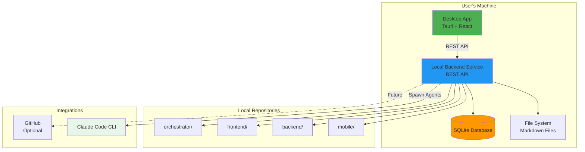

**Key Principle:** Local-first, works offline, optional cloud sync later.

---

## Project Structure

```
my-project/
├── orchestrator/              # Central coordination
│   ├── devflow/              # All PM artifacts
│   │   ├── 1-discovery/      # Research, requirements, personas
│   │   ├── 2-planning/       # PRDs, roadmaps, OKRs
│   │   ├── 3-design/         # UX flows, UI mockups, design system
│   │   ├── 4-architecture/   # System design, API specs, database
│   │   ├── 5-implementation/ # Epics & tasks
│   │   ├── 6-testing/        # Test plans, cases, reports
│   │   ├── 7-documentation/  # User guides, API docs
│   │   ├── 8-decisions/      # Architecture Decision Records
│   │   ├── 9-security/       # Security audits, threat models
│   │   └── 10-retrospectives/# Sprint retros, post-mortems
│   │
│   ├── config/
│   │   └── project.yml       # Multi-repo & workflow config
│   │
│   └── .claude/
│       ├── agents/           # Agent definitions (*.md)
│       │   ├── product-manager.md
│       │   ├── backend-developer.md
│       │   └── frontend-developer.md
│       └── skills/           # Reusable skills (*.md)
│           ├── nodejs-development.md
│           └── react-development.md
│
├── frontend/                 # Your frontend repo
│   ├── .specflux/            # Auto-created by SpecFlux
│   │   └── worktrees/        # Isolated workspaces (auto-managed)
│   └── src/
│
├── backend/                  # Your backend repo
│   ├── .specflux/            # Auto-created by SpecFlux
│   │   └── worktrees/        # Isolated workspaces (auto-managed)
│   └── src/
│
└── mobile/                   # Your mobile repo (optional)
    ├── .specflux/
    │   └── worktrees/
    └── src/
```

---

## Configurable Workflows

### Workflow Templates

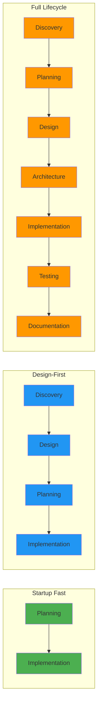

### Configuration Example

```yaml
# orchestrator/config/project.yml

project:
  name: "My SaaS Platform"
  mode: local

# Workflow configuration
workflow:
  template: startup-fast  # startup-fast | design-first | full-lifecycle
  
  enabled_phases:
    - planning
    - implementation
  
  auto_features:
    auto_create_tasks: true
    auto_assign_agents: true
    skip_approvals: true

# Kanban board
kanban:
  columns:
    - backlog
    - ready
    - in-progress
    - review
    - done

# Claude Code
claude_code:
  cli_path: /usr/local/bin/claude
  enabled: true

# Repositories
repositories:
  - name: backend
    path: ../backend
    git_url: github.com/me/backend
    agent: backend-developer
    
  - name: frontend
    path: ../frontend
    git_url: github.com/me/frontend
    agent: frontend-developer

# Agents (only install what you need)
agents:
  enabled:
    - product-manager
    - backend-developer
    - frontend-developer
```

---

## Core Workflows

### 1. Spec-Driven Development Flow


### 2. Agent Orchestration Flow

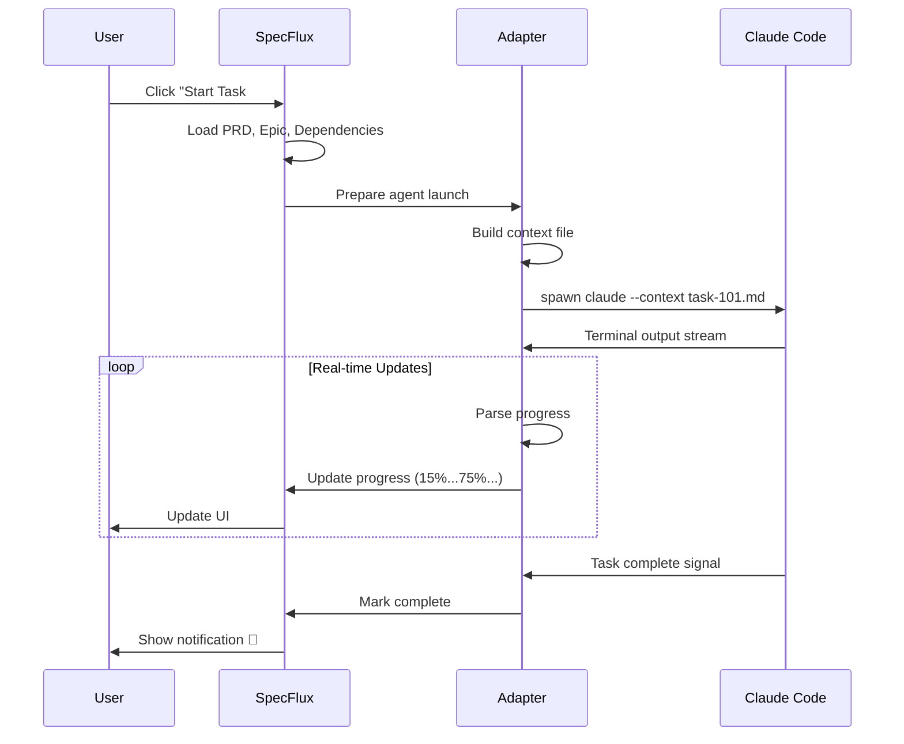

### 3. Cross-Repo Coordination

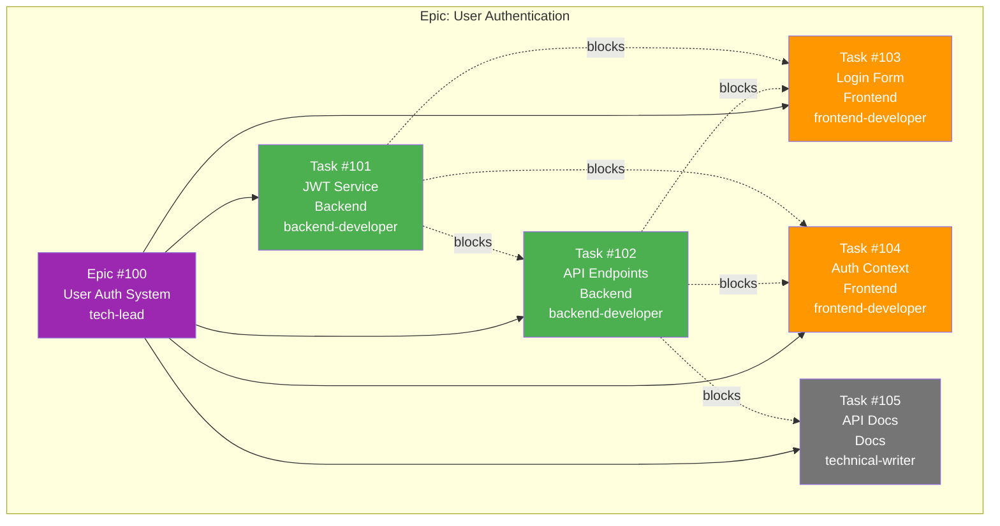

---

## Approval Gates & Human Review

### Critical Principle: Human-in-the-Loop

**AI agents generate, humans approve.** Every artifact produced by an agent must be reviewed and approved before becoming input for downstream tasks.

### Review Status Workflow

```
Task States:
- Backlog        → Not started
- Ready          → Ready to start (dependencies met)
- In Progress    → Agent actively working
- Pending Review → Agent completed, awaiting review (if requires_approval: true)
- Approved       → Reviewed and approved (or auto-approved)
- Done           → Merged/deployed
```

### Approval Flow

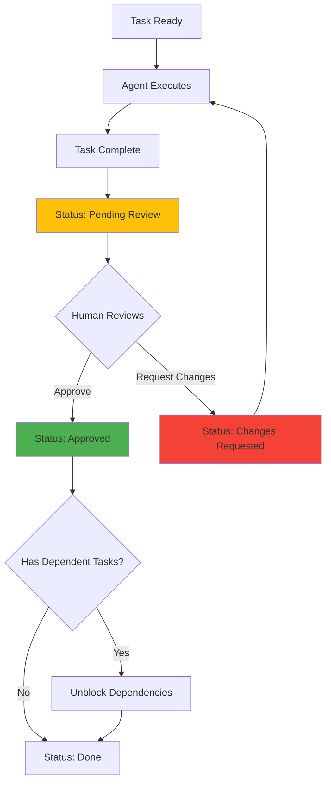

### What Requires Approval

#### Phase Outputs (Always)
- **Discovery:** Research findings, user personas
- **Planning:** PRDs, OKRs, roadmaps
- **Design:** Wireframes, mockups, design specs
- **Architecture:** System diagrams, API specs, database schemas
- **Implementation:** Feature code (via PR review)
- **Testing:** Test plans, test results
- **Documentation:** User guides, API docs

#### Task Outputs (Configurable)
- **Chain Outputs:** May require approval before passing to dependents
- **Code Changes:** Always via PR (external to SpecFlux)
- **Configuration Changes:** Based on workflow settings

### Approval UI

**When agent completes task:**

```
┌────────────────────────────────────────────────────────────┐
│  🎉 Task #42: JWT Service - Complete!                     │
├────────────────────────────────────────────────────────────┤
│                                                            │
│  Status: Pending Review                                    │
│                                                            │
│  Agent Output:                                             │
│  ┌──────────────────────────────────────────────────────┐ │
│  │ ✓ Implemented JWT service (src/auth/jwt.service.ts) │ │
│  │ ✓ Added tests (15/15 passing)                       │ │
│  │ ✓ Updated API routes                                │ │
│  │ ✓ Generated chain output                            │ │
│  └──────────────────────────────────────────────────────┘ │
│                                                            │
│  Files Changed (4):                                        │
│  📄 src/auth/jwt.service.ts         [View Diff]          │
│  📄 src/routes/auth.routes.ts       [View Diff]          │
│  📄 tests/auth/jwt.test.ts          [View Diff]          │
│  📄 chain-outputs/task-42.md        [View]               │
│                                                            │
│  Blocked Tasks (2):                                        │
│  #43: Login Endpoint                                       │
│  #44: Protected Routes                                     │
│                                                            │
│  ⚠️  Review required before these tasks can start         │
│                                                            │
│  [✅ Approve & Unblock]  [✏️ Request Changes]  [👀 Review Code]│
└────────────────────────────────────────────────────────────┘
```

**Request Changes Flow:**

```
┌────────────────────────────────────────────────────────────┐
│  Request Changes: Task #42                                 │
├────────────────────────────────────────────────────────────┤
│                                                            │
│  What needs to change?                                     │
│  ┌──────────────────────────────────────────────────────┐ │
│  │ - Add token expiration logging                       │ │
│  │ - Extract secret key to environment variable         │ │
│  │ - Add integration test with actual HTTP requests     │ │
│  └──────────────────────────────────────────────────────┘ │
│                                                            │
│  [ ] Restart agent with changes                            │
│  [ ] Provide as additional context                         │
│                                                            │
│  [Cancel]  [Submit Feedback]                              │
└────────────────────────────────────────────────────────────┘
```

### Approval Gates by Workflow

**Startup Fast:**
- Required: PRD, Architecture, Code Review (via PR)
- Optional: Design, Test Plans

**Design-First:**
- Required: Discovery, Design, PRD, Code Review
- Optional: Architecture, Test Plans

**Full Lifecycle:**
- Required: All phase outputs
- Required: All chain outputs
- Required: All code changes

### Team Collaboration

**Simple Model:**
- Any team member can approve any task
- Tasks can be configured to skip approval (auto-approve)
- No assignment needed - whoever reviews first approves

**Approval Required?**
```yaml
# Per task setting
task:
  requires_approval: true  # or false to skip

# Or per workflow phase
workflow:
  planning_requires_approval: true
  implementation_requires_approval: false  # Skip for speed
```

**Team Workflow:**
```
User A creates Task #42
  ↓
Agent completes
  ↓
Status: Pending Review (if requires_approval: true)
  ↓
Any team member can review
  ↓
First person to approve → unblocks dependents

Or if requires_approval: false
  ↓
Agent completes → Auto-approved → Unblock immediately
```

**UI:**
```
┌─────────────────────────────┐
│ Pending Review (3)          │
├─────────────────────────────┤
│ #42 JWT Service             │
│ Created by: Alice Smith     │
│ Anyone can review           │
│ [Review →]                  │
└─────────────────────────────┘
```

### Configuration

```yaml
# orchestrator/config/project.yml

approval_gates:
  # Simple: which phases require approval?
  phase_outputs:
    discovery: true
    planning: true
    design: true
    architecture: true
    implementation: false  # Auto-approve for speed
    testing: true
    documentation: false
  
  # Chain outputs
  chain_outputs:
    enabled: true
    auto_approve_if_no_dependents: true  # Skip review if no one waiting
  
  # Or set per task
  # task.requires_approval: true/false
```
    discovery: true
    planning: true
    design: true
    architecture: true
    implementation: false  # Handled by PR review
    testing: true
    documentation: true
  
  # Require approval for chain outputs
  chain_outputs:
    enabled: true
    threshold: "medium"  # none, low, medium, high
    # medium = approve if 2+ dependent tasks
  
  # Auto-approve settings (advanced)
  auto_approve:
    enabled: false
    conditions:
      - all_tests_pass
      - no_security_issues
      - linter_passes
```

### Notification System

**When task needs review:**
- Browser notification
- Email (optional)
- Slack/Discord webhook (optional)

**Blocked task indicators:**
```
Board View:

Ready          │ In Progress    │ Pending Review │ Approved
──────────────┼────────────────┼────────────────┼──────────
#40 DB Schema │ #42 JWT Svc    │                │
               │                │                │
🔒 #43 Login  │                │ Waiting on #42 │
🔒 #44 Auth   │                │ Waiting on #42 │
```

### Review History

**Track approval decisions:**

```typescript
interface ApprovalRecord {
  task_id: number;
  reviewer: string;
  decision: 'approved' | 'changes_requested';
  feedback: string;
  timestamp: Date;
}
```

**Display in task history:**
```
Task #42 Timeline:
├─ Started: 2:30 PM
├─ Completed: 3:15 PM (45 min)
├─ Review Requested: 3:15 PM
├─ Changes Requested by Calvin: 3:45 PM
│  └─ "Add token logging, use env vars"
├─ Agent Restarted: 3:46 PM
├─ Completed: 4:00 PM
├─ Approved by Calvin: 4:10 PM
└─ Dependencies Unblocked: #43, #44
```

### Benefits

**Quality Control:**
- Human oversight at critical points
- Catch issues before they propagate
- Ensure alignment with requirements

**Learning Loop:**
- Agent learns from feedback
- Patterns emerge from reviews
- Improve future task context

**Trust Building:**
- Humans remain in control
- Visibility into agent decisions
- Clear accountability

---

## Prompt Chaining for Task Dependencies

### The Problem
Tasks with dependencies need context from completed tasks to work correctly.

**Without chaining:**
- Agent #102 doesn't know what Agent #101 implemented
- Agent #103 has to guess API structure
- Misalignment and back-and-forth

**With chaining:**
- Agent #102 receives Agent #101's implementation summary
- Agent #103 knows exact APIs to call
- Smooth handoffs with full context

### How It Works

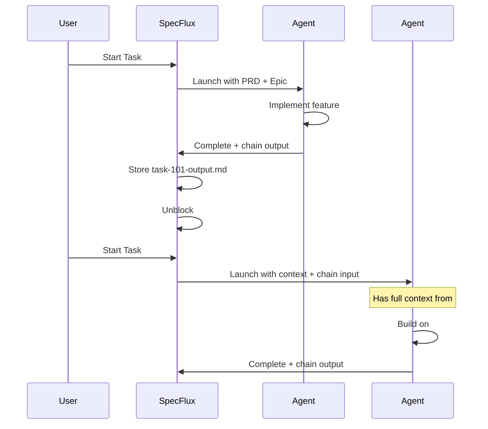

### Chain Output Format

When a task completes, the agent generates a summary:

**Example: Task #101 Output**

```
# Task #101 Output: JWT Service Implementation

## What I Built
Implemented JWT authentication service

## Files Created/Modified
- src/auth/jwt.service.ts - Main JWT service
- tests/jwt.test.ts - Unit tests (97% coverage)

## API Contract
class JWTService {
  generateToken(userId: string, role: string): string
  verifyToken(token: string): TokenPayload | null
}

## Configuration Required
JWT_SECRET=your-secret-key
JWT_EXPIRY=24h

## Integration Notes
- Use verifyToken() in middleware
- Token format: Bearer token in Authorization header

## Next Steps for Dependent Tasks
Task #102: Use JWTService.verifyToken() in auth middleware
```

### File Structure

```
orchestrator/devflow/5-implementation/epics/user-auth/
├── epic.md
├── tasks/
│   ├── 101-jwt-service.md
│   └── 102-api-endpoints.md
└── chain-outputs/              # ← Chain summaries
    ├── 101-output.md
    └── 102-output.md
```

### Context Injection

**Task without dependencies:**
```bash
claude --prd prd.md --epic epic.md --task task-101.md
```

**Task with dependencies:**
```bash
claude --prd prd.md --epic epic.md --task task-102.md \
       --chain-input chain-outputs/101-output.md
```

**Task with multiple dependencies:**
```bash
claude --prd prd.md --epic epic.md --task task-103.md \
       --chain-input chain-outputs/101-output.md \
       --chain-input chain-outputs/102-output.md
```

### Benefits

✅ **Reduced Context Switching** - No need to read previous task's code  
✅ **Consistency** - Decisions from #101 automatically flow to #102  
✅ **Faster Development** - No back-and-forth about APIs/formats  
✅ **Error Prevention** - Exact contracts specified  
✅ **Free Documentation** - Chain outputs document the epic  
✅ **Cross-Repo Support** - Frontend tasks can read backend outputs

### UI Integration

**Task card shows chain availability:**
```
┌─────────────────────────────────────────┐
│ #102: API Endpoints                     │
│ Dependencies (1):                       │
│ ✅ #101: JWT Service (Done)             │
│    📄 Chain output available            │
│ [🚀 Start with Chain Context]          │
└─────────────────────────────────────────┘
```

**Task detail shows chain inputs:**
```
Chain Inputs (2):
┌────────────────────────────────────┐
│ From #101: JWT Service             │
│ • Token format: Bearer token       │
│ • Use verifyToken() in middleware  │
│ [View Full Output →]               │
└────────────────────────────────────┘
```

### Configuration

```yaml
# orchestrator/config/project.yml

prompt_chaining:
  enabled: true
  output_directory: devflow/5-implementation/epics/{epic_id}/chain-outputs/
  
  # Agent generates chain output automatically
  # Includes: summary, API contracts, integration notes
```

---

## AI Agents & Responsibilities

### Agent Lifecycle Mapping

| Phase | Agent | Responsibilities | Files Created |
|-------|-------|-----------------|---------------|
| **Discovery** | product-researcher | User research, market analysis | `research/*.md` |
| | business-analyst | Requirements, stakeholder interviews | `requirements/*.md` |
| | ux-researcher | User personas, journey mapping | `personas/*.md` |
| **Planning** | product-manager | PRDs, roadmaps, feature prioritization | `prds/*.md`, `roadmap/*.md` |
| **Design** | ux-designer | User flows, wireframes, IA | `ux/*.md` |
| | ui-designer | Visual design, mockups, design system | `ui/*.md` |
| **Architecture** | system-architect | System architecture, tech stack | `system/*.md` |
| | backend-architect | API design, services | `backend/*.md` |
| | database-architect | Schema, ERD, migrations | `backend/database/*.md` |
| | frontend-architect | Component architecture | `frontend/*.md` |
| **Implementation** | tech-lead | Epic planning, task breakdown | `epics/*/epic.md` |
| | backend-developer | Backend implementation | `epics/*/tasks/backend/*.md` |
| | frontend-developer | Frontend implementation | `epics/*/tasks/frontend/*.md` |
| | mobile-developer | Mobile implementation | `epics/*/tasks/mobile/*.md` |
| **Testing** | qa-engineer | Test plans, cases, reports | `testing/*.md` |
| **Documentation** | technical-writer | User guides, API docs | `documentation/*.md` |
| **Security** | security-engineer | Security audits, threat models | `security/*.md` |

### Agent Collaboration Flow

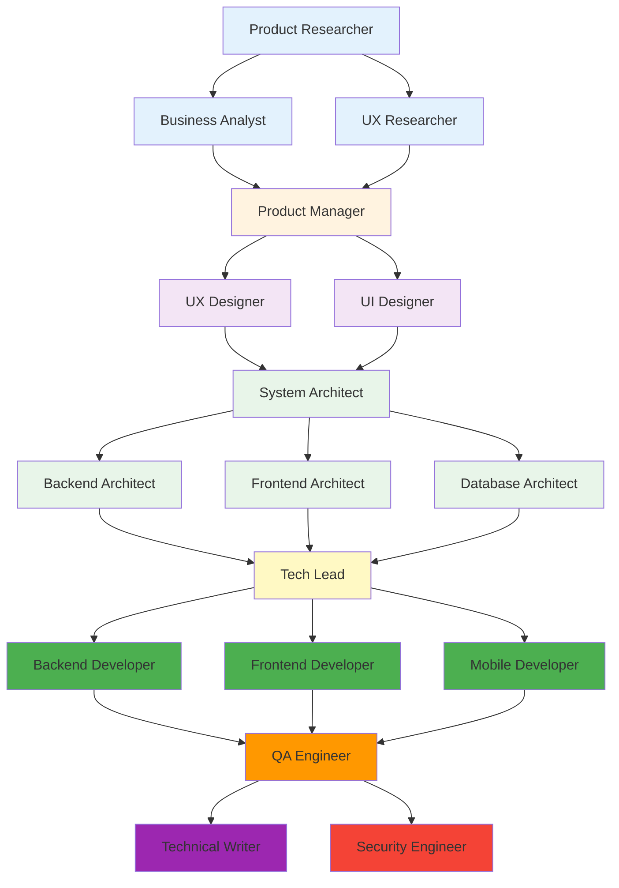

---

## UI Wireframes

### Navigation Structure

**Primary Navigation (Sidebar):**
```
┌──────────────┐
│ SpecFlux     │
├──────────────┤
│ 📊 Board     │  ← Main view (Kanban)
│ 📋 Tasks     │  ← List view (all tasks)
│ 📁 Epics     │  ← Epic management
│ 📄 Files     │  ← Browse PRDs, docs
│ ⚙️  Settings  │  ← Project config
└──────────────┘
```

**5 main sections - that's it!**

### Complete Layout with Navigation

```
┌────────────────────────────────────────────────────────────┐
│  ┌────────┬──────────────────────────────────────────────┐│
│  │SpecFlux│  My SaaS Project ▼              🔔 ⚙️  👤   ││
│  └────────┴──────────────────────────────────────────────┘│
├──────────┬─────────────────────────────────────────────────┤
│          │                                                 │
│ 📊 Board │  [Current view content here]                   │
│ 📋 Tasks │                                                 │
│ 📁 Epics │                                                 │
│ 📄 Files │                                                 │
│ ⚙️ Settings                                                │
│          │                                                 │
│          │                                                 │
└──────────┴─────────────────────────────────────────────────┘
```

**Top bar:**
- SpecFlux logo (home)
- Project selector dropdown
- Notifications (🔔)
- Settings quick access (⚙️)
- User profile (👤)

**Left sidebar (always visible):**
- 5 navigation items
- Active item highlighted
- Collapsible (toggle with hamburger icon)

---

### Main Dashboard (Board View)

```
┌────────────────────────────────────────────────────────────┐
│  ┌────────┬──────────────────────────────────────────────┐│
│  │SpecFlux│  My SaaS Project ▼              🔔 ⚙️  👤   ││
│  └────────┴──────────────────────────────────────────────┘│
├──────────┬─────────────────────────────────────────────────┤
│          │                                                 │
│ 📊 Board │  Getting Started                    [✕ Dismiss]│
│ ─────    │  ☑ Project created                             │
│ 📋 Tasks │  ☑ Repositories configured                     │
│ 📁 Epics │  ☐ Create first epic        [Start →]         │
│ 📄 Files │                                                 │
│ ⚙️ Settings Quick Actions                                  │
│          │  [📝 New Epic] [📋 Task] [🔄 Sync]            │
│          │                                                 │
│          │  Active Tasks (2)            [View All →]      │
│          │  • #101 JWT Service    75% ████▓░  Backend     │
│          │  • #103 Login Form     40% ██░░░░  Frontend    │
│          │                                                 │
│          │  Pending Review (1)          [Review →]        │
│          │  • #42 JWT Implementation                      │
│          │                                                 │
│          │  Repositories                  [+ Add]          │
│          │  ┌─────────┐ ┌─────────┐ ┌─────────┐          │
│          │  │Frontend │ │ Backend │ │  Docs   │          │
│          │  │🟢 Ready │ │🟢 Ready │ │🟢 Ready │          │
│          │  └─────────┘ └─────────┘ └─────────┘          │
└──────────┴─────────────────────────────────────────────────┘
```

### Board View (Kanban)

```
┌────────────────────────────────────────────────────────────┐
│  ┌────────┬──────────────────────────────────────────────┐│
│  │SpecFlux│  My SaaS Project ▼              🔔 ⚙️  👤   ││
│  └────────┴──────────────────────────────────────────────┘│
├──────────┬─────────────────────────────────────────────────┤
│          │  Board    [Repos: All ▼] [Epic: User Auth ▼]  │
│ 📊 Board ├─────────────────────────────────────────────────┤
│ ─────    │ Backlog │ Ready │ In Progress │ Review │ Done  │
│ 📋 Tasks │─────────┼───────┼─────────────┼────────┼───────│
│ 📁 Epics │         │┌────┐│  ┌────┐     │        │┌────┐ │
│ 📄 Files ││         ││#101││  │#102│     │        ││#100││
│ ⚙️ Settings         ││JWT ││  │API │     │        ││Auth││
│          │         ││Svc ││  │Endp│     │        ││PRD ││
│          │         ││    ││  │[██▓│     │        ││✓   ││
│          │         ││🔵  ││  │75% │     │        │└────┘│
│          │         │└────┘│  │🔵  │     │        │      │
│          │         │      │  └────┘     │        │      │
│          │         │┌────┐│  ┌────┐     │        │      │
│          │         ││#103││  │#104│     │        │      │
│          │         ││Logn││  │Auth│     │        │      │
│          │         ││Form││  │Ctx │     │        │      │
│          │         ││🟢  ││  │[█░░│     │        │      │
│          │         ││🔒  ││  │20% │     │        │      │
│          │         │└────┘│  │🟢  │     │        │      │
│          │         │      │  └────┘     │        │      │
└──────────┴─────────┴───────┴─────────────┴────────┴───────┘

🔵 Backend  🟢 Frontend  📱 Mobile  📝 Docs
```

### Tasks View (List)

```
┌────────────────────────────────────────────────────────────┐
│  ┌────────┬──────────────────────────────────────────────┐│
│  │SpecFlux│  My SaaS Project ▼              🔔 ⚙️  👤   ││
│  └────────┴──────────────────────────────────────────────┘│
├──────────┬─────────────────────────────────────────────────┤
│          │  Tasks    [Status: All ▼] [Search...]  [+ New]│
│ 📊 Board ├─────────────────────────────────────────────────┤
│ 📋 Tasks │ # │ Title         │ Status  │ Repo    │ Progress│
│ ─────    │───┼───────────────┼─────────┼─────────┼─────────│
│ 📁 Epics │100│ Auth PRD      │ Done    │ Docs    │ ✓       │
│ 📄 Files │101│ JWT Service   │ Ready   │ Backend │ -       │
│ ⚙️ Settings102│ API Endpoints │Progress │ Backend │ 75%     │
│          │103│ Login Form    │ Ready   │Frontend │ -       │
│          │104│ Auth Context  │Progress │Frontend │ 20%     │
│          │ 42│ JWT Impl      │ Review  │ Backend │ ⏱️      │
│          │───┼───────────────┼─────────┼─────────┼─────────│
│          │                                                  │
│          │  6 tasks    2 active    1 pending review        │
└──────────┴──────────────────────────────────────────────────┘
```

### Epics View

```
┌────────────────────────────────────────────────────────────┐
│  ┌────────┬──────────────────────────────────────────────┐│
│  │SpecFlux│  My SaaS Project ▼              🔔 ⚙️  👤   ││
│  └────────┴──────────────────────────────────────────────┘│
├──────────┬─────────────────────────────────────────────────┤
│          │  Epics                              [+ Create] │
│ 📊 Board ├─────────────────────────────────────────────────┤
│ 📋 Tasks │                                                 │
│ 📁 Epics │  ┌──────────────────────────────────────────┐  │
│ ─────    │  │ User Authentication         [████▓░] 75% │  │
│ 📄 Files │  │ 6 tasks    4 done    2 in progress       │  │
│ ⚙️ Settings  │ PRD: user-auth.md          [View →]      │  │
│          │  └──────────────────────────────────────────┘  │
│          │                                                 │
│          │  ┌──────────────────────────────────────────┐  │
│          │  │ Payment Integration         [░░░░░░] 0%  │  │
│          │  │ 0 tasks    Planning phase                │  │
│          │  │ PRD: payments.md           [View →]      │  │
│          │  └──────────────────────────────────────────┘  │
│          │                                                 │
│          │  ┌──────────────────────────────────────────┐  │
│          │  │ Admin Dashboard             [██████] 100%│  │
│          │  │ 8 tasks    All complete                  │  │
│          │  │ PRD: admin.md              [View →]      │  │
│          │  └──────────────────────────────────────────┘  │
└──────────┴──────────────────────────────────────────────────┘
```

### Files View

```
┌────────────────────────────────────────────────────────────┐
│  ┌────────┬──────────────────────────────────────────────┐│
│  │SpecFlux│  My SaaS Project ▼              🔔 ⚙️  👤   ││
│  └────────┴──────────────────────────────────────────────┘│
├──────────┬─────────────────────────────────────────────────┤
│          │  Files    orchestrator/devflow/                │
│ 📊 Board ├─────────────────────────────────────────────────┤
│ 📋 Tasks │  📁 2-planning/                                 │
│ 📁 Epics │    📄 user-auth.md                   [Edit]     │
│ 📄 Files │    📄 payments.md                    [Edit]     │
│ ─────    │    📄 admin.md                       [Edit]     │
│ ⚙️ Settings                                                │
│          │  📁 5-implementation/                           │
│          │    📁 epics/                                    │
│          │      📁 user-auth/                              │
│          │        📄 epic.md                   [Edit]      │
│          │      📁 payments/                               │
│          │        📄 epic.md                   [Edit]      │
│          │    📁 tasks/                                    │
│          │      📄 task-100.md                 [View]      │
│          │      📄 task-101.md                 [View]      │
│          │                                                 │
│          │  📁 chain-outputs/                              │
│          │    📄 task-100.md                   [View]      │
└──────────┴──────────────────────────────────────────────────┘
```

### Task Detail with Embedded Terminal

```
┌────────────────────────────────────────────────────────────┐
│  Task #102: API Endpoints Implementation                   │
├────────────────────────────────────────────────────────────┤
│  Left Panel: Details          │  Right Panel: Terminal     │
│                               │                            │
│  Status: In Progress          │  Terminal (backend/)       │
│  Agent: 🤖 backend-developer  │  ┌──────────────────────┐ │
│  Progress: [████▓░] 75%       │  │ $ cd backend         │ │
│  Time: 18 minutes             │  │ $ claude             │ │
│                               │  │                      │ │
│  Files Changed (5):           │  │ [Agent] Creating     │ │
│  ✓ routes/auth.ts (created)   │  │ authentication       │ │
│  ✓ controllers/auth.ts        │  │ endpoints...         │ │
│  ⚙ middleware/jwt.ts          │  │                      │ │
│  ⚙ tests/auth.test.ts         │  │ [File] Created:      │ │
│  ○ README.md (pending)        │  │ routes/auth.ts       │ │
│                               │  │                      │ │
│  Dependencies:                │  │ [Test] Running       │ │
│  ✓ #101 JWT Service (done)    │  │ unit tests...        │ │
│  → Blocks: #103, #104         │  │                      │ │
│                               │  │ ✓ 47 tests passing   │ │
│  GitHub:                      │  │                      │ │
│  Issue: #201                  │  │ [Agent] Task 75%     │ │
│  Branch: feature/auth-api     │  │ complete...          │ │
│                               │  └──────────────────────┘ │
│                               │                            │
│  [⏸ Pause Agent]              │  [Clear] [Copy Log]       │
│  [👀 Review Code]             │                            │
│  [🔁 Create PR]               │                            │
└────────────────────────────────────────────────────────────┘
```

### Agent Management

```
┌────────────────────────────────────────────────────────────┐
│  Settings          Agents & Skills                         │
├────────────────────────────────────────────────────────────┤
│                                                            │
│  Agents  |  Skills  |  Commands                           │
│  ═══════                                                   │
│                                                            │
│  Available Agents (8)                  [+ Install Agent]   │
│                                                            │
│  ┌──────────────────────────────────────────────────────┐ │
│  │ 🟢 product-manager                    [Edit] [Delete]│ │
│  │    Creates PRDs, roadmaps, feature prioritization    │ │
│  │    Location: .claude/agents/product-manager.md       │ │
│  │    Used in: 12 tasks                                 │ │
│  └──────────────────────────────────────────────────────┘ │
│                                                            │
│  ┌──────────────────────────────────────────────────────┐ │
│  │ 🟢 backend-developer                  [Edit] [Delete]│ │
│  │    Implements backend services, APIs, databases      │ │
│  │    Location: .claude/agents/backend-developer.md     │ │
│  │    Used in: 47 tasks                                 │ │
│  └──────────────────────────────────────────────────────┘ │
│                                                            │
│  ┌──────────────────────────────────────────────────────┐ │
│  │ 🟡 ui-designer                        [Edit] [Delete]│ │
│  │    Visual design, mockups, design systems            │ │
│  │    Location: .claude/agents/ui-designer.md           │ │
│  │    Used in: 3 tasks                                  │ │
│  └──────────────────────────────────────────────────────┘ │
│                                                            │
│  Quick Actions on Agent:                                  │
│  • [📝 Edit in Claude Code] - AI-assisted editing        │
│  • [📄 Open .md File] - Manual editing                   │
│  • [🧪 Test Agent] - Run test task                       │
│  • [📋 View Tasks] - See all tasks using this agent      │
│                                                            │
└────────────────────────────────────────────────────────────┘
```

### Workflow Configuration

```
┌────────────────────────────────────────────────────────────┐
│  Settings          Workflow Configuration                  │
├────────────────────────────────────────────────────────────┤
│                                                            │
│  Active Template: Startup Fast                  [Change]  │
│                                                            │
│  Enabled Phases                                            │
│  ┌──────────────────────────────────────────────────────┐ │
│  │                                                      │ │
│  │  ☐ 1. Discovery                              [Edit] │ │
│  │     Research, requirements, personas                │ │
│  │                                                      │ │
│  │  ☑ 2. Planning                               [Edit] │ │
│  │     PRDs, roadmaps, OKRs                            │ │
│  │     Required: PRD                                   │ │
│  │                                                      │ │
│  │  ☐ 3. Design                                 [Edit] │ │
│  │     UX flows, UI mockups, design system             │ │
│  │                                                      │ │
│  │  ☐ 4. Architecture                           [Edit] │ │
│  │     System design, API specs, database              │ │
│  │                                                      │ │
│  │  ☑ 5. Implementation                         [Edit] │ │
│  │     Epics, tasks, coding                            │ │
│  │     Required: Epic, Tasks                           │ │
│  │                                                      │ │
│  │  ☐ 6. Testing                                [Edit] │ │
│  │     Test plans, QA, bug tracking                    │ │
│  │                                                      │ │
│  │  ☐ 7. Documentation                          [Edit] │ │
│  │     User guides, API docs, tutorials                │ │
│  │                                                      │ │
│  └──────────────────────────────────────────────────────┘ │
│                                                            │
│  💡 Tip: Enable only what your team needs                 │
│                                                            │
│                              [Cancel]  [Save Changes]     │
└────────────────────────────────────────────────────────────┘
```

---

## Key Features

### Core (MVP)
- ✅ **Unified Kanban Board** - All repos in one view
- ✅ **One-Click Agent Launch** - Context injected automatically
- ✅ **Parallel Task Execution** - Run multiple tasks simultaneously with auto-managed Git worktrees
- ✅ **Human-in-the-Loop Approvals** - Review and approve agent outputs before downstream tasks
- ✅ **Embedded Terminal** - Real-time agent monitoring
- ✅ **Progress Tracking** - Automatic via terminal parsing
- ✅ **Dependency Management** - Visual blocking/unblocking with approval gates
- ✅ **Prompt Chaining** - Tasks receive context from approved dependencies
- ✅ **Configurable Workflows** - Startup → Enterprise templates with approval settings
- ✅ **Agent Management UI** - Browse, configure, edit agents/skills
- ✅ **File-Based Artifacts** - All docs in markdown, Git-trackable
- ✅ **Multi-Repo Support** - Coordinate across repositories

### Future Enhancements
- ⏳ **GitHub Integration** - Bidirectional sync, webhooks
- ⏳ **Agent Library** - Community-contributed agents
- ⏳ **Advanced Analytics** - Performance metrics, insights
- ⏳ **Cloud Collaboration** - Team mode, real-time sync
- ⏳ **Tool Expansion** - Cursor, Windsurf support
- ⏳ **Custom Workflows** - Beyond templates, full customization

---

## Data Storage Strategy

### SQLite Database
```sql
-- Projects, repositories
-- Tasks, status, assignments
-- Dependencies, progress
-- Activity log, statistics
```

### File System (Markdown)
```
orchestrator/devflow/
  └── All PRDs, Epics, Tasks, Designs, Architecture docs
  
Benefits:
✓ Human-readable
✓ Git-trackable
✓ Version controlled
✓ Easy to share
```

**Why Both?**
- Database: Fast queries, relationships, real-time status
- Files: Human collaboration, version history, portability

---

## Multi-User Collaboration

### Design Philosophy

**Proper multi-user schema from day 1, used simply at first, scales naturally to teams later.**

- **MVP (Now):** Single user per project - Desktop app auto-creates user from OS
- **Future:** Multiple users per project - Add team members, assign tasks, manage permissions
- **No Migration:** Schema supports both - just add rows to `project_members` table

### Database Design

```
users                    # User profiles
  ├─ id, email, display_name, avatar_url
  
project_members          # Who belongs to which project
  ├─ project_id, user_id, role
  ├─ Roles: owner, admin, developer, viewer
  
projects
  ├─ owner_user_id → users.id

tasks
  ├─ created_by_user_id → users.id
  ├─ assigned_to_user_id → users.id (optional)
```

**MVP Usage:** Desktop app creates one user (from OS), auto-adds as project owner, auto-assigns tasks to self.

**Future Usage:** Invite users → Add to `project_members` → Assign tasks → Check permissions.

### Git-Based File Sync

**The orchestrator repository is version-controlled with Git:**

```
orchestrator/           # Git repository
├── .git/              # Version control
├── devflow/           # All PM artifacts tracked
├── config/
└── .claude/
```

**How It Works:**

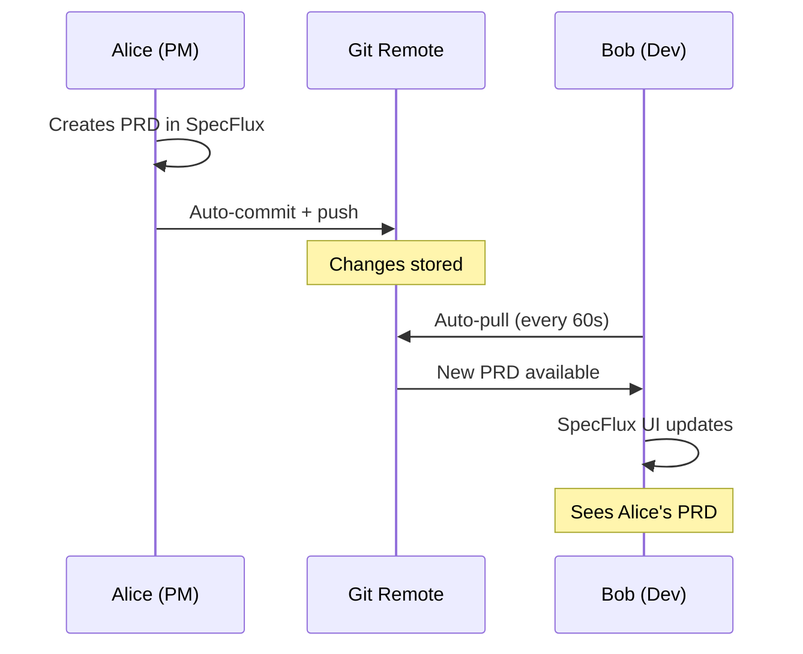

### Approval Workflow

```
Alice creates Task #42
  ↓
Agent completes
  ↓
Status: Pending Review (if requires_approval: true)
  ↓
Anyone on team can review
  ↓
Bob approves
  ↓
Dependent tasks unblock
```

See [Approval Gates](#approval-gates--human-review) for configuration.

### Configuration

```yaml
# orchestrator/config/project.yml

git:
  enabled: true
  remote_url: "git@github.com:org/myapp-orchestrator.git"
  auto_commit: true              # Commit on every save
  auto_push: false               # Manual push (user control)
  auto_pull_interval: 60         # Pull every 60 seconds
  on_conflict: "notify"          # Show notification, user resolves
```

### User Experience

**Creating/Editing Documents:**
1. User edits PRD in SpecFlux UI
2. SpecFlux auto-commits locally
3. User clicks "Sync to Team" → Git push
4. Notification: "PRD synced to team ✓"

**Receiving Updates:**
1. SpecFlux pulls every 60 seconds
2. New changes → Notification
3. UI updates automatically
4. Conflicts → User resolves manually

**Future: Team Members**
1. Project owner invites team member
2. User receives email invitation
3. Accepts → Added to `project_members`
4. Can now view/edit project

---
2. Detects remote changes
3. Shows notification: "New PRD available"
4. UI refreshes automatically

**Conflict Resolution:**
1. SpecFlux detects merge conflict
2. Shows diff viewer with both versions
3. User chooses: Keep mine | Keep theirs | Edit manually
4. Resolved changes pushed

### UI Indicators

**Sync Status:**
```
┌────────────────────────────────────────┐
│ 📡 Sync: ✓ Up to date                 │
│    Last sync: 2 minutes ago            │
│    [🔄 Sync Now]                       │
└────────────────────────────────────────┘
```

**Update Notification:**
```
┌────────────────────────────────────────┐
│ 🔔 New Updates Available               │
│                                        │
│ Sarah updated:                         │
│ • User Auth PRD                        │
│ • Task #101 description                │
│                                        │
│ [Pull Updates]  [Ignore]              │
└────────────────────────────────────────┘
```

### Project Isolation

**Each project has its own orchestrator repo:**
```
~/projects/
├── myapp/
│   ├── orchestrator/         # Git: myapp-orchestrator
│   ├── frontend/
│   └── backend/
│
└── other-project/
    ├── orchestrator/         # Git: other-orchestrator
    ├── web/
    └── api/
```

**SpecFlux tracks projects by unique ID:**
```json
// ~/.devflow/projects.json
{
  "projects": [
    {
      "id": "myapp-2024-11-xyz123",
      "name": "My SaaS Platform",
      "local_path": "/Users/sarah/projects/myapp/orchestrator",
      "git_remote": "git@github.com:org/myapp-orchestrator.git"
    }
  ]
}
```

### Benefits

✅ **Simple** - Uses existing Git infrastructure  
✅ **Offline-capable** - Work locally, sync later  
✅ **Version history** - Full audit trail via Git  
✅ **Familiar** - Developers already know Git  
✅ **Free** - No additional infrastructure costs  
✅ **Conflict resolution** - Standard Git merge tools  
✅ **Near real-time** - 60-second sync interval acceptable  

### Future Enhancement

**Phase 2: Add real-time notifications** (without replacing Git)
- WebSocket for instant update alerts
- Git remains the source of truth
- Best of both worlds: version control + real-time UX

---

## Parallel Task Execution

### Auto-Managed Git Worktrees

**Run multiple tasks in the same repository simultaneously without conflicts.**

SpecFlux automatically uses Git worktrees to isolate concurrent tasks:

```
backend/
├── src/                       # Main working directory
├── .specflux/worktrees/       # Auto-managed (hidden from user)
│   ├── task-101/              # Isolated workspace for Task #101
│   └── task-102/              # Isolated workspace for Task #102
```

### How It Works

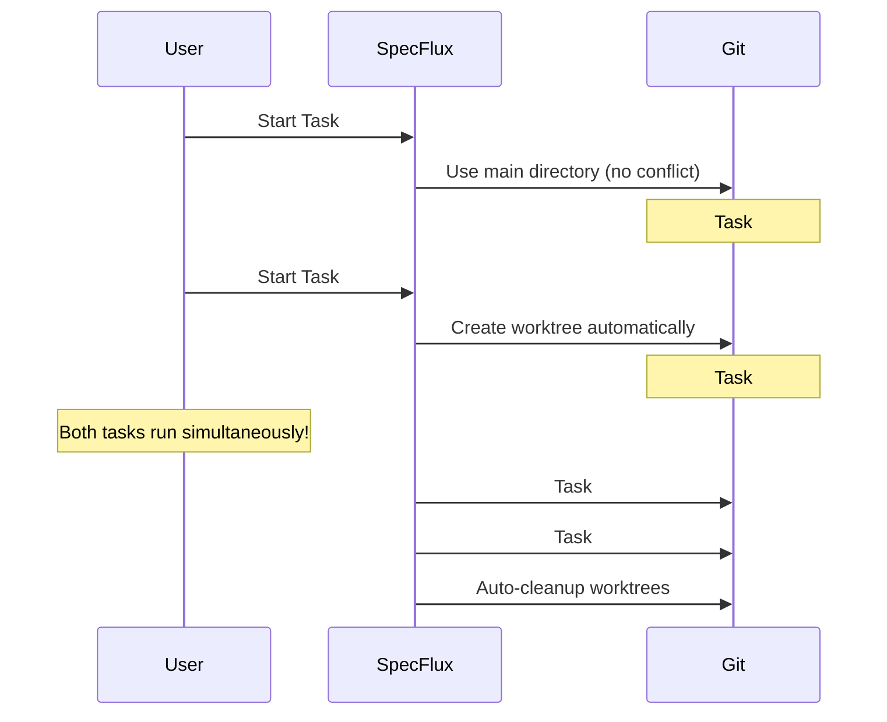

### User Experience

**User perspective:**
1. Click "Start Task" on multiple tasks
2. All tasks run simultaneously
3. Each gets its own terminal view
4. Progress tracked independently
5. Auto-commits, auto-PRs, auto-cleanup

**SpecFlux handles automatically:**
- ✅ Worktree creation (invisible to user)
- ✅ Branch management
- ✅ Conflict prevention
- ✅ Cleanup after completion
- ✅ Merge back to main

### UI: Multiple Active Tasks

```
Active Tasks (3)

┌────────────────────────────────────┐
│ #101 JWT Service       75% ████▓░ │
│ Backend  👤 backend-dev   [View →]│
└────────────────────────────────────┘

┌────────────────────────────────────┐
│ #102 Database Schema   40% ██░░░░ │
│ Backend  👤 backend-dev   [View →]│
└────────────────────────────────────┘

┌────────────────────────────────────┐
│ #103 Login Form        60% ███░░░ │
│ Frontend 👤 frontend-dev  [View →]│
└────────────────────────────────────┘
```

**Click any task to see its terminal output in tabbed or split view.**

### Benefits

- 🚀 **Faster development** - Run 3-5 tasks simultaneously
- 🛡️ **Zero conflicts** - Complete isolation per task
- 🎯 **Simple UX** - Just click "Start", SpecFlux handles the rest
- 🧹 **Auto-cleanup** - No manual worktree management
- 📦 **No Git knowledge required** - Transparent to users

### Configuration

```yaml
# orchestrator/config/project.yml

execution:
  parallel_execution: true              # Enabled by default
  max_concurrent_tasks_per_repo: 5      # Prevent resource exhaustion
  auto_cleanup: true                    # Remove worktrees after completion
  auto_create_pr: true                  # Create PRs automatically
```

---

## Claude Code Advanced Features Integration

### SpecFlux as Configuration Automation Layer

SpecFlux automatically generates and manages Claude Code's advanced configuration for users. Users never need to understand or manually configure Claude Code - SpecFlux handles everything.

**User Experience:**
1. Create project in SpecFlux UI
2. SpecFlux auto-generates all Claude Code configuration
3. Click "Start Task" in UI
4. Claude Code launches with perfect setup

**Value Proposition:** "Claude Code on Rails" - All the power, zero configuration.

---

### What SpecFlux Auto-Generates

#### 1. CLAUDE.md Files (Per Repository)

**When user adds a repository:**

SpecFlux automatically creates `CLAUDE.md` with project context:

```markdown
# Backend Repository

## Project Context
Part of: My SaaS App
Orchestrated by: ../orchestrator/

## Tech Stack
- Node.js 20 + Express
- PostgreSQL
- TypeScript

## Build Commands
- npm run dev
- npm test
- npm run lint

## Code Style
- Async/await patterns
- Comprehensive error handling
- TypeScript strict mode

## SpecFlux Integration
Tasks may run in .specflux/worktrees/task-{id}/
Chain context available from dependent tasks
```

**Updated automatically when:**
- User changes tech stack in settings
- User modifies build commands
- User updates code style preferences

---

#### 2. Skills Library (Auto-Installed)

**Skills are knowledge packages that agents auto-load when relevant.**

SpecFlux ships with skill templates and installs them based on workflow:

**Startup Fast Workflow:**
- `worktree-management` - Parallel execution patterns
- `chain-context` - Dependency handling

**Full Lifecycle Workflow:**
- All Startup Fast skills, plus:
- `testing-patterns` - Test-driven development
- `security-practices` - Security best practices
- `documentation-standards` - Doc generation

**User benefit:** Agents automatically know project-specific patterns.

---

#### 3. Task Context Files (Auto-Generated)

**When user clicks "Start Task":**

SpecFlux generates a context file with everything the agent needs:

```markdown
# Task #42: Implement JWT Service

## PRD Reference
Path: ../orchestrator/devflow/2-planning/user-auth.md
Summary: JWT-based authentication with refresh tokens

## Epic Reference
Path: ../orchestrator/devflow/5-implementation/epics/user-auth/epic.md
Technical Approach: Use jsonwebtoken library, 15min access tokens

## Chain Inputs from Dependencies

### Task #40: Database Schema
Output: Created `users` table with email, password_hash
Location: chain-outputs/task-40.md

### Task #41: Password Hashing
Output: Implemented bcrypt hashing in auth.service.ts
Location: chain-outputs/task-41.md

## Acceptance Criteria
- Generate JWT on successful login
- Validate JWT on protected routes
- Implement refresh token rotation
- Add tests with 90%+ coverage
```

**User never creates these manually.**

---

#### 4. Quality Hooks (Workflow-Based)

**SpecFlux configures hooks based on workflow template:**

**Startup Fast:**
```json
{
  "preToolUse": {
    "Bash(git commit)": {
      "command": "npm test",
      "blocking": true
    }
  }
}
```

**Full Lifecycle (adds security & lint):**
```json
{
  "preToolUse": {
    "Bash(git commit)": {
      "command": "npm test && npm audit && npm run lint",
      "blocking": true
    }
  }
}
```

**User benefit:** Agents can't commit broken code.

---

#### 5. MCP Server Configuration

**SpecFlux auto-configures external tool integrations:**

`.mcp.json` (in orchestrator):
```json
{
  "mcpServers": {
    "github": {
      "command": "npx",
      "args": ["-y", "@modelcontextprotocol/server-github"],
      "env": {
        "GITHUB_TOKEN": "{{SPECFLUX_AUTO_INJECTED}}"
      }
    },
    "sqlite": {
      "command": "npx",
      "args": [
        "-y",
        "@modelcontextprotocol/server-sqlite",
        "{{SPECFLUX_DB_PATH}}"
      ]
    }
  }
}
```

**Capabilities unlocked:**
- Agents can create GitHub issues/PRs automatically
- Agents can query SpecFlux database for task info
- Agents can access orchestrator files directly

**SpecFlux injects credentials and paths automatically.**

---

### Architecture: How SpecFlux Orchestrates Claude Code

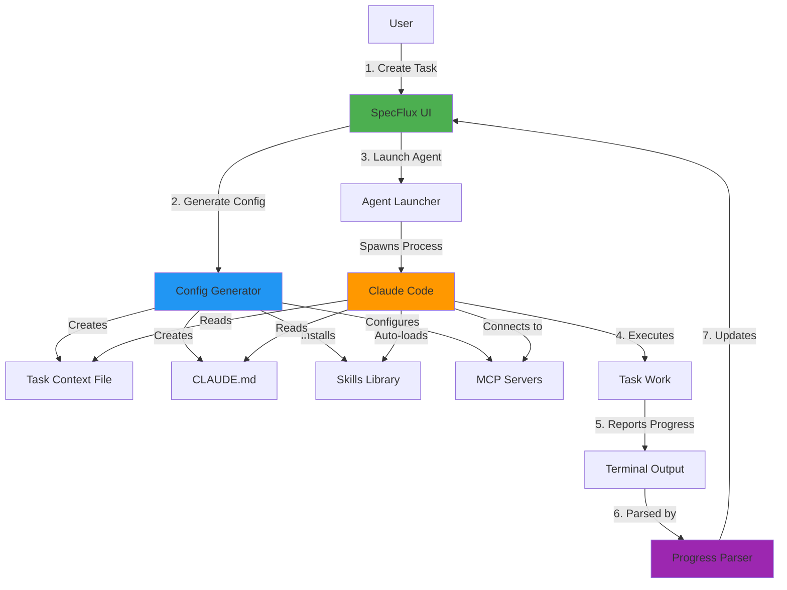

---

### File Structure (Auto-Created)

```
user-project/
├── orchestrator/                  # Created by SpecFlux
│   ├── CLAUDE.md                  # Auto-generated
│   ├── .claude/
│   │   └── skills/                # Auto-installed
│   │       ├── worktree-management/
│   │       └── chain-context/
│   ├── .mcp.json                  # Auto-configured
│   └── devflow/
│       └── tasks/
│           └── task-42-context.md # Auto-generated per task
│
├── backend/                       # User's repo
│   ├── CLAUDE.md                  # Auto-generated by SpecFlux
│   ├── .specflux/
│   │   └── worktrees/             # Auto-managed
│   └── src/
│
└── frontend/                      # User's repo
    ├── CLAUDE.md                  # Auto-generated by SpecFlux
    ├── .specflux/
    │   └── worktrees/             # Auto-managed
    └── src/
```

**User never edits .claude/ directory - SpecFlux manages it.**

---

### Benefits Summary

| What SpecFlux Generates | User Benefit | Without SpecFlux |
|------------------------|--------------|------------------|
| **CLAUDE.md** | Agents understand project instantly | Manual documentation |
| **Skills** | Automatic pattern knowledge | Manual skill creation |
| **Task Context** | Perfect context for each task | Manual context gathering |
| **Hooks** | Automatic quality gates | No enforcement |
| **MCP Config** | External tool integration | Manual setup |

**Result:** Users get all the power of Claude Code's advanced features with zero configuration effort.

---

## Technical Stack

### Desktop App
- **Tauri** - Cross-platform desktop framework (Rust + Web)
- **React** - UI library
- **TypeScript** - Type safety
- **TailwindCSS** - Styling
- **React Router** - Navigation (5 routes)
- **react-beautiful-dnd** - Drag & drop for Kanban

**UI Structure:**
- Top bar: Project selector, notifications (🔔), settings (⚙️), user (👤)
- Left sidebar: 5 nav items (📊 Board, 📋 Tasks, 📁 Epics, 📄 Files, ⚙️ Settings)
- Main area: Current view (Board, Tasks, Epics, Files, or Settings)

### Backend Service
- **Node.js + TypeScript** - REST API service
- **Express** or **Fastify** - Web framework
- **SQLite** - Local database (`better-sqlite3`)
- **OpenAPI/Swagger** - API specification & documentation
- **openapi-generator** - Auto-generate TypeScript client

**API-First Approach:**
- Define all APIs in OpenAPI spec (YAML)
- Auto-generate TypeScript client for frontend
- Auto-generate types for backend
- Interactive API docs at `/api-docs`
- Type-safe frontend-backend communication

### Key Libraries
- **node-pty** - Terminal/PTY emulation
- **xterm.js** - Terminal UI component
- **simple-git** - Git operations
- **chokidar** - File system watching
- **ws** - WebSocket for real-time updates

### Integration
- **Claude Code CLI** - Agent execution
- **Git** - Version control
- **GitHub API** (future) - Issue sync, webhooks

### Architecture

```
┌─────────────────────────────────────┐
│  Desktop App (Tauri)                │
│  React + TypeScript                 │
└─────────────────────────────────────┘
              ↓ REST API
┌─────────────────────────────────────┐
│  Backend Service (Node.js)          │
│  TypeScript + Express               │
│  SQLite + Git + File System         │
└─────────────────────────────────────┘
              ↓
┌─────────────────────────────────────┐
│  Claude Code CLI                    │
│  Multiple Repositories              │
└─────────────────────────────────────┘
```

---

## Design Principles

1. **Local-First** - Works offline, cloud enhances
2. **Keep It Simple** - Focus on core workflow
3. **AI-Native** - Designed for Claude Code
4. **Configurable** - Adapt to any team process
5. **Developer-Friendly** - Built by devs, for devs
6. **Progressive Enhancement** - Start minimal, expand later
7. **No Lock-In** - Own your data, portable files

---

## Getting Started (User Journey)

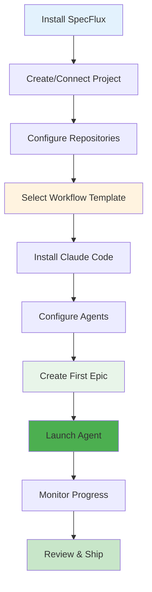

### Onboarding Steps
1. **Install** - Download desktop app
2. **Setup** - Point to repos or create new
3. **Configure** - Choose workflow template
4. **Launch** - Create epic, start agent
5. **Ship** - Review, PR, merge, done

---

## Example Usage Scenarios

### Scenario 1: Solo Developer (Startup Fast)

```yaml
# Minimal workflow
workflow: startup-fast
phases: [planning, implementation]
agents: [backend-developer, frontend-developer]

# Workflow
PRD → AI generates tasks → Click start → 
Agent codes → Review → Ship
```

### Scenario 2: Small Team (Design-First)

```yaml
# Design-heavy workflow
workflow: design-first
phases: [discovery, design, planning, implementation]
agents: [ux-designer, ui-designer, developers]

# Workflow
Research → Design mockups → Client approval → 
PRD → Tasks → Agents code → Review → Ship
```

### Scenario 3: Enterprise (Full Lifecycle)

```yaml
# Complete governance
workflow: full-lifecycle
phases: all
agents: all
approval_gates: [planning, architecture, implementation]

# Workflow
Discovery → PRD → Approval → Design → 
Architecture → Approval → Code → QA → 
Security audit → Docs → Deploy
```

---

## Open Questions for Development

1. **Backend Language:** Node.js (familiar) or Go (performance)?
2. **Terminal Library:** node-pty + xterm.js sufficient?
3. **Progress Parsing:** Regex patterns or structured JSON from Claude?
4. **State Management:** Redux, Zustand, or React Context?
5. **File Watching:** Chokidar or native FS watchers?

---

## Appendix: Agent Definitions

### Minimal Agent Set (MVP)

1. **product-manager** - Creates PRDs, manages roadmap
2. **backend-developer** - Implements backend features
3. **frontend-developer** - Implements frontend features
4. **tech-lead** - Creates epics, breaks down tasks

### Full Agent Set (Future)

5. **ux-designer** - User flows, wireframes
6. **ui-designer** - Visual design, mockups
7. **system-architect** - System architecture
8. **backend-architect** - API design
9. **database-architect** - Schema design
10. **mobile-developer** - Mobile implementation
11. **qa-engineer** - Test plans, QA
12. **technical-writer** - Documentation
13. **security-engineer** - Security audits
14. **devops-architect** - Infrastructure

---

## Summary

**SpecFlux orchestrates Claude Code agents across multiple repositories with configurable workflows.**

**For MVP (Solo Dev):**
- Use "Startup Fast" template
- Just PRD → Tasks → Code → Ship
- Launch agents with one click
- Track progress in real-time
- Ship faster with AI assistance

**Key Innovation:** Unified interface + automated context + configurable workflow = 10x faster multi-repo development.

**Status:** Ready for development. Start with MVP, expand based on usage.

---

**End of Specification**
