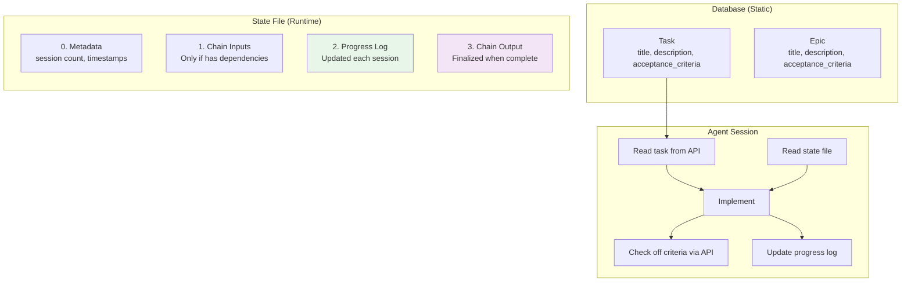
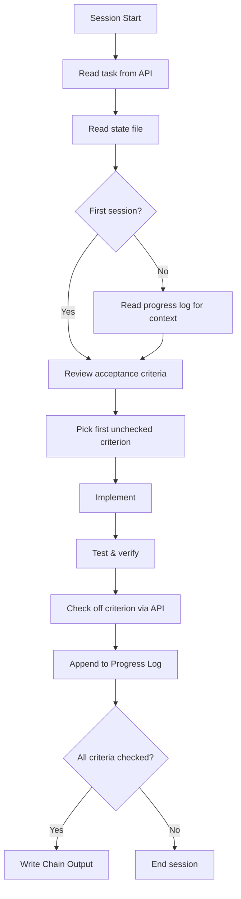
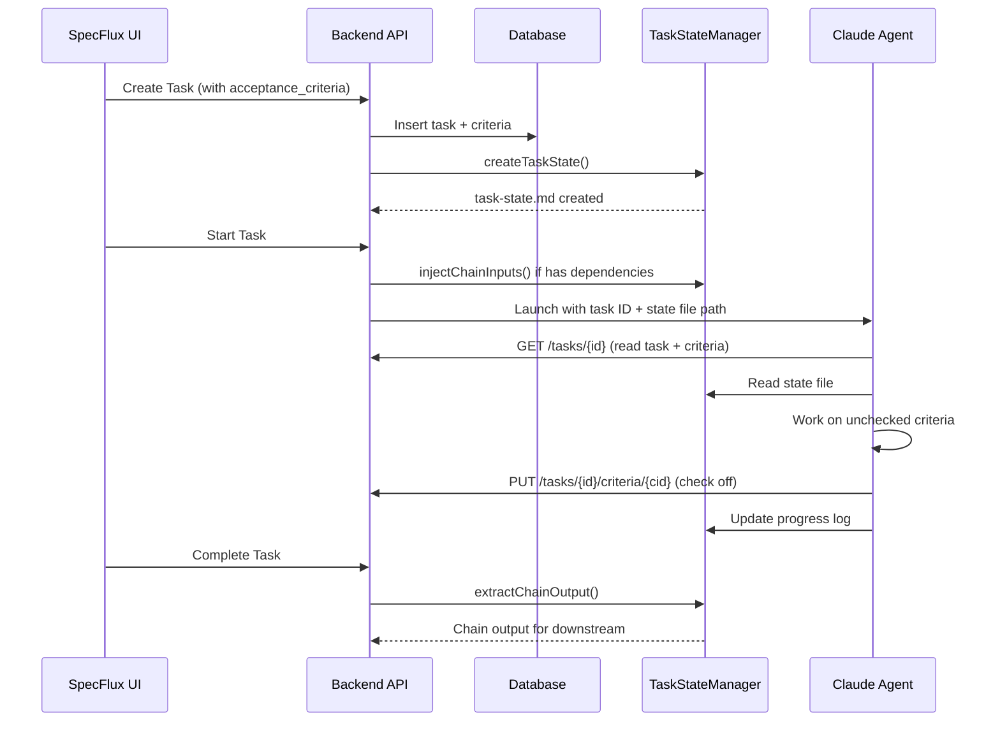

# Unified Task State Design

**Status:** Proposal
**Date:** November 2024

---

## Table of Contents

1. [Architecture Overview](#1-architecture-overview)
2. [Data Model Changes](#2-data-model-changes)
3. [Task State File Format](#3-task-state-file-format)
4. [Examples by Use Case](#4-examples-by-use-case)
5. [Agent Session Protocol](#5-agent-session-protocol)
6. [File Size Management](#6-file-size-management)
7. [Implementation Guide](#7-implementation-guide)
8. [Appendix: Background & Comparisons](#appendix-background--comparisons)

---

## 1. Architecture Overview

### Core Concept

Separate **static task definition** (in database) from **runtime state** (in state file).



### Key Principles

| Principle | Description |
|-----------|-------------|
| **Separation of concerns** | Static definition in DB, runtime state in file |
| **Acceptance criteria required** | Both Epic and Task must have ≥1 criterion |
| **State file is minimal** | Only chain context + progress + output |
| **Chain inputs only when needed** | Tasks without dependencies skip this section |
| **Progress log is critical** | Enables session continuity across context resets |
| **Size-aware** | Auto-archive when file exceeds 75 KB |

### File Structure

```
.specflux/
├── task-states/
│   ├── task-101-state.md     # Working files (< 75 KB each)
│   ├── task-102-state.md
│   └── task-103-state.md
└── archives/
    └── task-101-archive.md    # Full history if archived
```

---

## 2. Data Model Changes

### Epic Model

Add `acceptance_criteria` field (required, minimum 1 item):

```typescript
interface Epic {
  id: number;
  title: string;
  description: string;
  acceptance_criteria: AcceptanceCriterion[];  // NEW - required, min 1
  // ... other fields
}

interface AcceptanceCriterion {
  id: number;
  text: string;
  checked: boolean;
  checked_at?: string;  // ISO timestamp when checked
}
```

### Task Model

Add `acceptance_criteria` field (required, minimum 1 item):

```typescript
interface Task {
  id: number;
  title: string;
  description: string;
  acceptance_criteria: AcceptanceCriterion[];  // NEW - required, min 1
  // ... other fields
}
```

### Database Schema

```sql
-- New table for acceptance criteria (shared by epics and tasks)
CREATE TABLE acceptance_criteria (
  id INTEGER PRIMARY KEY,
  entity_type TEXT NOT NULL CHECK (entity_type IN ('epic', 'task')),
  entity_id INTEGER NOT NULL,
  text TEXT NOT NULL,
  checked INTEGER DEFAULT 0,
  checked_at TEXT,
  position INTEGER DEFAULT 0,
  created_at TEXT DEFAULT CURRENT_TIMESTAMP
);

CREATE INDEX idx_ac_entity ON acceptance_criteria(entity_type, entity_id);
```

### API Endpoints

```
# Tasks
GET    /tasks/:id                         → includes acceptance_criteria[]
POST   /tasks/:id/criteria                → { text: string } → add criterion
PUT    /tasks/:id/criteria/:criterionId   → { text?, checked?, position? }
DELETE /tasks/:id/criteria/:criterionId   → remove criterion

# Epics
GET    /epics/:id                         → includes acceptance_criteria[]
POST   /epics/:id/criteria                → { text: string } → add criterion
PUT    /epics/:id/criteria/:criterionId   → { text?, checked?, position? }
DELETE /epics/:id/criteria/:criterionId   → remove criterion
```

### Acceptance Criteria Hierarchy

| Level | Purpose | Checked By | Example |
|-------|---------|------------|---------|
| **Epic AC** | High-level success conditions | Human at Epic completion | "Users can authenticate via OAuth" |
| **Task AC** | Implementation checkpoints | Agent during work | "POST /auth/login returns JWT" |

- Epic AC = "Definition of done" for the whole feature
- Task AC = Working checklist for the agent

### Validation Rules

- Epic: Must have ≥1 acceptance criterion before creating tasks
- Task: Must have ≥1 acceptance criterion before starting work
- Criterion text: Non-empty, max 500 characters

---

## 3. Task State File Format

### Sections Overview

| Section | Required | When to Include |
|---------|----------|-----------------|
| **0. Metadata** | Yes | Always (JSON) |
| **1. Chain Inputs** | No | Only if task has dependencies |
| **2. Progress Log** | Yes | Agent updates each session |
| **3. Chain Output** | Yes | Agent finalizes when complete |

> **Note:** Task definition and acceptance criteria are in the database, not the state file.
> Agent reads task from API and updates criteria via API calls.

### Full Format Template

````markdown
# Task #{id}: {title}

## 0. Metadata
```json
{
  "task_id": 101,
  "epic_id": 10,
  "total_sessions": 3,
  "started_at": "2024-11-26T10:00:00Z",
  "last_session_at": "2024-11-26T14:00:00Z"
}
```

## 1. Chain Inputs
(Only if this task depends on other tasks)

### From Task #{dep_id}: {dep_title}
> {summary of what upstream task produced}

## 2. Progress Log

### Session 1 - {timestamp}
**Did:** {bullet points}
**Issues:** {any blockers}
**Next:** {clear next steps}

## 3. Chain Output
(Agent fills when task is complete)

### Summary
{what was built}

### For Downstream Tasks
{API contracts, integration notes}
````

---

## 4. Examples by Use Case

### Example A: Simple Task (No Dependencies)

A self-contained task. State file is minimal - just metadata and progress.

**Task in database:**
```json
{
  "id": 201,
  "title": "Add dark mode toggle",
  "epic_id": 15,
  "description": "Add a dark mode toggle to settings page. Use existing theme context.",
  "acceptance_criteria": [
    { "id": 1, "text": "Toggle switch in Settings > General", "checked": false },
    { "id": 2, "text": "Persists preference to localStorage", "checked": false },
    { "id": 3, "text": "Applies theme immediately without reload", "checked": false }
  ]
}
```

**State file (`task-201-state.md`):**
````markdown
# Task #201: Add dark mode toggle

## 0. Metadata
```json
{
  "task_id": 201,
  "epic_id": 15,
  "total_sessions": 0,
  "started_at": null
}
```

## 2. Progress Log

(No sessions yet)

## 3. Chain Output

(To be completed)
````

**Size: ~500 bytes** - No chain inputs, no context duplication.

---

### Example B: Task with Dependencies

A task that builds on work from upstream tasks. State file includes chain inputs.

**Task in database:**
```json
{
  "id": 102,
  "title": "Auth API endpoints",
  "epic_id": 10,
  "description": "Create REST endpoints for login, logout, and token refresh. Use JWT service from Task #101.",
  "dependencies": [100, 101],
  "acceptance_criteria": [
    { "id": 1, "text": "POST /auth/login returns JWT on valid credentials", "checked": true },
    { "id": 2, "text": "POST /auth/logout invalidates refresh token", "checked": false },
    { "id": 3, "text": "POST /auth/refresh returns new access token", "checked": false },
    { "id": 4, "text": "All endpoints have input validation", "checked": false },
    { "id": 5, "text": "Integration tests pass", "checked": false }
  ]
}
```

**State file (`task-102-state.md`):**
````markdown
# Task #102: Auth API endpoints

## 0. Metadata
```json
{
  "task_id": 102,
  "epic_id": 10,
  "total_sessions": 2,
  "started_at": "2024-11-26T14:00:00Z",
  "last_session_at": "2024-11-26T15:30:00Z"
}
```

## 1. Chain Inputs

### From Task #100: Database Schema
> Users table: id (UUID), email (unique), password_hash, created_at

### From Task #101: JWT Service
> JWTService API:
> - `generateToken(userId: string): string`
> - `verifyToken(token: string): TokenPayload | null`
> - `refreshToken(oldToken: string): string`
>
> Config: JWT_SECRET, JWT_EXPIRY=15m

## 2. Progress Log

### Session 1 - 2024-11-26 14:00
**Did:**
- Created auth.routes.ts with login endpoint
- Integrated JWTService from Task #101
- Login works with valid credentials

**Issues:** None

**Next:** Implement logout and refresh endpoints

### Session 2 - 2024-11-26 15:30
**Did:**
- Added logout endpoint with token blacklist
- Started refresh endpoint

**Issues:** Need to handle concurrent refresh requests

**Next:** Fix race condition, add validation, write tests

## 3. Chain Output

(To be completed)
````

**Size: ~2 KB** - Includes chain inputs for dependencies.

---

### Example C: Completed Task with Chain Output

A completed task with chain output for downstream tasks.

**Task in database:**
```json
{
  "id": 101,
  "title": "JWT Service",
  "epic_id": 10,
  "status": "complete",
  "description": "Implement JWT token service. Support access tokens (15min) and refresh tokens (7 days).",
  "acceptance_criteria": [
    { "id": 1, "text": "generateToken() creates valid JWT", "checked": true },
    { "id": 2, "text": "verifyToken() validates signature and expiry", "checked": true },
    { "id": 3, "text": "refreshToken() rotates tokens securely", "checked": true },
    { "id": 4, "text": "Unit tests with 90%+ coverage", "checked": true }
  ]
}
```

**State file (`task-101-state.md`):**
````markdown
# Task #101: JWT Service

## 0. Metadata
```json
{
  "task_id": 101,
  "epic_id": 10,
  "total_sessions": 5,
  "started_at": "2024-11-26T10:00:00Z",
  "completed_at": "2024-11-26T14:00:00Z"
}
```

## 2. Progress Log

### Session 1 - 2024-11-26 10:00
**Did:** Set up project structure, added jsonwebtoken dependency
**Issues:** TypeScript types not found
**Next:** Fix types, implement generateToken

### Session 2 - 2024-11-26 11:00
**Did:** Fixed types, implemented generateToken()
**Issues:** None
**Next:** Implement verifyToken

### Session 3 - 2024-11-26 12:00
**Did:** Implemented verifyToken with signature validation
**Issues:** None
**Next:** Add refresh token logic

### Session 4 - 2024-11-26 13:00
**Did:** Added refreshToken with rotation
**Issues:** None
**Next:** Write tests

### Session 5 - 2024-11-26 14:00
**Did:** Wrote unit tests, achieved 94% coverage
**Issues:** None
**Next:** Task complete

## 3. Chain Output

### Summary
JWT authentication service with token generation, verification, and secure refresh.

### Files Created
- `src/auth/jwt.service.ts` - Main service
- `src/auth/jwt.service.test.ts` - Tests (94% coverage)

### API Contract
```typescript
class JWTService {
  generateToken(userId: string): string
  verifyToken(token: string): TokenPayload | null
  refreshToken(oldToken: string): string
}
```

### Configuration Required
```env
JWT_SECRET=min-32-char-secret
JWT_EXPIRY=15m
JWT_REFRESH_EXPIRY=7d
```

### Integration Notes
- Import: `import { jwtService } from '../auth/jwt.service'`
- Returns null for invalid tokens (check before proceeding)
- Token format: Bearer in Authorization header
````

**Size: ~3 KB** - Chain output provides context for downstream tasks.

---

### Example D: Minimal Bug Fix

A small fix - state file is tiny.

**Task in database:**
```json
{
  "id": 305,
  "title": "Fix login button disabled state",
  "epic_id": null,
  "description": "Login button stays disabled after validation passes. Fix in src/components/LoginForm.tsx line ~45.",
  "acceptance_criteria": [
    { "id": 1, "text": "Button enables when email and password are valid", "checked": false },
    { "id": 2, "text": "Button disables during submission", "checked": false }
  ]
}
```

**State file (`task-305-state.md`):**
````markdown
# Task #305: Fix login button disabled state

## 0. Metadata
```json
{
  "task_id": 305,
  "epic_id": null,
  "total_sessions": 0,
  "started_at": null
}
```

## 2. Progress Log

(No sessions yet)

## 3. Chain Output

(Small fix - minimal output needed)
````

**Size: ~300 bytes** - Bug fixes have minimal state.

---

## 5. Agent Session Protocol

### Startup Sequence (Every Session)



### Protocol Instructions (Inject to Agent)

```markdown
## Session Protocol

### Phase 1: Orientation
1. Read task from API: GET /tasks/{id}
2. Read state file for progress context
3. Run `git status` to check repo state
4. Review acceptance criteria - find unchecked items

### Phase 2: Implementation
5. Pick ONE unchecked criterion to work on
6. Read relevant source files first
7. Implement directly (don't just suggest)
8. Write tests to verify it works

### Phase 3: Handoff
9. Check off criterion via API: PUT /tasks/{id}/criteria/{criterionId}
10. Append to Progress Log in state file:
    - What you did
    - Any issues
    - Next steps
11. If all criteria checked → write Chain Output section
```

### Agent Behavior Rules

```markdown
## Rules

DO NOT suggest changes. IMPLEMENT them.
DO NOT add features beyond acceptance criteria.
DO NOT create abstractions for single-use code.
DO NOT assume file contents - read first.

DO check off criteria via API after testing.
DO update progress log before ending session.
DO keep solutions simple and direct.
```

---

## 6. File Size Management

### Thresholds

| Size | Action |
|------|--------|
| < 50 KB | OK |
| 50-75 KB | Warning |
| > 75 KB | Auto-archive older sessions |
| > 20 sessions | Suggest task decomposition |

### Archiving Strategy

Keep last 5 sessions in full detail, summarize older ones:

````markdown
## 2. Progress Log

### Archived Summary (Sessions 1-5)
**Duration:** 2024-11-26 10:00 - 14:00
**Accomplishments:** Set up project, core implementation done
**Commits:** abc123, def456, ghi789
[Full details: .specflux/archives/task-101-archive.md]

### Session 6 - 2024-11-26 15:00
(Full detail)

### Session 7 - 2024-11-26 16:00
(Full detail - most recent)
````

### Task Sizing Guidelines

| Complexity | Sessions | Recommendation |
|------------|----------|----------------|
| Simple | 1-3 | Single task |
| Medium | 4-8 | Single task, ideal size |
| Large | 9-15 | Consider splitting |
| Very Large | 16+ | Must decompose |

---

## 7. Implementation Guide

### Task State Manager

```typescript
const SIZE_THRESHOLDS = {
  WARNING_KB: 50,
  AUTO_ARCHIVE_KB: 75,
  MAX_RECENT_SESSIONS: 5,
  WARN_TOTAL_SESSIONS: 20,
};

class TaskStateManager {
  async createTaskState(task: Task): Promise<void> {
    const content = this.generateInitialState(task);
    await writeFile(this.getStatePath(task.id), content);
  }

  async appendSession(taskId: number, session: Session): Promise<void> {
    const state = await this.readState(taskId);
    state.progressLog.push(session);

    if (this.getSizeKb(state) > SIZE_THRESHOLDS.AUTO_ARCHIVE_KB) {
      await this.archiveOldSessions(state);
    }

    await this.writeState(taskId, state);
  }

  async extractChainOutput(taskId: number): Promise<ChainOutput> {
    const state = await this.readState(taskId);
    return this.parseChainOutput(state);
  }

  async injectChainInputs(taskId: number, dependencies: Task[]): Promise<void> {
    const state = await this.readState(taskId);
    for (const dep of dependencies) {
      const chainOutput = await this.extractChainOutput(dep.id);
      state.chainInputs.push({ taskId: dep.id, title: dep.title, content: chainOutput });
    }
    await this.writeState(taskId, state);
  }
}
```

### SpecFlux Integration Points



---

## Appendix: Background & Comparisons

### References

- [Anthropic - Effective Harnesses for Long-Running Agents](https://www.anthropic.com/engineering/effective-harnesses-for-long-running-agents)
- [Claude 4.x Best Practices](https://platform.claude.com/docs/en/build-with-claude/prompt-engineering/claude-4-best-practices)

### Problem Statement

**Challenge 1: Inter-Task Context**
When tasks depend on each other, downstream tasks need upstream outputs.
**Solution:** Chain Outputs in state file (Section 3.3)

**Challenge 2: Intra-Task Context**
When a task spans multiple sessions, agent loses memory on context reset.
**Solution:** Progress Log in state file (Section 3.2)

### Design Decisions

| Decision | Rationale |
|----------|-----------|
| Task definition in DB | Agent reads via API, no duplication |
| Acceptance criteria in DB | Checkable via API, visible in UI |
| State file for runtime only | Minimal size, focused purpose |
| Chain inputs in state file | Injected once when task starts |

### Before vs After

| Aspect | Before | After |
|--------|--------|-------|
| Task definition | Duplicated in state file | Database only |
| Acceptance criteria | In state file | Database (API-checkable) |
| Session continuity | Lost on reset | Preserved in Progress Log |
| Upstream context | Injected at start | Chain Inputs section |
| State file size | ~10 KB typical | ~2 KB typical |

### Claude 4 Alignment

| Claude 4 Recommendation | Our Implementation |
|-------------------------|-------------------|
| Structured state tracking | JSON metadata + DB |
| Save progress before reset | Progress Log section |
| Explicit action directives | Agent rules: "IMPLEMENT, don't suggest" |
| Read before edit | Protocol: "Read files first" |
| Verification before marking done | Check criteria via API after testing |
