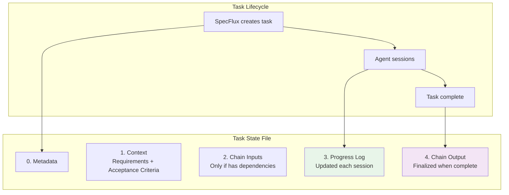
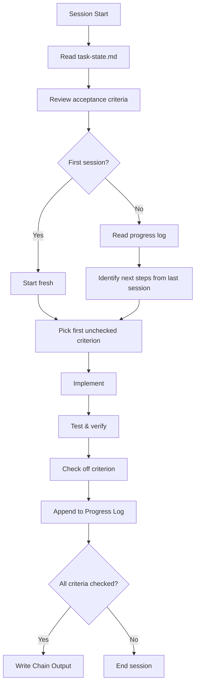
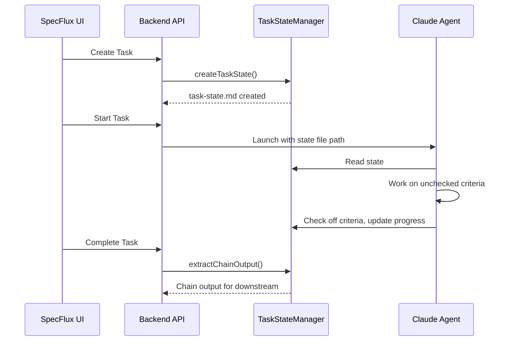

# Unified Task State Design

**Status:** Proposal
**Date:** November 2024

---

## Table of Contents

1. [Architecture Overview](#1-architecture-overview)
2. [Task State File Format](#2-task-state-file-format)
3. [Examples by Use Case](#3-examples-by-use-case)
4. [Agent Session Protocol](#4-agent-session-protocol)
5. [File Size Management](#5-file-size-management)
6. [Token Optimization](#6-token-optimization)
7. [Implementation Guide](#7-implementation-guide)
8. [Appendix: Background & Comparisons](#appendix-background--comparisons)

---

## 1. Architecture Overview

### Core Concept

One file per task that evolves through its lifecycle, enabling session continuity and task handoffs.



### Key Principles

| Principle | Description |
|-----------|-------------|
| **One file per task** | All state in `task-{id}-state.md` |
| **Minimal context** | Only include what agent needs |
| **Chain inputs only when needed** | Tasks without dependencies skip this section |
| **Acceptance criteria as checkboxes** | Agent checks off as features are verified |
| **Progress log is critical** | Enables session continuity across context resets |
| **Size-aware** | Auto-archive when file exceeds 75 KB |

### File Structure

```
.specflux/
├── task-states/
│   ├── task-101-state.md     # Working files (< 75 KB each)
│   ├── task-102-state.md
│   └── task-103-state.md
└── archives/
    └── task-101-archive.md    # Full history if archived
```

---

## 2. Task State File Format

### Sections Overview

| Section | Required | When to Include |
|---------|----------|-----------------|
| **0. Metadata** | Yes | Always (JSON) |
| **1. Context** | Yes | Always - requirements + acceptance criteria |
| **2. Chain Inputs** | No | Only if task has dependencies |
| **3. Progress Log** | Yes | Agent updates each session |
| **4. Chain Output** | Yes | Agent finalizes when complete |

### Full Format Template

````markdown
# Task #{id}: {title}

## 0. Metadata
```json
{
  "task_id": 101,
  "epic_id": 10,
  "status": "in_progress",
  "total_sessions": 3
}
```

## 1. Context

**Epic:** {epic_title} (#{epic_id})
**Repository:** {repo_name}

### Requirements
{brief task requirements - 2-5 sentences}

### Acceptance Criteria
- [ ] Criterion 1
- [ ] Criterion 2
- [ ] Criterion 3

## 2. Chain Inputs
(Only if this task depends on other tasks)

### From Task #{dep_id}: {dep_title}
> {summary of what upstream task produced}

## 3. Progress Log

### Session 1 - {timestamp}
**Did:** {bullet points}
**Issues:** {any blockers}
**Next:** {clear next steps}

## 4. Chain Output
(Agent fills when task is complete)

### Summary
{what was built}

### For Downstream Tasks
{API contracts, integration notes}
````

---

## 3. Examples by Use Case

### Example A: Simple Task (No Dependencies)

A self-contained task with clear requirements. **Most common case.**

````markdown
# Task #201: Add dark mode toggle

## 0. Metadata
```json
{
  "task_id": 201,
  "epic_id": 15,
  "status": "in_progress",
  "total_sessions": 0
}
```

## 1. Context

**Epic:** UI Polish (#15)
**Repository:** frontend

### Requirements
Add a dark mode toggle to the settings page. Use existing theme context.
Follow the ui-patterns skill for styling.

### Acceptance Criteria
- [ ] Toggle switch in Settings > General
- [ ] Persists preference to localStorage
- [ ] Applies theme immediately without reload

## 3. Progress Log

(No sessions yet)

## 4. Chain Output

(To be completed)
````

**Size: ~2 KB** - Simple, focused, no chain inputs needed.

---

### Example B: Task with Dependencies

A task that builds on work from upstream tasks.

````markdown
# Task #102: Auth API endpoints

## 0. Metadata
```json
{
  "task_id": 102,
  "epic_id": 10,
  "status": "in_progress",
  "dependencies": [100, 101],
  "total_sessions": 2
}
```

## 1. Context

**Epic:** User Authentication (#10)
**Repository:** backend

### Requirements
Create REST endpoints for login, logout, and token refresh.
Use the JWT service from Task #101.

### Acceptance Criteria
- [x] POST /auth/login returns JWT on valid credentials
- [ ] POST /auth/logout invalidates refresh token
- [ ] POST /auth/refresh returns new access token
- [ ] All endpoints have input validation
- [ ] Integration tests pass

## 2. Chain Inputs

### From Task #100: Database Schema
> Users table: id (UUID), email (unique), password_hash, created_at

### From Task #101: JWT Service
> JWTService API:
> - `generateToken(userId: string): string`
> - `verifyToken(token: string): TokenPayload | null`
> - `refreshToken(oldToken: string): string`
>
> Config: JWT_SECRET, JWT_EXPIRY=15m

## 3. Progress Log

### Session 1 - 2024-11-26 14:00
**Did:**
- Created auth.routes.ts with login endpoint
- Integrated JWTService from Task #101
- Login works with valid credentials

**Issues:** None

**Next:** Implement logout and refresh endpoints

### Session 2 - 2024-11-26 15:30
**Did:**
- Added logout endpoint with token blacklist
- Started refresh endpoint

**Issues:** Need to handle concurrent refresh requests

**Next:** Fix race condition, add validation, write tests

## 4. Chain Output

(To be completed)
````

**Size: ~8 KB** - Includes chain inputs because depends on #100 and #101.

---

### Example C: Completed Task with Chain Output

A task that has been completed across multiple sessions.

````markdown
# Task #101: JWT Service

## 0. Metadata
```json
{
  "task_id": 101,
  "epic_id": 10,
  "status": "complete",
  "total_sessions": 5
}
```

## 1. Context

**Epic:** User Authentication (#10)
**Repository:** backend

### Requirements
Implement JWT token service for authentication.
Support access tokens (15min) and refresh tokens (7 days).

### Acceptance Criteria
- [x] generateToken() creates valid JWT
- [x] verifyToken() validates signature and expiry
- [x] refreshToken() rotates tokens securely
- [x] Unit tests with 90%+ coverage

## 3. Progress Log

### Session 1 - 2024-11-26 10:00
**Did:** Set up project structure, added jsonwebtoken dependency
**Issues:** TypeScript types not found
**Next:** Fix types, implement generateToken

### Session 2 - 2024-11-26 11:00
**Did:** Fixed types, implemented generateToken()
**Issues:** None
**Next:** Implement verifyToken

### Session 3 - 2024-11-26 12:00
**Did:** Implemented verifyToken with signature validation
**Issues:** None
**Next:** Add refresh token logic

### Session 4 - 2024-11-26 13:00
**Did:** Added refreshToken with rotation
**Issues:** None
**Next:** Write tests

### Session 5 - 2024-11-26 14:00
**Did:** Wrote unit tests, achieved 94% coverage
**Issues:** None
**Next:** Task complete

## 4. Chain Output

### Summary
JWT authentication service with token generation, verification, and secure refresh.

### Files Created
- `src/auth/jwt.service.ts` - Main service
- `src/auth/jwt.service.test.ts` - Tests (94% coverage)

### API Contract
```typescript
class JWTService {
  generateToken(userId: string): string
  verifyToken(token: string): TokenPayload | null
  refreshToken(oldToken: string): string
}
```

### Configuration Required
```env
JWT_SECRET=min-32-char-secret
JWT_EXPIRY=15m
JWT_REFRESH_EXPIRY=7d
```

### Integration Notes
- Import: `import { jwtService } from '../auth/jwt.service'`
- Returns null for invalid tokens (check before proceeding)
- Token format: Bearer in Authorization header
````

**Size: ~10 KB** - Complete with chain output for downstream tasks.

---

### Example D: Minimal Bug Fix

A small fix with pinpointed location.

````markdown
# Task #305: Fix login button disabled state

## 0. Metadata
```json
{
  "task_id": 305,
  "epic_id": null,
  "status": "in_progress",
  "total_sessions": 0
}
```

## 1. Context

**Repository:** frontend

### Requirements
Login button stays disabled after form validation passes.
Fix: Check `isValid` state in button disabled prop.
File: `src/components/LoginForm.tsx` line ~45

### Acceptance Criteria
- [ ] Button enables when email and password are valid
- [ ] Button disables during submission

## 3. Progress Log

(No sessions yet)

## 4. Chain Output

(Small fix - minimal output needed)
````

**Size: ~1.5 KB** - Bug fix with clear location, no dependencies.

---

## 4. Agent Session Protocol

### Startup Sequence (Every Session)



### Protocol Instructions (Inject to Agent)

```markdown
## Session Protocol

### Phase 1: Orientation
1. Read task-state.md completely
2. Run `git status` to check state
3. Review acceptance criteria - find unchecked items

### Phase 2: Implementation
4. Pick ONE unchecked criterion to work on
5. Read relevant source files first
6. Implement directly (don't just suggest)
7. Write tests to verify it works

### Phase 3: Handoff
8. Check off completed criteria with [x]
9. Append to Progress Log:
   - What you did
   - Any issues
   - Next steps
10. If all criteria checked → write Chain Output
```

### Agent Behavior Rules

```markdown
## Rules

DO NOT suggest changes. IMPLEMENT them.
DO NOT add features beyond acceptance criteria.
DO NOT create abstractions for single-use code.
DO NOT assume file contents - read first.

DO check off criteria only after testing.
DO update progress log before ending session.
DO keep solutions simple and direct.
```

---

## 5. File Size Management

### Thresholds

| Size | Action |
|------|--------|
| < 50 KB | OK |
| 50-75 KB | Warning |
| > 75 KB | Auto-archive older sessions |
| > 20 sessions | Suggest task decomposition |

### Archiving Strategy

Keep last 5 sessions in full detail, summarize older ones:

````markdown
## 3. Progress Log

### Archived Summary (Sessions 1-5)
**Duration:** 2024-11-26 10:00 - 14:00
**Accomplishments:** Set up project, core implementation done
**Commits:** abc123, def456, ghi789
[Full details: .specflux/archives/task-101-archive.md]

### Session 6 - 2024-11-26 15:00
(Full detail)

### Session 7 - 2024-11-26 16:00
(Full detail - most recent)
````

### Task Sizing Guidelines

| Complexity | Sessions | Recommendation |
|------------|----------|----------------|
| Simple | 1-3 | Single task |
| Medium | 4-8 | Single task, ideal size |
| Large | 9-15 | Consider splitting |
| Very Large | 16+ | Must decompose |

---

## 6. Token Optimization

### Embed vs Link Strategy

Only embed what agent needs every session. Link rarely-accessed content.

| Content | Access Pattern | Strategy |
|---------|----------------|----------|
| Requirements | Always needed | **Embed** |
| Acceptance criteria | Always needed | **Embed** |
| Chain input summaries | Usually needed | **Embed** |
| Full PRD | Sometimes | **Link** |
| Full Epic | Sometimes | **Link** |
| Archived sessions | Rarely | **Link** |

### Example: Linking Full Documents

````markdown
## 1. Context

**Epic:** User Auth (#10) [details](/api/epics/10)
**PRD:** [user-auth.md](/api/prds/user-auth)

### Requirements
JWT tokens with 15-min expiry. Use jsonwebtoken library.

## 2. Chain Inputs

### From Task #100: Database Schema
> Users table: id, email, password_hash

[Full chain output](/api/tasks/100/chain-output)
````

---

## 7. Implementation Guide

### Task State Manager

```typescript
const SIZE_THRESHOLDS = {
  WARNING_KB: 50,
  AUTO_ARCHIVE_KB: 75,
  MAX_RECENT_SESSIONS: 5,
  WARN_TOTAL_SESSIONS: 20,
};

class TaskStateManager {
  async createTaskState(task: Task): Promise<void> {
    const content = this.generateInitialState(task);
    await writeFile(this.getStatePath(task.id), content);
  }

  async appendSession(taskId: number, session: Session): Promise<void> {
    const state = await this.readState(taskId);
    state.progressLog.push(session);

    if (this.getSizeKb(state) > SIZE_THRESHOLDS.AUTO_ARCHIVE_KB) {
      await this.archiveOldSessions(state);
    }

    await this.writeState(taskId, state);
  }

  async extractChainOutput(taskId: number): Promise<ChainOutput> {
    const state = await this.readState(taskId);
    return this.parseChainOutput(state);
  }

  async updateAcceptanceCriteria(taskId: number, index: number, checked: boolean): Promise<void> {
    const state = await this.readState(taskId);
    state.acceptanceCriteria[index].checked = checked;
    await this.writeState(taskId, state);
  }
}
```

### SpecFlux Integration Points



---

## Appendix: Background & Comparisons

### References

- [Anthropic - Effective Harnesses for Long-Running Agents](https://www.anthropic.com/engineering/effective-harnesses-for-long-running-agents)
- [Claude 4.x Best Practices](https://platform.claude.com/docs/en/build-with-claude/prompt-engineering/claude-4-best-practices)

### Problem Statement

**Challenge 1: Inter-Task Context**
When tasks depend on each other, downstream tasks need upstream outputs.
**Solution:** Chain Outputs in Section 4

**Challenge 2: Intra-Task Context**
When a task spans multiple sessions, agent loses memory on context reset.
**Solution:** Progress Log in Section 3

### Before vs After

| Aspect | Before | After |
|--------|--------|-------|
| Session continuity | Lost on reset | Preserved in Progress Log |
| Upstream context | Injected at start | Chain Inputs section |
| Downstream handoff | Separate file | Chain Output section |
| Progress tracking | None | Acceptance criteria checkboxes |
| File count per task | Multiple | One unified file |

### Claude 4 Alignment

| Claude 4 Recommendation | Our Implementation |
|-------------------------|-------------------|
| Structured state tracking | JSON metadata |
| Save progress before reset | Progress Log section |
| Explicit action directives | Agent rules: "IMPLEMENT, don't suggest" |
| Read before edit | Protocol: "Read files first" |
| Verification before marking done | Check criteria only after testing |

### Why Not Just Link Everything?

Linking doesn't save tokens if agent needs the content:

```
Embed: File 10 KB → Agent reads 10 KB tokens
Link:  File 2 KB + API call 8 KB → Same 10 KB tokens + overhead
```

Only link content that's **conditionally accessed**.
