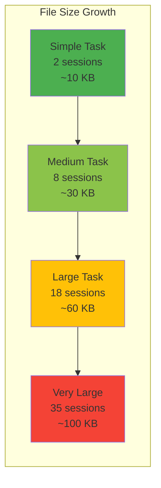
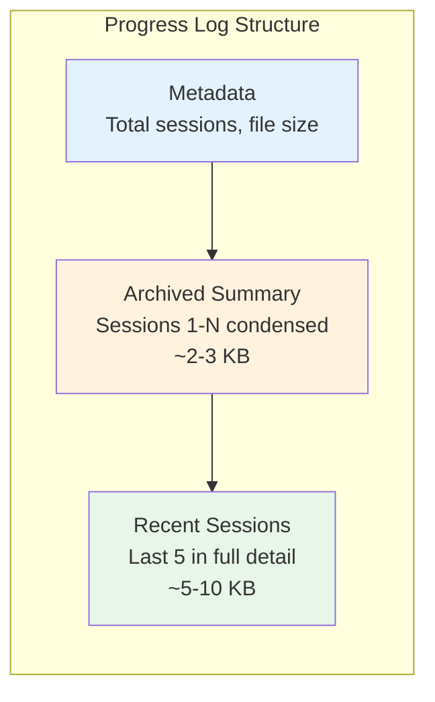
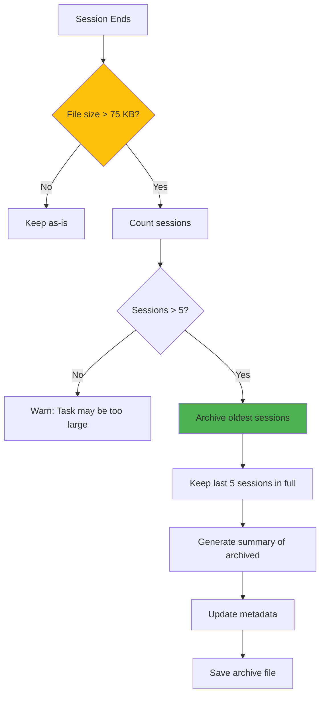
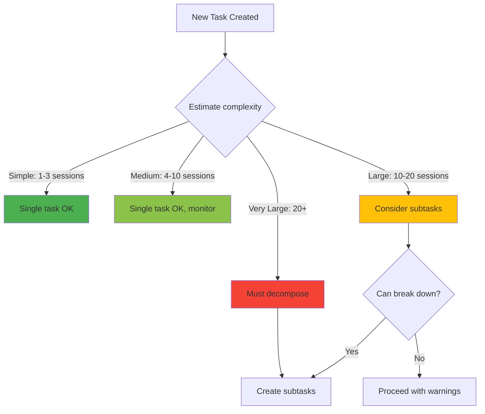

# Unified Task State Design

**Status:** Proposal
**Date:** November 2024
**References:**
- [Anthropic - Effective Harnesses for Long-Running Agents](https://www.anthropic.com/engineering/effective-harnesses-for-long-running-agents)
- [Claude 4.x Best Practices](https://platform.claude.com/docs/en/build-with-claude/prompt-engineering/claude-4-best-practices)

---

## The Problem

AI agents face two distinct context challenges:

### Challenge 1: Inter-Task Context (Already Solved by SpecFlux)

When multiple tasks depend on each other, downstream tasks need to know what upstream tasks produced.


**Current Solution:** Chain Outputs - summaries passed between tasks.

### Challenge 2: Intra-Task Context (NOT Solved Yet)

When a single task requires multiple sessions (context window resets), the agent loses memory of previous work.


**Current Gap:** No mechanism for session-to-session continuity within a single task.

---

## The Solution: Unified Task State

Instead of separate files for different purposes, maintain **one living document** per task that serves all needs:


### How It Works


---

## File Structure

### Single File Per Task

```
orchestrator/devflow/task-states/
├── task-101-state.md    # JWT Service
├── task-102-state.md    # API Endpoints
├── task-103-state.md    # Login Form
└── ...
```

### File Format

```markdown
# Task #101: JWT Service - State

## 1. Static Context (Generated by SpecFlux at task creation)

**PRD:** ../2-planning/user-auth.md
**Epic:** User Authentication System
**Repository:** backend
**Agent:** backend-developer

### Task Description
Implement JWT token generation and verification service.

### Acceptance Criteria
- [ ] Generate JWT on successful login
- [ ] Validate JWT on protected routes
- [ ] Implement refresh token rotation
- [ ] Add tests with 90%+ coverage

---

## 2. Chain Inputs (From completed upstream tasks)

### From Task #100: Database Schema
> Users table created with columns:
> - id (UUID, primary key)
> - email (VARCHAR, unique)
> - password_hash (VARCHAR)
> - created_at (TIMESTAMP)

---

## 3. Progress Log (Updated by agent each session)

### Session 1 - 2024-11-26 14:30
**What I did:**
- Created `src/auth/jwt.service.ts` with `generateToken()` method
- Added jsonwebtoken dependency

**Issues encountered:**
- TypeScript types for jsonwebtoken not found

**Current state:**
- generateToken() implemented but not tested
- verifyToken() not started

**Next steps:**
- Install @types/jsonwebtoken
- Implement verifyToken()
- Write unit tests

### Session 2 - 2024-11-26 15:45
**What I did:**
- Fixed TypeScript types issue
- Implemented verifyToken() with signature validation
- Added 8 unit tests, all passing

**Issues encountered:**
- None

**Current state:**
- Core functionality complete
- Unit tests passing

**Next steps:**
- Add integration test with HTTP request
- Update acceptance criteria checkboxes
- Finalize chain output

---

## 4. Chain Output (Finalized when task is marked complete)

### Summary
Implemented JWT authentication service with token generation and verification.

### Files Created/Modified
- `src/auth/jwt.service.ts` - Main service (new)
- `src/auth/jwt.service.test.ts` - Unit tests (new)
- `package.json` - Added jsonwebtoken dependency

### API Contract
```typescript
class JWTService {
  generateToken(userId: string, role?: string): string
  verifyToken(token: string): TokenPayload | null
  refreshToken(oldToken: string): string
}

interface TokenPayload {
  userId: string;
  role: string;
  exp: number;
}
```

### Configuration Required
```env
JWT_SECRET=your-secret-key-min-32-chars
JWT_EXPIRY=15m
JWT_REFRESH_EXPIRY=7d
```

### Integration Notes for Downstream Tasks
- Import: `import { jwtService } from '../auth/jwt.service'`
- Use in middleware: `const payload = jwtService.verifyToken(token)`
- Token format: Bearer token in Authorization header
- Returns null for invalid/expired tokens (check before proceeding)
```

---

## Lifecycle Visualization


---

## Data Flow Across Multiple Tasks


---

## Agent Session Protocol

Every agent session follows this protocol (injected into agent context):


### Protocol Instructions (Injected to Agent)

```markdown
## Session Startup Protocol

1. **Read State First**
   - Open and read the entire task-state.md file
   - Understand the static context (what to build)
   - Review chain inputs (what upstream provided)
   - Read ALL progress log entries (what's been done)

2. **Verify Environment**
   - Run `pwd` to confirm correct directory
   - Run `git status` to see current state
   - Start dev server if needed

3. **Plan This Session**
   - Identify the next incomplete item from "Next steps"
   - Focus on ONE feature per session
   - Don't try to complete everything at once

4. **Work Incrementally**
   - Make small, testable changes
   - Commit frequently with clear messages
   - Test before moving on

5. **Update Progress Before Ending**
   - Append a new session entry to Progress Log
   - Document what you did, issues, current state, next steps
   - This is critical for the next session!

6. **Finalize If Complete**
   - Update acceptance criteria checkboxes
   - Write the Chain Output section
   - This helps downstream tasks
```

---

## Comparison: Before vs After

### Before (Current SpecFlux)


**Problems:**
- Progress lost when context resets
- No session continuity
- Agent may redo work

### After (Unified Task State)


**Benefits:**
- Progress preserved across sessions
- Agent always has full context
- Clean handoff to downstream tasks

---

## Implementation in SpecFlux

### When Task is Created

```typescript
// SpecFlux generates initial task state file
function createTaskState(task: Task, epic: Epic, prd: PRD, chainInputs: ChainOutput[]) {
  const content = `
# Task #${task.id}: ${task.title} - State

## 1. Static Context
**PRD:** ${prd.path}
**Epic:** ${epic.title}
**Repository:** ${task.repository}
**Agent:** ${task.agent}

### Task Description
${task.description}

### Acceptance Criteria
${task.acceptanceCriteria.map(c => `- [ ] ${c}`).join('\n')}

---

## 2. Chain Inputs
${chainInputs.map(ci => `
### From Task #${ci.taskId}: ${ci.taskTitle}
> ${ci.summary}
`).join('\n')}

---

## 3. Progress Log

(Agent will append entries here)

---

## 4. Chain Output

(Agent will finalize when task is complete)
`;

  writeFile(`devflow/task-states/task-${task.id}-state.md`, content);
}
```

### When Task is Started

```typescript
// Inject task state file path into agent context
function launchAgent(task: Task) {
  const stateFile = `devflow/task-states/task-${task.id}-state.md`;

  // Agent receives instructions to read this file first
  spawnClaude({
    context: `
      Read ${stateFile} completely before starting.
      Follow the Session Startup Protocol.
      Update the Progress Log before ending your session.
    `,
    workingDirectory: task.repository.path
  });
}
```

### When Task Completes

```typescript
// Extract chain output for downstream tasks
function extractChainOutput(task: Task): ChainOutput {
  const stateFile = readFile(`devflow/task-states/task-${task.id}-state.md`);
  const chainOutputSection = parseSection(stateFile, '## 4. Chain Output');

  return {
    taskId: task.id,
    taskTitle: task.title,
    summary: chainOutputSection,
    timestamp: new Date()
  };
}
```

---

## Summary

The Unified Task State approach:

1. **Combines** context injection, chain inputs, progress tracking, and chain outputs into **one file**
2. **Solves** both inter-task (dependency handoffs) and intra-task (session continuity) problems
3. **Enables** agents to pick up exactly where they left off after context resets
4. **Maintains** clean handoffs to downstream tasks through the Chain Output section
5. **Follows** the patterns proven effective by Anthropic's research on long-running agents

This is an evolution of SpecFlux's existing approach, not a replacement. It extends our "chain outputs" concept to also handle session continuity within a single task.

---

## Claude 4.x Best Practices Integration

The Claude 4 documentation provides critical insights that validate and extend our design.

### Key Insight: Multi-Window Workflows

From the docs:
> "Use initial context windows for framework setup (tests, scripts), then iterate on structured task lists"
> "Save your current progress and state to memory before the context window refreshes"

**This directly validates our Unified Task State approach.** Claude 4 is designed for exactly this pattern - structured state tracking across context windows.

### Recommended State Tracking Strategy

The docs recommend:
- **JSON** for structured data (test results, feature checklists)
- **Unstructured text** for progress notes
- **Git** for versioning across sessions


### Updated File Format with Claude 4 Patterns

```markdown
# Task #101: JWT Service - State

## 1. Static Context
(Same as before - PRD, Epic, Task Description)

## 2. Chain Inputs
(Same as before - from upstream tasks)

## 3. Feature Checklist (JSON for structured tracking)

```json
{
  "features": [
    {
      "id": "jwt-1",
      "description": "generateToken() creates valid JWT",
      "passes": false,
      "tested_at": null
    },
    {
      "id": "jwt-2",
      "description": "verifyToken() validates signature",
      "passes": true,
      "tested_at": "2024-11-26T15:45:00Z"
    }
  ],
  "overall_progress": "40%"
}
```

## 4. Progress Log (Unstructured text for session notes)

### Session 1 - 2024-11-26 14:30
(Detailed session notes as before)

## 5. Git History (References for rollback)

- `abc123` - feat: add generateToken method
- `def456` - feat: add verifyToken with signature validation
- `ghi789` - test: add unit tests for JWT service

## 6. Chain Output
(Finalized when complete)
```

---

## Claude 4 Agent Prompting Principles

### 1. Explicit Action Directives

Claude 4 requires explicit instructions to take action. Weak vs Strong:

| Weak (Avoid) | Strong (Use) |
|--------------|--------------|
| "Can you suggest changes?" | "Change this function to improve performance." |
| "Maybe add some tests?" | "Write unit tests for all public methods." |
| "Consider adding error handling" | "Add try/catch blocks with specific error types." |

**SpecFlux should inject action-oriented language:**

```markdown
## Agent Instructions

DO NOT just suggest changes. IMPLEMENT them directly.
DO NOT ask for permission. Make the changes and explain what you did.
DO NOT leave TODOs. Complete each feature before moving on.
```

### 2. Contextual Framing (Explain WHY)

Instead of just rules, explain the reasoning:

```markdown
## Why This Matters

You MUST read the task-state.md file first because:
- It contains progress from previous sessions that you don't remember
- Skipping this will cause you to redo work or miss bugs
- The feature checklist tells you exactly what's incomplete

You MUST update the progress log before ending because:
- The next session (which might be you after context reset) needs this
- Without it, work will be lost and repeated
- This is how multi-window workflows succeed
```

### 3. Minimize Overengineering

From Claude 4 docs:
> "Add prompts emphasizing simplicity—avoid unnecessary abstractions, extra files, or hypothetical flexibility beyond current requirements."

**Inject into agent context:**

```markdown
## Code Quality Rules

- Implement ONLY what the acceptance criteria require
- Do NOT add "nice to have" features
- Do NOT create abstractions for single-use code
- Do NOT add configuration for hypothetical future needs
- Keep solutions simple and direct
- Three similar lines of code is better than a premature abstraction
```

### 4. Code Exploration Before Edits

From Claude 4 docs:
> "ALWAYS read and understand relevant files before proposing code edits."

**Add to session protocol:**

```markdown
## Before Writing Any Code

1. Read existing files in the area you'll modify
2. Understand the current patterns and conventions
3. Check for similar implementations to follow
4. NEVER assume file contents - always read first
5. NEVER make claims about code without investigating
```

### 5. Avoid Test-Driven Hardcoding

From Claude 4 docs:
> "Implement general-purpose solutions that work for all valid inputs, not just passing specific tests."

**Add to agent instructions:**

```markdown
## Testing Philosophy

- Write code that solves the general problem, not just the test cases
- If tests pass but the solution is hacky, refactor before marking complete
- Add edge case tests beyond the acceptance criteria
- A passing test suite with hardcoded values is a FAILURE
```

---

## Verification Tools Integration

Claude 4 docs emphasize:
> "Implement testing mechanisms (Playwright, computer use) for autonomous validation"

### MCP Server Configuration

SpecFlux should auto-configure verification tools:

```json
{
  "mcpServers": {
    "playwright": {
      "command": "npx",
      "args": ["-y", "@anthropic/mcp-playwright"],
      "description": "Browser automation for E2E testing"
    },
    "github": {
      "command": "npx",
      "args": ["-y", "@modelcontextprotocol/server-github"],
      "description": "Create PRs, issues automatically"
    }
  }
}
```

### Verification Protocol


**Agent instruction for verification:**

```markdown
## Verification Requirements

For EVERY feature you implement:
1. Write automated tests (unit or integration)
2. Run the tests and confirm they pass
3. For UI features, use Playwright to verify visually
4. Only mark a feature as "passes: true" after ALL verification
5. If you cannot verify, explain why in the progress log
```

---

## Updated Session Protocol (Claude 4 Optimized)

```markdown
## Session Startup Protocol (FOLLOW EXACTLY)

### Phase 1: Orientation (DO THIS FIRST)
1. Run `pwd` to verify correct directory
2. Read the ENTIRE task-state.md file
3. Run `git log --oneline -10` to see recent history
4. Run `git status` to check working state

### Phase 2: Understanding (BEFORE ANY CODE)
5. Review the feature checklist - identify incomplete features
6. Read previous session notes in Progress Log
7. Read relevant source files you'll modify (NEVER assume contents)
8. Check for existing patterns to follow

### Phase 3: Planning (FOCUS ON ONE FEATURE)
9. Pick the NEXT incomplete feature from checklist
10. Plan your approach (spend 2-3 minutes thinking)
11. Identify files you'll create or modify

### Phase 4: Implementation (ACTION-ORIENTED)
12. Start dev server if needed
13. IMPLEMENT the feature directly (don't just suggest)
14. Write tests as you go
15. Commit with descriptive messages

### Phase 5: Verification (REQUIRED)
16. Run all tests - they MUST pass
17. For UI features, verify visually with Playwright
18. Update feature checklist: set passes=true only if verified

### Phase 6: Handoff (BEFORE SESSION ENDS)
19. Append to Progress Log:
    - What you did this session
    - Any issues encountered
    - Current state of the codebase
    - Clear next steps
20. If task complete, finalize Chain Output section
21. Commit all changes including task-state.md updates
```

---

## Summary: Claude 4 Alignment

| Claude 4 Recommendation | SpecFlux Implementation |
|-------------------------|------------------------|
| Structured state tracking | Unified Task State file with JSON + text |
| Multi-window workflows | Progress Log persists across sessions |
| Explicit action directives | Action-oriented agent instructions |
| Contextual framing | Explain WHY in all instructions |
| Minimize overengineering | Simplicity rules in agent context |
| Read before edit | Mandatory code exploration phase |
| Verification tools | Playwright MCP integration |
| Avoid hardcoding | Testing philosophy guidelines |

The Claude 4 best practices **validate our approach** and provide specific prompting patterns to make agents more effective within the Unified Task State framework.

---

## File Size Management

The Progress Log section grows with each session. Without management, files can become too large for efficient context loading.

### Size Analysis

| Section | Size Per Entry | Typical Count | Total Size |
|---------|----------------|---------------|------------|
| Static Context | 1-2 KB | 1 | 1-2 KB |
| Chain Inputs | 1-3 KB each | 0-5 | 0-15 KB |
| Feature Checklist | 200 bytes each | 5-20 features | 1-4 KB |
| **Progress Log** | 1-2 KB each | **Variable** | **Growth Vector** |
| Git History | 100 bytes each | 10-50 commits | 1-5 KB |
| Chain Output | 2-5 KB | 1 | 2-5 KB |

### Size Projections by Task Complexity



| Task Complexity | Sessions | Progress Log | Total File | Status |
|-----------------|----------|--------------|------------|--------|
| Simple | 1-3 | 2-6 KB | ~10 KB | Safe |
| Medium | 5-10 | 8-20 KB | ~30 KB | Safe |
| Large | 15-20 | 25-40 KB | ~60 KB | Monitor |
| Very Large | 30+ | 50-70 KB | ~100 KB | Requires mitigation |

### Size Thresholds

| Threshold | Action |
|-----------|--------|
| **< 50 KB** | No action needed |
| **50-75 KB** | Warning: Consider summarizing |
| **> 75 KB** | Auto-summarize older sessions |
| **> 20 sessions** | Suggest task decomposition |

### Mitigation Strategy: Rolling Window with Summarization

Keep recent sessions in full detail, summarize older ones:



### Updated File Format with Size Management

```markdown
# Task #101: JWT Service - State

## 0. Metadata

```json
{
  "task_id": 101,
  "created_at": "2024-11-26T14:00:00Z",
  "updated_at": "2024-11-26T18:30:00Z",
  "total_sessions": 12,
  "archived_sessions": 7,
  "recent_sessions": 5,
  "file_size_kb": 42,
  "archive_path": ".specflux/archives/task-101-archive.md"
}
```

## 1. Static Context
(PRD, Epic, Task Description - unchanged)

## 2. Chain Inputs
(From upstream tasks - unchanged)

## 3. Feature Checklist
(JSON checklist - unchanged)

## 4. Progress Log

### Archived Summary (Sessions 1-7)

**Duration:** 2024-11-26 14:00 - 2024-11-26 16:45
**Key Accomplishments:**
- Set up project structure and dependencies
- Implemented generateToken() with proper JWT signing
- Fixed TypeScript configuration issues
- Added verifyToken() with signature validation
- Wrote 8 unit tests, all passing

**Issues Resolved:**
- @types/jsonwebtoken installation
- Environment variable loading for JWT_SECRET

**Commits:** abc123, def456, ghi789, jkl012, mno345

[Full session details: .specflux/archives/task-101-archive.md]

### Session 8 - 2024-11-26 17:00
**What I did:**
- Implemented refresh token rotation
- Added token blacklist for revocation

**Issues:** None

**Current state:** Core refresh logic working

**Next steps:** Add integration tests for refresh flow

### Session 9 - 2024-11-26 17:30
(Full detail)

### Session 10 - 2024-11-26 18:00
(Full detail)

### Session 11 - 2024-11-26 18:15
(Full detail)

### Session 12 - 2024-11-26 18:30
(Full detail - most recent)

## 5. Git History
(Recent commits only, older in archive)

## 6. Chain Output
(Finalized when complete)
```

### Archive File Structure

```
.specflux/
├── task-states/
│   ├── task-101-state.md      # Working file (< 75 KB)
│   └── task-102-state.md
└── archives/
    ├── task-101-archive.md     # Full history for task 101
    └── task-102-archive.md
```

**Archive file format:**

```markdown
# Task #101 Archive - Full Session History

## Session 1 - 2024-11-26 14:00
(Complete original entry)

## Session 2 - 2024-11-26 14:30
(Complete original entry)

... (all archived sessions in full detail)

## Session 7 - 2024-11-26 16:45
(Complete original entry)

---
Archived on: 2024-11-26 18:30
Reason: Working file exceeded 75 KB threshold
Sessions archived: 1-7
```

### Summarization Algorithm



### Implementation: Size-Aware Task State Manager

```typescript
interface TaskStateMetadata {
  task_id: number;
  created_at: string;
  updated_at: string;
  total_sessions: number;
  archived_sessions: number;
  recent_sessions: number;
  file_size_kb: number;
  archive_path: string | null;
}

interface ProgressSession {
  session_number: number;
  timestamp: string;
  what_i_did: string[];
  issues: string[];
  current_state: string;
  next_steps: string[];
  commits: string[];
}

const SIZE_THRESHOLDS = {
  WARNING_KB: 50,
  AUTO_ARCHIVE_KB: 75,
  MAX_RECENT_SESSIONS: 5,
  WARN_TOTAL_SESSIONS: 20,
};

class TaskStateManager {
  private taskId: number;
  private statePath: string;
  private archivePath: string;

  constructor(taskId: number) {
    this.taskId = taskId;
    this.statePath = `devflow/task-states/task-${taskId}-state.md`;
    this.archivePath = `.specflux/archives/task-${taskId}-archive.md`;
  }

  async appendSession(session: ProgressSession): Promise<void> {
    const state = await this.readState();

    // Add new session
    state.sessions.push(session);
    state.metadata.total_sessions++;
    state.metadata.updated_at = new Date().toISOString();

    // Check size and archive if needed
    const sizeKb = this.calculateSizeKb(state);

    if (sizeKb > SIZE_THRESHOLDS.AUTO_ARCHIVE_KB) {
      await this.archiveOldSessions(state);
    }

    // Warn if task is getting too large
    if (state.metadata.total_sessions > SIZE_THRESHOLDS.WARN_TOTAL_SESSIONS) {
      console.warn(`Task ${this.taskId} has ${state.metadata.total_sessions} sessions. Consider decomposing.`);
    }

    await this.writeState(state);
  }

  private async archiveOldSessions(state: TaskState): Promise<void> {
    const sessionsToKeep = SIZE_THRESHOLDS.MAX_RECENT_SESSIONS;
    const sessionsToArchive = state.sessions.slice(0, -sessionsToKeep);
    const recentSessions = state.sessions.slice(-sessionsToKeep);

    // Append to archive file
    await this.appendToArchive(sessionsToArchive);

    // Generate summary of archived sessions
    const summary = this.generateArchiveSummary(sessionsToArchive);

    // Update state
    state.archivedSummary = summary;
    state.sessions = recentSessions;
    state.metadata.archived_sessions += sessionsToArchive.length;
    state.metadata.recent_sessions = recentSessions.length;
    state.metadata.archive_path = this.archivePath;
    state.metadata.file_size_kb = this.calculateSizeKb(state);
  }

  private generateArchiveSummary(sessions: ProgressSession[]): ArchivedSummary {
    const firstSession = sessions[0];
    const lastSession = sessions[sessions.length - 1];

    // Extract key accomplishments across all sessions
    const allAccomplishments = sessions.flatMap(s => s.what_i_did);
    const allIssues = sessions.flatMap(s => s.issues).filter(Boolean);
    const allCommits = sessions.flatMap(s => s.commits);

    return {
      session_range: `${firstSession.session_number}-${lastSession.session_number}`,
      duration: {
        start: firstSession.timestamp,
        end: lastSession.timestamp,
      },
      key_accomplishments: this.deduplicateAndSummarize(allAccomplishments),
      issues_resolved: this.deduplicateAndSummarize(allIssues),
      commits: allCommits,
    };
  }

  async getContextForAgent(): Promise<string> {
    const state = await this.readState();

    // Return formatted state file content
    // Agent sees: metadata, static context, chain inputs,
    // feature checklist, archived summary, recent sessions
    return this.formatForAgent(state);
  }
}
```

### Task Decomposition Warning

When a task exceeds thresholds, SpecFlux should suggest decomposition:

```
┌────────────────────────────────────────────────────────────┐
│  ⚠️  Task #101 is getting large                           │
├────────────────────────────────────────────────────────────┤
│                                                            │
│  This task has 22 sessions and is 85 KB.                  │
│  Large tasks are harder for agents to complete.           │
│                                                            │
│  Consider breaking it into smaller subtasks:              │
│                                                            │
│  Suggested decomposition:                                  │
│  ├─ Task 101a: JWT generation (estimated 5 sessions)      │
│  ├─ Task 101b: Token verification (estimated 4 sessions)  │
│  ├─ Task 101c: Refresh tokens (estimated 5 sessions)      │
│  └─ Task 101d: Integration tests (estimated 4 sessions)   │
│                                                            │
│  [Decompose Task]  [Continue Anyway]  [Dismiss]           │
└────────────────────────────────────────────────────────────┘
```

### Best Practices for Task Sizing



**Guidelines:**
1. **Ideal task size:** 3-8 sessions, 20-50 KB state file
2. **One feature = one subtask** when possible
3. **Natural breakpoints:** API design → Implementation → Tests → Documentation
4. **Chain outputs connect subtasks** - decomposition doesn't lose context
