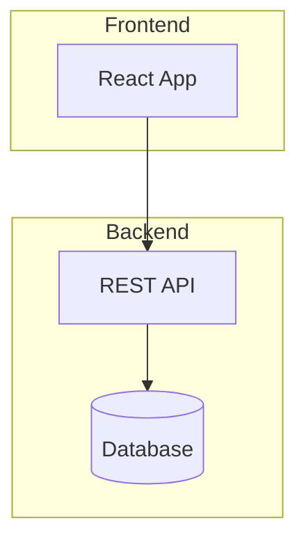
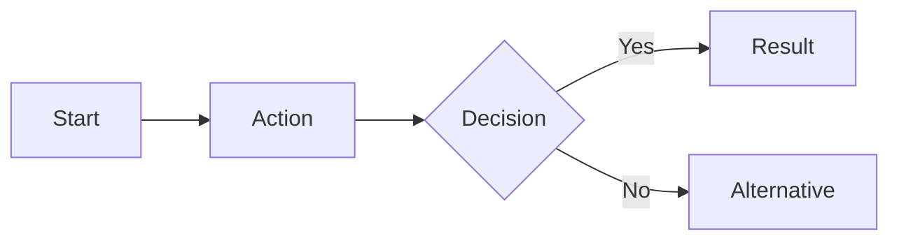
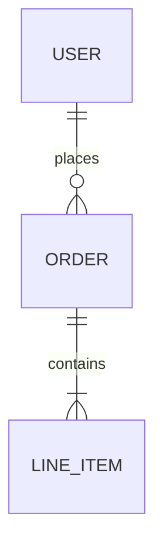

# /specflux:planning - Unified Planning Workflow

Create PRDs, break into epics and tasks - all in one continuous workflow.

**Skills**: Use `specflux-api` for API operations, `prd-template` for PRD structure, `epic-template` for epic structure.

## Prerequisites Check (REQUIRED)

**Before making any API calls, verify the SpecFlux API environment is configured.**

```bash
echo "SPECFLUX_API_URL: ${SPECFLUX_API_URL:-NOT SET}"
echo "SPECFLUX_API_KEY: ${SPECFLUX_API_KEY:+SET (hidden)}"
```

If either variable is NOT SET, see the `specflux-api` skill for setup instructions. Do not proceed with API calls until both are configured.

## Context from Environment

The terminal session provides context via environment variables:
- `SPECFLUX_PROJECT_REF` - Project reference for API calls (e.g., "SPEC")
- `SPECFLUX_CONTEXT_TYPE` - Current context type ("prd", "prd-workshop", "epic", etc.)
- `SPECFLUX_CONTEXT_ID` - Entity ID (e.g., "prd_abc123")
- `SPECFLUX_CONTEXT_REF` - Display key (e.g., "SPEC-P1")
- `SPECFLUX_CONTEXT_TITLE` - Entity title

## Arguments

- `/specflux:planning` - Auto-detect state and continue workflow
- `/specflux:planning draft` - Start drafting a new PRD
- `/specflux:planning refine` - Refine current PRD
- `/specflux:planning breakdown` - Break PRD into epics and tasks
- `/specflux:planning status` - Show planning progress

## Workflow State Detection

```
Check Context ($SPECFLUX_CONTEXT_TYPE, $SPECFLUX_CONTEXT_ID)
    │
    ├─► No context → Start PRD creation interview (Phase 1)
    │
    ├─► PRD context, is Vision PRD (has "## Roadmap" section with child PRD links)
    │       → Inform user: "This is a Vision PRD containing the project roadmap.
    │          To continue planning, navigate to a child PRD in the UI.
    │          Vision PRDs don't have epics - the child PRDs do."
    │
    ├─► PRD context, is Stub PRD (contains "This PRD is a stub")
    │       → Continue interview to flesh out the stub into a full PRD
    │
    ├─► PRD context, no epics → Offer: refine PRD or breakdown
    │
    ├─► PRD context, has epics → Offer: add epics or break into tasks
    │
    └─► Direct argument → Jump to that action
```

### Detecting PRD Types

**Vision PRD**: Read the PRD document and check for:
- Has `## Roadmap` section
- Roadmap contains links to other PRDs (pattern: `→ **[SPEC-P`)

**Stub PRD**: Read the PRD document and check for:
- Contains text "This PRD is a stub"

## Phase 1: PRD Creation

### When to Enter
- No context (automatically starts interview)
- Argument is `draft`

### Interview (one question at a time)

Ask conversationally, one question per turn:
1. What are you building?
2. What problem does it solve? Who has this problem?
3. What's the simplest version that would be useful?
4. List 3-5 core features for MVP
5. Any technical constraints or preferences?
6. (Optional) Tag for this PRD? Tags group related PRDs for batch implementation.
   - Example: "mvp-phase1", "auth-features", "q1-2026"
   - User can skip by saying "skip" or "none"

### Analyze Complexity

After gathering interview answers, analyze for multi-PRD indicators:

**Signals that suggest multiple PRDs needed:**
- User describes >5-7 core features
- User explicitly mentions phases/versions ("v2", "later", "eventually", "future")
- Features span distinct domains (auth, payments, analytics, admin)
- User mentions "starting from scratch" or no existing infrastructure
- Clear separation between "must have now" vs "nice to have later"
- Project sounds like it will take months, not weeks

**If signals detected:**
1. Propose PRD breakdown to user:
   > "Based on what you've described, this sounds like a multi-phase project. I'd suggest breaking it into separate PRDs:
   >
   > - **Phase 0: Infrastructure** - repo setup, CI/CD, cloud hosting *(if starting from scratch)*
   > - **Phase 1: MVP** - {core features you identified}
   > - **Phase 2: {name}** - {features mentioned for later}
   >
   > Does this breakdown make sense? (yes/adjust/single-prd)"

2. `yes` → Continue to Vision PRD Flow (below)
3. `single-prd` → Continue with normal PRD creation
4. `adjust` → Refine breakdown with user, then create

**If simple idea (no signals):**
Continue with normal PRD creation flow.

---

### Vision PRD Flow (when multiple PRDs confirmed)

Use this flow when the user confirms a multi-PRD breakdown.

**Step 0: Prompt for shared tag (once)**

Before creating any PRDs, ask:
> "Would you like to tag these PRDs for batch implementation later?
> (e.g., 'mvp-launch', 'q1-2026') or skip"

Store the tag (or null if skipped) for use in all child PRD creations.

**Step 1: Create Vision PRD via API**
```
POST /api/projects/{projectRef}/prds
{"title": "{Project Name}", "description": "Vision and roadmap for {project}", "tag": "{shared-tag}"}
```

**Step 2: Generate Vision PRD document**

Use the Vision PRD template from `prd-template` skill. Include:
- The Idea (from Q1, Q2 answers)
- Problem & Users (from Q2 answers)
- Roadmap with phases (from complexity analysis)
- Constraints (from Q5 answers)

**Step 3: Save and register Vision PRD**
- Save to `{folderPath}/prd.md`
- Register via API: `{"fileName": "prd.md", "documentType": "PRD", "isPrimary": true}`

**Step 4: Create child PRD stubs**

For each phase identified, create a stub PRD via API with the shared tag:
```
POST /api/projects/{projectRef}/prds
{"title": "Phase 0: Infrastructure Setup", "description": "Repository, CI/CD, and cloud setup", "tag": "{shared-tag}"}

POST /api/projects/{projectRef}/prds
{"title": "Phase 1: {MVP Name}", "description": "{brief MVP description}", "tag": "{shared-tag}"}

POST /api/projects/{projectRef}/prds
{"title": "Phase 2: {Phase Name}", "description": "{brief phase description}", "tag": "{shared-tag}"}
```

For each stub, create a minimal prd.md using the Stub PRD template from `prd-template` skill, then register via API.

**Step 5: Update Vision PRD with links**

After child PRDs are created (you now have their displayKeys and folderPaths), update the Vision PRD's Roadmap section:
```markdown
### Phase 0: Infrastructure
→ **[SPEC-P2: Infrastructure Setup]({folderPath}/prd.md)**

### Phase 1: MVP
→ **[SPEC-P3: {MVP Name}]({folderPath}/prd.md)**
```

**Step 6: Inform user and end**
> "Vision PRD created with {n} child PRDs:
> - SPEC-P2: Infrastructure Setup (stub)
> - SPEC-P3: {MVP Name} (stub)
> - SPEC-P4: {Phase 2 Name} (stub)
>
> Navigate to a child PRD in the UI to refine it and break into epics."

**Do not proceed to epic breakdown for Vision PRDs.** Vision PRDs only contain the roadmap - child PRDs contain the implementable features.

---

### Generate PRD

Use this structure (concise for humans, detailed for AI):

```markdown
# {Project Name}

## Problem Statement
{Why does this need to exist? Who has this problem?}

## Target Users
- Primary: {who}
- Secondary: {who}

## Core Features (MVP)
1. {Feature 1} - {brief description}
2. {Feature 2} - {brief description}
3. {Feature 3} - {brief description}

## User Flows
{Describe key user journeys - reference diagrams in supporting docs}

## Out of Scope (for now)
- {Feature that's explicitly not in MVP}

## Technical Constraints
- {Platform, language, integration requirements}

## Success Metrics
- {How do we know this is working?}
```

### Generate Supporting Documents (as needed)

Based on the product type, offer to generate:

**Architecture Diagram** (`architecture.md`) - for technical products:
```markdown
# Architecture Overview



## Components
- **Frontend**: {description}
- **Backend**: {description}
```

**User Flow Diagram** (`user-flows.md`) - for user-facing products:
```markdown
# User Flows

## {Flow Name}



### Steps
1. User does X
2. System responds with Y
```

**Data Model** (`data-model.md`) - for data-driven products:
```markdown
# Data Model



## Entities
- **User**: {fields}
- **Order**: {fields}
```

**Wireframes** (`wireframes.md`) - for UI-heavy products:
```markdown
# Wireframes

## {Screen Name}

```
+----------------------------------+
|  Logo    [Search...]    [Login]  |
+----------------------------------+
|    +--------+  +--------+        |
|    | Card 1 |  | Card 2 |        |
|    +--------+  +--------+        |
+----------------------------------+
```
```

### Save PRD via API

1. Create PRD:
   ```
   POST /api/projects/{projectRef}/prds
   {"title": "{prd-name}", "description": "{brief summary}", "tag": "{tag or null}"}
   ```

   **Tag handling:**
   - If user provided a tag → include it in the request
   - If user skipped → omit `tag` field or set to `null`
   - For multiple PRDs → prompt for shared tag once, apply to all

2. Save markdown to `{folderPath}/prd.md`

3. Register document:
   ```
   POST /api/projects/{projectRef}/prds/{prdRef}/documents
   {"fileName": "prd.md", "filePath": "{folderPath}/prd.md", "documentType": "PRD", "isPrimary": true}
   ```

4. Save and register supporting docs similarly

### Transition to Breakdown

After PRD is saved, ask:
> "PRD created. Ready to break this into epics and tasks? (yes/refine/later)"

- `yes` → Continue to Phase 2
- `refine` → Take feedback and update PRD
- `later` → End session, user can run `/specflux:planning breakdown` later

---

## Phase 2: Epic Breakdown

### When to Enter
- PRD context exists and user wants to break down
- Argument is `breakdown`
- User said "yes" after PRD creation

### Read PRD Context (if needed)

If continuing from Phase 1, context is already loaded. Otherwise fetch:

```
GET /api/projects/{projectRef}/prds/{prdRef}
GET /api/projects/{projectRef}/prds/{prdRef}/documents
```

Then read documents from file system.

### Clarify Ambiguities

Before proceeding, identify and ask about any unclear requirements.

### Design Epics

1. **Break PRD into epics** by feature domain, user journey, or technical layer

2. **Order by dependencies** - Independent epics FIRST, then dependent ones

3. **Map PRD documents to epics**:
   - UI epics → wireframes, mockups
   - Backend epics → data models, API specs
   - All epics → main PRD for context

4. **Write self-contained epic descriptions**:

```markdown
## Overview
{Context, user stories, what this epic delivers}

## Scope
IN: {what's included}
OUT: {what's excluded}

## Technical Approach
{Data model, API contracts, key implementation details}

## Reference Documents
- `{filePath}` - {description}

## Edge Cases
- {edge case 1}
```

5. **Add acceptance criteria (3-5)** focused on outcomes:
   - Good: "Users can complete purchase end-to-end"
   - Bad: "API returns 200" (too low-level)

### Create Epics via API

```
POST /api/projects/{projectRef}/epics
{
  "title": "...",
  "description": "...",
  "prdRef": "{prdRef}",
  "acceptanceCriteria": [
    {"criteria": "..."},
    {"criteria": "..."}
  ]
}
```

**CRITICAL**:
- `prdRef` is REQUIRED - always link epics to their source PRD
- `acceptanceCriteria` format is `[{"criteria": "..."}, ...]` NOT `["...", ...]`

Without `prdRef`, epics will be orphaned and not visible under the PRD in the UI.

### Add Epic Dependencies

After creating all epics, add dependencies between them:

```
POST /api/projects/{projectRef}/epics/{epicRef}/dependencies
{"dependsOnEpicRef": "SPEC-E1"}
```

**Dependency Guidelines:**
- API/infrastructure epics should have no dependencies (do first)
- UI/frontend epics typically depend on API epics
- Integration epics depend on both API and UI epics
- Independent epics (docs, config) can run in parallel

**Example dependency chain:**
```
E1: API Changes       → No dependencies (first)
E2: Plugin Commands   → Depends on E1
E3: Hook Integration  → Depends on E1, E2
E4: Skill Updates     → No dependencies (parallel with E1)
```

---

## Phase 3: Task Breakdown

### For Each Epic

1. **Break into 1-4 hour tasks**

2. **Write actionable task descriptions**:
   - Objective (one sentence)
   - Files to create/modify
   - Implementation details
   - Error handling

3. **Add verifiable acceptance criteria** - each must be testable:
   - `[Unit]` "hashPassword returns bcrypt hash with cost 12"
   - `[Integration]` "POST /auth/register returns 201 for valid input"
   - `[E2E]` "User completes registration and sees welcome message"

### Create Tasks via API

```
POST /api/projects/{projectRef}/tasks
{"epicRef": "...", "title": "...", "description": "...", "priority": "HIGH|MEDIUM|LOW"}

POST /api/projects/{projectRef}/tasks/{taskRef}/acceptance-criteria
{"criteria": "..."}

POST /api/projects/{projectRef}/tasks/{taskRef}/dependencies
{"dependsOnTaskRef": "..."}
```

---

## Phase 4: Verify Coverage

Present coverage matrix to user:

```
## Coverage Report
| PRD Requirement | Epic | Tasks | Status |
|-----------------|------|-------|--------|
| User auth       | E1   | 1.1-3 | ✓      |
| Product browse  | E2   | 2.1-4 | ✓      |
```

Confirm:
- Every PRD requirement → Epic → Tasks
- No gaps between PRD and implementation
- Get user approval

---

## Status Command

When `/specflux:planning status`:

1. Fetch current PRD/epics/tasks
2. Display progress:

```
## Planning Status: {PRD Title}

PRD: ✓ Created (5 documents)
Epics: 3 created, 1 in progress
Tasks: 12 total (8 ready, 4 pending dependencies)

Next: Run `/specflux:planning breakdown` to continue task creation
```

---

## Key Principles

1. **One question at a time** - Interview conversationally
2. **Confirm before saving** - Show draft, get approval
3. **Continuous flow** - Naturally transition from PRD → Epics → Tasks
4. **Self-contained artifacts** - Epics and tasks include all context needed to implement
5. **Testable criteria** - Every acceptance criterion is verifiable
6. **No gaps** - 100% PRD coverage before finishing
